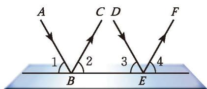
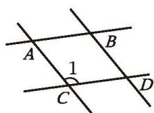

> [!info] 情景引入
> 如图 2-28，直线 $a$ 与直线 $b$ 平行。
> 
> 

>   
>    
>   
图 2-28

> 

> 
> 1. 测量同位角 $\angle 1$ 和 $\angle 5$ 的大小, 它们有什么关系? 图中还有其他同位角吗？它们的大小有什么关系？改变直线 $c$ 与直线 $a$ 所成角的大小再试一试，你能得到相同的结论吗？
> 2. 图中有几对内错角？它们的大小有什么关系？为什么？
> 3. 图中有几对同旁内角？它们的大小有什么关系？为什么？
> 
>> [!summary]- [平行线的性质](课本/【2024版】【北师大版】/【2024版】【北师大版】七年级下册数学/概念/平行线的性质.md)
>> **两条平行直线被第三条直线所截，同位角相等。** 
>> 简述为：**两直线平行，同位角相等。**
>> 
>> **两条平行直线被第三条直线所截，内错角相等。** 
>> 简述为：**两直线平行，内错角相等。**
> >
>> **两条平行直线被第三条直线所截，同旁内角互补。** 
>> 简述为：**两直线平行，同旁内角互补。**

> [!question] 思考·交流
> 如图 2-29，一束平行光线 $AB$ 与 $DE$ 射向一个水平镜面后被反射，此时 $\angle 1 = \angle 2$ ， $\angle 3 = \angle 4$ 。
> 
> 

>   
>    
>   
图 2-29

> 

> 
> 4. $\angle 1$ 与 $\angle 3$ 的大小有什么关系？ $\angle 2$ 与 $\angle 4$ 呢？
> 5. 反射光线 $BC$ 与 $EF$ 也平行吗?
> 
>|   | 我是这样思考的： (1) 由 $AB \parallel DE$，可以得到 $\angle 1=\angle 3$； $\qquad \qquad \qquad$由 $\angle 1=\angle 2$，$\angle 3=\angle 4$，可以得到 $\angle 2=\angle 4$。 (2) 由 $\angle 2=\angle 4$，可以得到 $BC \parallel EF$。 |
> | :--- | :---: |
> 
> 你能说明小颖每一步的理由吗？你是如何思考的？与同伴进行交流。

##### 随堂练习

1. 如图， $AB \parallel CD$ ， $AC \parallel BD$ ，分别找出与 $\angle 1$ 相等或互补的角。

  
   
  
(第 1 题)

