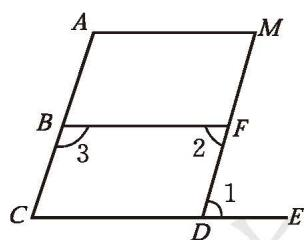
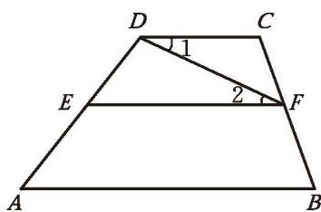
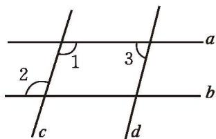
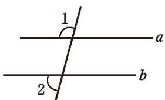
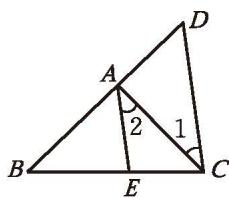

> [!example]- 例 1
> 根据图 2-30 回答下列问题：
> (1) 若 $\angle 1 = \angle 2$ ，则可以判定哪两条直线平行？依据是什么？
> (2) 若 $\angle 2 = \angle M$ ，则可以判定哪两条直线平行？依据是什么？
> (3) 若 $\angle 2 + \angle 3 = 180^{\circ}$ , 则可以判定哪两条直线平行? 依据是什么?
> 
> 
> *图 2-30*
> 
>>[!success]- 解
>>(1) $\angle 1$ 与 $\angle 2$ 是内错角，若 $\angle 1 = \angle 2$ ，则根据 **“内错角相等，两直线平行”**，可得 $BF \parallel CE$ ；
>>
>>(2) $\angle 2$ 与 $\angle M$ 是同位角，若 $\angle 2 = \angle M$ ，则根据 **“同位角相等，两直线平行”**，可得 $AM \parallel BF$ ；
>>
>>(3) $\angle 2$ 与 $\angle 3$ 是同旁内角，若 $\angle 2 + \angle 3 = 180^{\circ}$ ，则根据 **“同旁内角互补，两直线平行”**，可得 $AC \parallel MD$ 。

> [!example]- 例 2
> 如图 2-31, $AB \parallel CD$ , 如果 $\angle 1 = \angle 2$ , 那么 $EF$ 与 $AB$ 平行吗? 说说你的理由。
> 
> 
> *图 2-31*
> 
>>[!success]- 解
>>因为 $\angle 1 = \angle 2$，根据 **“内错角相等，两直线平行”**，所以 $EF \parallel CD$ 。
>>
>>又因为 $AB \parallel CD$ ，根据 **“平行于同一条直线的两条直线平行”**，所以 $EF \parallel AB$ 。

> [!example]- 例 3
> 如图 2-32, 已知直线 $a \parallel b$ , 直线 $c \parallel d$ , $\angle 1 = 107^{\circ}$ , 求 $\angle 2, \angle 3$ 的度数。
> 
> 
> *图 2-32*
> 
>>[!success]- 解
>>因为 $a \parallel b$，根据 **“两直线平行，内错角相等”**，所以 $\angle 2 = \angle 1 = 107^{\circ}$ 。
>>
>>因为 $c \parallel d$ ，根据 **“两直线平行，同旁内角互补”**，所以 $\angle 1 + \angle 3 = 180^{\circ}$ 。
>>
>>所以 $\angle 3 = 180^{\circ} - \angle 1 = 180^{\circ} - 107^{\circ} = 73^{\circ}$ 。

> [!important] 回顾·反思
> 回顾直线相交与平行的探究过程，你积累了哪些研究几何图形的方法与经验？

##### 随堂练习

1. 如图，已知 $\angle 1 = 105^{\circ}$ ， $\angle 2 = 75^{\circ}$ ，请说明 $a \parallel b$ 。

  
   
  
(第 1 题)

2. 如图, $AE \parallel CD$ , $\angle 1 = 37^{\circ}$ , $\angle D = 54^{\circ}$ , 求 $\angle 2$ 和 $\angle BAE$ 的度数。

  
   
  
(第 2 题)

