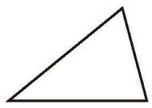
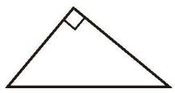
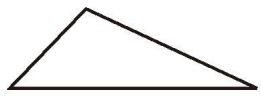
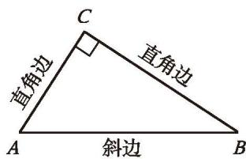

> [!question] 思考·交流
> (1) 图 4-6 中小明所拿三角形被遮住的两个内角是什么角？小颖的呢？试着说明理由。
> 
> 

>   
>   
>    
>   
图 4-6 &emsp;&emsp;&emsp;&emsp;&emsp;&emsp;&emsp;&emsp;&emsp;&emsp;&emsp;&emsp;&emsp;&emsp; 图 4-7

> 

> 
> (2) 图 4-7 中小亮所拿三角形被遮住的两个内角可能是什么角？将所得结果与 (1) 的结果进行比较，并与同伴进行交流。

我们可以按三角形内角的大小把三角形分为三类：

|  |  |  |
| :------------------------------------------------------------------------------: | :------------------------------------------------------------------------------: | :------------------------------------------------------------------------------: |
|               [锐角三角形](课本/【2024版】【北师大版】/【2024版】【北师大版】七年级下册数学/概念/锐角三角形.md) (acute triangle) 三个内角都是锐角               |               [直角三角形](课本/【2024版】【北师大版】/【2024版】【北师大版】七年级下册数学/知识点/直角三角形.md) (right triangle) 有一个内角是直角               |              [钝角三角形](课本/【2024版】【北师大版】/【2024版】【北师大版】七年级下册数学/概念/钝角三角形.md) (obtuse triangle) 有一个内角是钝角               |

通常，我们用符号"$Rt△ABC$"表示"直角三角形 $ABC$"。如图 4-8，直角所对的边称为直角三角形的[斜边](课本/【2024版】【北师大版】/【2024版】【北师大版】七年级下册数学/概念/斜边.md)（hypotenuse），夹直角的两条边称为直角三角形的[直角边](课本/【2024版】【北师大版】/【2024版】【北师大版】七年级下册数学/概念/直角边.md)（leg）。

  
   
  
图 4-8

> [!question] 尝试·思考
> 直角三角形的两个锐角之间有什么关系？
> 
>> [!summary]- 答
>> 直角三角形的两个锐角互余。

---

##### 随堂练习

1. 观察下面的三角形，其中哪些是锐角三角形，哪些是直角三角形，哪些是钝角三角形？

  
   
  
(第 1 题)

2. 一个三角形两个内角的度数分别如下，这个三角形是什么三角形？
   (1) $30^{\circ}$ 和 $60^{\circ}$； (2) $40^{\circ}$ 和 $70^{\circ}$； (3) $50^{\circ}$ 和 $20^{\circ}$。
