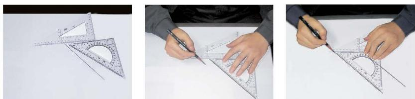
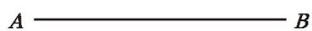
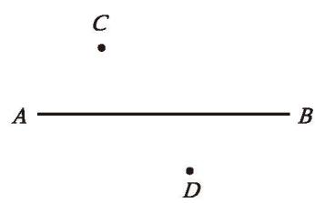
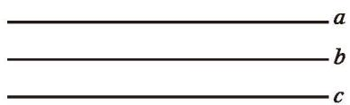

两直线平行，用符号“$\parallel$”表示。例如，直线 $a$ 与直线 $b$ 平行，记作 $a \parallel b$ 。

> [!question] 尝试·思考
> 1. 你能借助三角尺画平行线吗? 小明按如图 2-18 所示的方法画出了已知直线的平行线, 请说明其中的道理。
> 
> 

>   
>    
>   
图 2-18

> 

> 
> 2. 如图 2-19, 你能过直线 $AB$ 外一点 $C$ 画直线 $AB$ 的平行线吗? 能画出几条?
> 
> 

>   
>    
>   
图 2-19

> 

> 
> > [!summary]- 核心结论
> > **过直线外一点有且只有一条直线与这条直线平行。**

> [!question] 操作·思考
> 在图 2-20 中，分别过点 $C$ 和 $D$ 画直线 $AB$ 的平行线 $EF$ 和 $GH$，那么 $EF$ 与 $GH$ 有怎样的位置关系？
> 
> 

>   
>    
>   
图 2-20

> 

> 
> > [!summary]- 核心结论
> > **平行于同一条直线的两条直线平行。**
> > 
> > 也就是说：如果 $b \parallel a, c \parallel a$ ，那么 $b \parallel c$ 。
> > 
> > 

> >   
> >    
> >   
图 2-21

> > 

