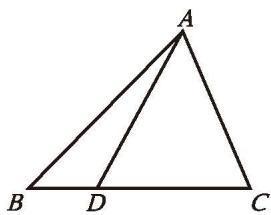
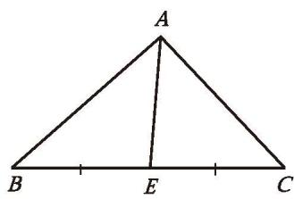
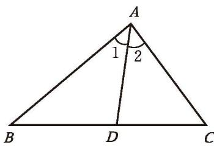
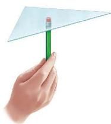

如图 4-14，在 $\triangle ABC$ 中，点 $D$ 是 $BC$ 边上的一个动点，连接 $AD$，在点 $D$ 的运动过程中，观察点 $D$ 或线段 $AD$ 有哪些特殊的位置。说说你的想法，并与同伴进行交流。

  
  
   
  

  
图 4-14 &emsp;&emsp;&emsp;&emsp;&emsp;&emsp;&emsp;&emsp;&emsp;&emsp;&emsp;&emsp;&emsp;&emsp; 图 4-15

从三角形的一个顶点向它的对边所在直线作垂线，顶点和垂足之间的线段叫作[三角形的高线](课本/【2024版】【北师大版】/【2024版】【北师大版】七年级下册数学/概念/三角形的高线.md)，简称三角形的高（height）。如图 4-15，线段 $AF$ 是 $\triangle ABC$ 的 $BC$ 边上的高。

在三角形中，连接一个顶点与它对边中点的线段，叫作[三角形的中线](课本/【2024版】【北师大版】/【2024版】【北师大版】七年级下册数学/概念/三角形的中线.md)（median）。如图 4-16，线段 $AE$ 是 $\triangle ABC$ 的 $BC$ 边上的中线。

|  $BE = EC$ |  |
| :--------------------------------------------------------------------------------------------------------------: | :-------------------------------------------------------------------------------------------------: |
|                                                      图 4-16                                                      |                                               图 4-17                                                |

在三角形中，一个内角的角平分线与它的对边相交，这个角的顶点与交点之间的线段叫作[三角形的角平分线](课本/【2024版】【北师大版】/【2024版】【北师大版】七年级下册数学/概念/三角形的角平分线.md)。如图 4-17，线段 $AD$ 是 $\triangle ABC$ 的一条角平分线。

---

> [!question] 操作·交流
> (1) 在纸上画一个锐角三角形，并画出它的三条中线，它们有怎样的位置关系？与同伴进行交流。  
> (2) 钝角三角形和直角三角形的三条中线也有同样的位置关系吗？画一画，折一折，并与同伴进行交流。  
> *(也可以利用数学软件探索任意三角形三条中线的位置关系)*
> 
> 

>   
>    
>   
图 4-18

> 

> 
> (3) 如图 4-18，用铅笔可以支起一张质地均匀的三角形卡片，怎样确定这个点的位置呢？
> 
>> [!success]- 思考结论
>> 三角形的三条中线交于一点。这个点称为[三角形的重心](课本/【2024版】【北师大版】/【2024版】【北师大版】七年级下册数学/概念/三角形的重心.md)。

> [!question] 思考·交流
> 请你探究三角形的三条角平分线是否交于一点。三角形的三条高呢？你是怎么做的？与同伴进行交流。
> 
>> [!success]- 思考结论
>> 三角形的三条角平分线交于一点。  
>> 三角形的三条高所在的直线交于一点。
