> [!question] 思考·交流
> 观察图 4-9 中的三角形，你能发现它们各自的边长之间有什么关系吗？
> 
> 

>   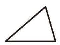
>   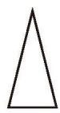
>   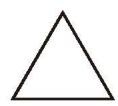
>   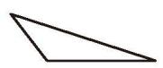
>   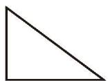
>    
>   
图 4-9

> 

> 
>> [!success]- 思考结论
>> 三角形的三边有的各不相等，有的两边相等，有的三边都相等。

有两边相等的三角形叫作[等腰三角形](课本/【2024版】【北师大版】/【2024版】【北师大版】七年级下册数学/概念/等腰三角形.md)，如图 4-10 所示。

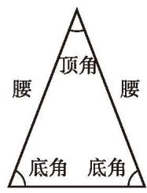
   
  
底边

  
图 4-10

三边都相等的三角形叫作[等边三角形](课本/【2024版】【北师大版】/【2024版】【北师大版】七年级下册数学/概念/等边三角形.md)。

---

> [!question] 思考·交流
> (1) 节日的晚上，房间内亮起了彩灯。如图 4-11，装有黄色彩灯的电线与装有红色彩灯的电线哪根较长？  
> (2) 在一个三角形中，任意两边之和与第三边的长度有怎样的关系？为什么？与同伴进行交流。
> 
> 

>   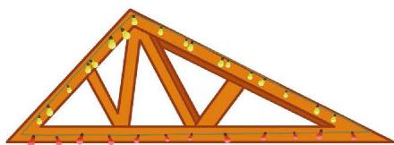
>    
>   
图 4-11

> 

> [!summary] 三角形三边关系定理
> 三角形的任意两边之和大于第三边。

---

> [!question] 操作·思考
> 1. 分别量出图 4-12 中三个三角形的三边长度，并填入空格内。
> 
> 

>   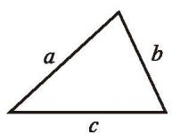
>   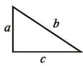
>   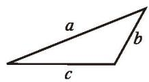
>    
>   
(1) &emsp;&emsp;&emsp;&emsp;&emsp;&emsp;&emsp;&emsp;&emsp;&emsp;&emsp;&emsp; (2) &emsp;&emsp;&emsp;&emsp;&emsp;&emsp;&emsp;&emsp;&emsp;&emsp;&emsp;&emsp; (3)

>   
图 4-12

> 

> 
> (1) $a = \_$ ， $b = \_$ ， $c = \_$ ；  
> (2) $a = \_$ ， $b = \_$ ， $c = \_$ ；  
> (3) $a = \_$ ， $b = \_$ ， $c = \_$ 。  
> 
> 计算每个三角形的任意两边之差，并与第三边比较，你能得到什么结论？再画一些三角形试一试。
> 
> 2. 如图 4-13，在 $\triangle ABC$ 中，以点 $B$ 为圆心，以 $BA$ 的长为半径作弧，与边 $BC$ 交于点 $D$ ，图中是否有线段长度等于 $BC - AB$ 呢？能用圆规直观说明 $BC - AB$ 与 $AC$ 之间的大小关系吗？改变三角形的形状再试试看，你能得到什么结论？
> 
> 

>   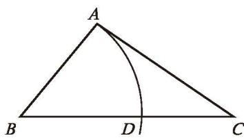
>    
>   
图 4-13

> 

> [!summary] 三角形三边关系推论
> 三角形的任意两边之差小于第三边。

---

> [!example]- 例 1
> 有两根长度分别为 $5 \text{ cm}$ 和 $8 \text{ cm}$ 的木棒，用长度为 $2 \text{ cm}$ 的木棒与它们能摆成三角形吗？为什么？用长度为 $13 \text{ cm}$ 的木棒呢？
> 
>> [!success]- 解
>> 用长度为 $2 \text{ cm}$ 的木棒时，由于 $2 + 5 = 7 < 8$，出现了两边之和小于第三边的情况，所以它们不能摆成三角形。
>> 
>> 如果一根木棒能与原来的两根木棒摆成三角形，那么它的长度取值范围是什么？
>> 
>> 用长度为 $13 \text{ cm}$ 的木棒时，由于 $5 + 8 = 13$，出现了两边之和等于第三边的情况，所以它们也不能摆成三角形。

---

> [!question] 回顾·反思
> 回顾三角形的不同分类方法，每种方法分别选用了怎样的分类标准？在对其他对象进行分类时，你是如何选择不同标准的？

##### 随堂练习

1. 一个三角形的两边长分别为 3 和 5，第三边的长可以是 8 吗？可以是 2 吗？说说你的理由。

2. 在 $\triangle ABC$ 中， $a=4$ ， $b=2$，已知第三边 $c$ 的长是偶数，求 $c$ 的长。
