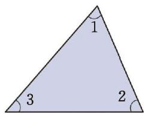

> [!question] 观察·交流
> 我们知道，将一个三角形的三个角撕下来，拼在一起，可以得到三角形三个内角的和为 $180^{\circ}$。
> 
> 小明只撕下三角形的一个角，也得到了上面的结论，他的做法如下。
> 
> 如图 4-4，剪一张三角形纸片，它的三个内角分别为 $\angle 1$，$\angle 2$ 和 $\angle 3$。将 $\angle 1$ 撕下，按图 4-5 所示进行摆放，其中 $\angle 1$ 的顶点与 $\angle 2$ 的顶点重合，它的一条边与 $\angle 2$ 的一条边重合。
> 
> 

>   
>   
>    
>   
图 4-4 &emsp;&emsp;&emsp;&emsp;&emsp;&emsp;&emsp;&emsp;&emsp;&emsp;&emsp;&emsp;&emsp;&emsp; 图 4-5

> 

> 
> 利用图 4-5，小明说明了三角形三个内角的和为 $180^{\circ}$。你知道他是如何说明的吗？说说你的想法，并与同伴进行交流。

> [!summary] [三角形内角和定理](课本/【2024版】【北师大版】/【2024版】【北师大版】七年级下册数学/概念/三角形内角和定理.md)
> 三角形三个内角的和等于 $180^{\circ}$。
