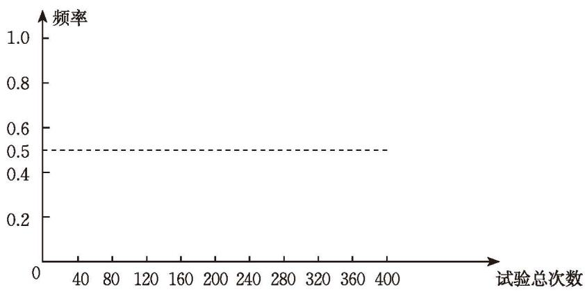

掷一枚质地均匀的硬币，硬币落下后，会出现两种情况（如图 3-4）：

  
  
   
  
正面朝上 &emsp;&emsp;&emsp;&emsp;&emsp;&emsp;&emsp;&emsp; 正面朝下

  
图 3-4

你认为正面朝上和正面朝下的可能性相同吗？

> [!question] 试验与汇总
> 1. 两人一组做 20 次掷硬币的试验，并将数据记录在下表中。
> 
> | 试验项目 | 记录数据 |
| :--- | :--- |
> | 试验总次数 | |
> | 正面朝上的次数 | |
> | 正面朝上的频率 | |
> | 正面朝下的次数 | |
> | 正面朝下的频率 | |
> 
> 2. 累计全班同学的试验结果，并将试验数据汇总填入下表。*(利用数学软件也可以模拟掷硬币试验)*
> 
> | 试验项目 \ 试验总次数 | 40 | 80 | 120 | 160 | 200 | 240 | 280 | 320 | 360 | 400 |
| :--- | :---: | :---: | :---: | :---: | :---: | :---: | :---: | :---: | :---: | :---: |
| 正面朝上的次数 | | | | | | | | | | |
| 正面朝上的频率 | | | | | | | | | | |
| 正面朝下的次数 | | | | | | | | | | |
| 正面朝下的频率 | | | | | | | | | | |
> 
> 3. 根据表格，完成图 3-5 的折线统计图。
> 
> 

>   
>    
>   
图 3-5

> 

> 
> 4. 观察图 3-5 的折线统计图，你发现了什么规律？
> 5. 下表列出了历史上一些数学家所做的掷硬币试验的数据：
> 
> | 试验者 | 试验总次数 $n$ | 正面朝上的次数 $m$ | 正面朝上的频率 $\frac{m}{n}$ |
| :--- | :---: | :---: | :---: |
| 布丰 | 4040 | 2048 | 0.5069 |
| 德·摩根 | 4092 | 2048 | 0.5005 |
| 费勒 | 10000 | 4979 | 0.4979 |
| 皮尔逊 | 12000 | 6019 | 0.5016 |
| 皮尔逊 | 24000 | 12012 | 0.5005 |
| 维尼 | 30000 | 14994 | 0.4998 |
| 罗曼诺夫斯基 | 80640 | 39699 | 0.4923 |
> 
> 表中的数据支持你发现的规律吗？

在一次试验中，一个随机事件是否发生是无法预测的，是随机的，但在大量重复的试验中，一个随机事件发生的频率又呈现出一定的规律性。无论是掷质地均匀的硬币还是抛瓶盖，在试验次数很大时，正面朝上（盖口向上）的频率都会在一个常数附近摆动。

一般地，在大量重复的试验中，一个随机事件发生的频率会在某一个常数附近摆动，这个性质称为[频率的稳定性](课本/【2024版】【北师大版】/【2024版】【北师大版】七年级下册数学/概念/频率的稳定性.md)。频率反映了该事件发生的频繁程度，频率越大，该事件发生越频繁，这就意味着该事件发生的可能性也越大，因而，我们就用这个常数来表示该事件发生的可能性的大小。

我们把刻画一个事件发生的可能性大小的数值，称为这个事件发生的[概率](课本/【2024版】【北师大版】/【2024版】【北师大版】七年级下册数学/概念/概率.md)（probability）。我们常用大写字母 $A, B, C$ 等表示事件，用 $P(A)$ 表示事件 $A$ 发生的概率。例如，在掷质地均匀的硬币的试验中，事件"正面朝上"的频率会在 $\frac{1}{2}$ 附近摆动，所以，$P(\text{正面朝上}) = \frac{1}{2}$。

一般地，在大量重复的试验中，我们可以用事件 $A$ 发生的频率来估计事件 $A$ 发生的概率。

> [!question] 尝试·思考
> 随机事件 $A$ 发生的概率 $P(A)$ 的取值范围是什么？必然事件发生的概率是多少？不可能事件发生的概率又是多少？
> 
>> [!success]- 思考结论
>> 必然事件发生的概率是 1，不可能事件发生的概率是 0，随机事件 $A$ 发生的概率 $P(A)$ 是 0 与 1 之间的一个常数。

> [!question] 思考·交流
> 1. 小明做了 4 次抛瓶盖的试验，其中有 3 次盖口向上，由此，他估计盖口向上的概率是 $\frac{3}{4}$，你同意他的想法吗？与同伴进行交流。
> 2. 掷一枚质地均匀的硬币，正面朝上的概率是 $\frac{1}{2}$，那么，掷 10 次硬币，一定会有 5 次正面朝上吗？如何理解正面朝上的概率是 $\frac{1}{2}$？与同伴进行交流。

> [!important] 回顾·反思
> 回顾你做过的抛瓶盖和掷硬币试验，你对事件发生的频率与概率的关系有怎样的理解？

##### 随堂练习

1. 某射击运动员在同一条件下进行射击，结果见下表：

| 射击总次数 $n$ | 10 | 20 | 50 | 100 | 200 | 500 | 1 000 |
| :---: | :---: | :---: | :---: | :---: | :---: | :---: | :---: |
| 击中靶心的次数 $m$ | 9 | 16 | 41 | 88 | 168 | 429 | 861 |
| 击中靶心的频率 $\frac{m}{n}$ | | | | | | | |

(1) 请完成上表；
(2) 根据上表，画出该运动员击中靶心的频率的折线统计图；
(3) 请估计该运动员射击一次便击中靶心的概率。
