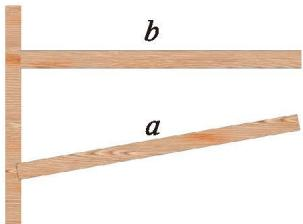
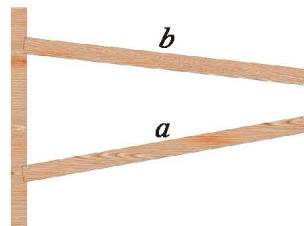
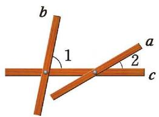
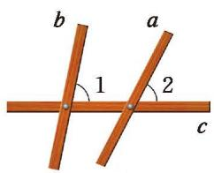
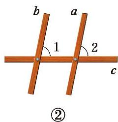
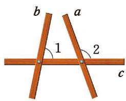
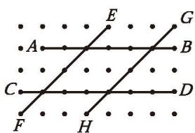
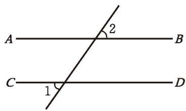

> [!info] 情景引入
> 在日常生活中，人们经常用到平行线。如图 2-13，装修工人要在墙上钉木条，如果木条 $b$ 与竖直木条垂直，那么木条 $a$ 与竖直木条所成的角为多少度时，才能使木条 $a$ 与木条 $b$ 平行？
> 
> 

>   

>     

>       
>       
图 2-13

>     

>     

>       
>       
图 2-14

>     

>   

> 

> 
> 如果木条 $b$ 不与竖直木条垂直呢？
>> [!question]- 操作·交流
>> 1. 如图 2-15, 三根木条相交成 $\angle 1, \angle 2$ , 固定木条 $b, c$ , 转动木条 $a$ 。如图 2-16, 在转动木条 $a$ 的过程中, 观察 $\angle 2$ 的变化以及它与 $\angle 1$ 的大小关系, 你发现木条 $a$ 与木条 $b$ 的位置关系发生了什么变化? 木条 $a$ 何时与木条 $b$ 平行? 与同伴进行交流。
> >
> >

> >  

>  >   

>  >     
>>       
图 2-15

>>     

> >    

> >      
> >      
①

> >    

> >    

> >      
> >      
图 2-16

>  >   

>  >   

>  >     
>>       
③

>  >   

> >  

> >

> >
> >2. 改变图 2-15 中 $\angle 1$ 的大小, 按照 (1) 中的方式再做一做。 $\angle 1$ 与 $\angle 2$ 的大小满足什么关系时, 木条 $a$ 与木条 $b$ 平行? 与同伴进行交流。

如图 2-17, 具有 $\angle 1$ 与 $\angle 2$ 这样位置关系的角称为[同位角](课本/【2024版】【北师大版】/【2024版】【北师大版】七年级下册数学/概念/同位角.md) (corresponding angles)。 $\angle 3$ 与 $\angle 4$ 也是同位角。

  
   
  
图 2-17

在图 2-17 中，找出其他的同位角。

> [!summary] 同位角相等，两直线平行
> **两条直线被第三条直线所截，如果同位角相等，那么这两条直线平行。**
> 简述为：**同位角相等，两直线平行。**

[探究 两直线平行](课本/【2024版】【北师大版】/【2024版】【北师大版】七年级下册数学/知识点/探究%20两直线平行.md)

---

##### 随堂练习

1. 找出下面点阵（点阵中相邻的四个点构成正方形）中互相平行的线段。

  
   
  
(第 1 题)

2. 如图, $\angle 1 = \angle 2 = 55^{\circ}$ , 直线 $AB$ 与 $CD$ 平行吗?

  
   
  
(第 2 题)

3. 对于同一平面内的三条直线 $a, b, c$, 如果 $a$ 与 $b$ 平行, $c$ 与 $a$ 相交, 那么 $c$ 与 $b$ 的位置关系是相交还是平行? 请画图说明。