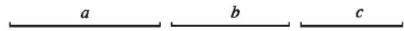
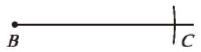
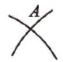
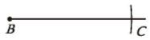
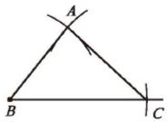
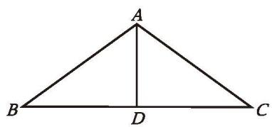

> [!question] 尝试·思考
> (1) 已知一个三角形的三个内角分别为 $40^{\circ}$ ， $60^{\circ}$ 和 $80^{\circ}$ ，你能画出这个三角形吗？把你画的三角形与同伴画的进行比较，它们一定全等吗？  
> (2) 已知一个三角形的三条边分别为 $4 \text{ cm}, 5 \text{ cm}$ 和 $7 \text{ cm}$ ，你能画出这个三角形吗？把你画的三角形与同伴画的进行比较，它们一定全等吗？
> 
>> [!success]- 思考结论
>> 三个内角分别相等的两个三角形不一定全等。
> 
> (3) 小组合作，选择三条线段作为三角形的三条边，并用尺规作出这个三角形。把你作的三角形与同伴作的进行比较，它们一定全等吗？
> 
>> [!summary]- SSS（边边边）
>> 三边分别相等的两个三角形全等，简写为"边边边"或"SSS"。

---

通过刚才的探究过程，我们可以总结出"已知三角形的三边，用尺规作这个三角形"的方法和步骤。

如图 4-21，已知线段 a, b, c，用尺规作 $\triangle ABC$ ，使 AB = c, AC = b, BC = a。

  
图4-21

作法与示范：

| 作法                                           |                                                                                                    示范                                                                                                     |
| :------------------------------------------- | :-------------------------------------------------------------------------------------------------------------------------------------------------------------------------------------------------------: |
| 1. 作一条线段 $BC = a$。                           |                                                                                                        |
| 2. 分别以点 $B,C$ 为圆心，以 $c,b$ 的长为半径作弧，两弧交于点 $A$。 |   |
| 3. 连接 $AB, AC$。$\triangle ABC$ 就是所要作的三角形。    |                                                                                                        |

由上面的结论可知，只要三角形三边的长度确定了，这个三角形的形状和大小就完全确定了。图 4-22 是用三根木条钉成的一个三角形框架，它的大小和形状是固定不变的。三角形的这个性质叫作[三角形的稳定性](课本/【2024版】【北师大版】/【2024版】【北师大版】七年级下册数学/概念/三角形的稳定性.md)。
图 4-23 是用四根木条钉成的一个框架，它的形状是可以改变的，因此，四边形具有不稳定性。

  
  
   
  
图 4-22 &emsp;&emsp;&emsp;&emsp;&emsp;&emsp;&emsp;&emsp;&emsp;&emsp;&emsp;&emsp;&emsp;&emsp;&emsp;&emsp; 图 4-23

在生活中，我们经常会看到应用三角形稳定性的例子（如图 4-24）。

  
   
  
你还能举出一些其他的例子吗？

  
图 4-24

---

##### 随堂练习

1. 如图，在等腰三角形 $ABC$ 中， $AB = AC$ ， $AD$ 是它的一条中线， $\triangle ABD$ 与 $\triangle ACD$ 全等吗？为什么？

  
   
  
(第 1 题)

[阅读·欣赏 跪姿射击的稳定性](课本/【2024版】【北师大版】/【2024版】【北师大版】七年级下册数学/趣味阅读/阅读·欣赏%20跪姿射击的稳定性.md)