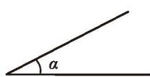
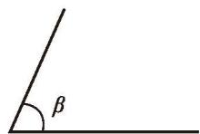
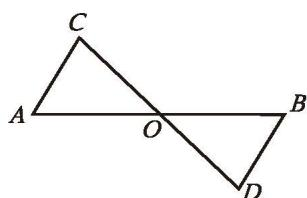

由前面的讨论我们知道，如果给出一个三角形三条边的长度，那么由此得到的三角形都是全等的。如果已知一个三角形的两角及一边，那么有几种可能的情况呢？每种情况下得到的三角形都全等吗？

> [!question] 尝试·思考
> 如果"两角及一边"条件中的边是两角所夹的边，情况会怎样呢？小组合作，选择两个角和一条线段作为三角形的两个内角及其夹边，并用尺规作出这个三角形。你作的三角形与同伴作的一定全等吗？

> [!summary] ASA（角边角）
> 两角及其夹边分别相等的两个三角形全等，简写为"角边角"或"ASA"。

回顾上述作图过程，请你总结"已知三角形的两角及其夹边，用尺规作这个三角形"的方法和步骤。

如图 4-26，已知 $\angle \alpha$ ， $\angle \beta$ ，线段 $c$ ，用尺规作 $\triangle ABC$ ，使 $\angle A = \angle \alpha$ ， $\angle B = \angle \beta$ ， $AB = c$ 。

  

    
  

  

    
    
图 4-26

  

  

    
  

请按照给出的作法作出相应的图形：

作法：

| 1. 作 $\angle DAF = \angle \alpha$ 。 2. 在射线 $AF$ 上截取线段 $AB = c$ 。 3. 以点 $B$ 为顶点，以 $BA$ 为一边，作 $\angle ABE = \angle \beta$ ， $BE$ 交 $AD$ 于点 $C$ 。 $\triangle ABC$ 就是所要作的三角形。 |     |
| :------------------------------------------------------------------------------------------------------------------------------------------------------------------------------ | :-: |

> [!question] 思考·交流
> 如果"两角及一边"条件中的边是其中一角的对边，情况会怎样呢？你能将它转化为"尝试·思考"中的条件吗？与同伴进行交流。

> [!summary] AAS（角角边）
> 两角分别相等且其中一组等角的对边相等的两个三角形全等，简写为"角角边"或"AAS"。

---

##### 随堂练习

1. 如图， $AB$ 与 $CD$ 相交于点 $O$ ， $O$ 是 $AB$ 的中点， $\angle A = \angle B$ ， $\triangle AOC$ 与 $\triangle BOD$ 全等吗？为什么？

  
   
  
(第 1 题)

