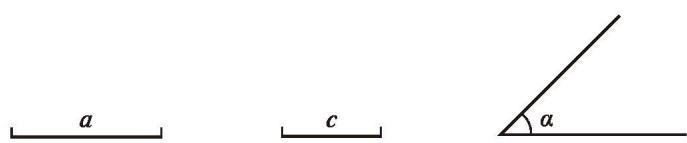
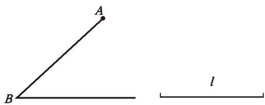
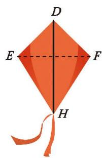

如果已知一个三角形的两边及一角，那么有几种可能的情况呢？每种情况下得到的三角形都全等吗？

> [!question] 尝试·思考
> 如果"两边及一角"条件中的角是两边的夹角，情况会怎样呢？小组合作，选择两条线段和一个角作为三角形的两边及其夹角，并用尺规作出这个三角形。你作的三角形与同伴作的一定全等吗？

> [!summary] SAS（边角边）
> 两边及其夹角分别相等的两个三角形全等，简写为"边角边"或"SAS"。

回顾上述作图过程，请你总结"已知三角形的两边及其夹角，用尺规作这个三角形"的方法和步骤。

如图 4-27，已知线段 $a, c, \angle \alpha$ ，用尺规作 $\triangle ABC$ ，使 $BC = a$ ， $AB = c$ ， $\angle ABC = \angle \alpha$ 。

  
   
  
图 4-27

请按照给出的作法作出相应的图形：

作法：
1. 作一条线段 $BC = a$ 。
2. 以点 $B$ 为顶点，以 $BC$ 为一边，作角 $\angle DBC = \angle \alpha$ 。
3. 在射线 $BD$ 上截取线段 $BA = c$ 。
4. 连接 $AC$ 。 $\triangle ABC$ 就是所要作的三角形。

---

> [!tip] 尝试·交流
> 如果"两边及一角"条件中的角是其中一边的对角，情况会怎样呢？  
> 如图 4-28，已知 $\triangle ABC$ 的 $AB$ 边和边长为 $l$ 的 $AC$ 边，以及 $AC$ 边的对角 $\angle B$ ，你能用尺规确定顶点 $C$ 的位置吗？把你作的三角形与同伴作的进行比较，由此你发现了什么？与同伴进行交流。
> 
> 

>   
>    
>   
图 4-28

> 

> 
>> [!success]- 思考结论
>> 两边分别相等且其中一组等边的对角相等的两个三角形不一定全等。

---

##### 随堂练习

1. 分别找出各图中的全等三角形，并说明理由。

  
  
   
  
(1) &emsp;&emsp;&emsp;&emsp;&emsp;&emsp;&emsp;&emsp;&emsp;&emsp;&emsp;&emsp;&emsp;&emsp;&emsp;&emsp; (第 1 题的第 2 小题)

2. 小明做了一只如图所示的风筝，其中 $\angle EDH = \angle FDH$ ， $ED = FD$ 。将上述条件标注在图中，小明不用测量就知道 $EH = FH$ ，请你说明理由。

  
   
  
(第 2 题)

