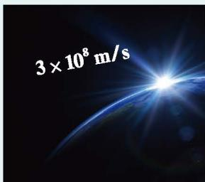

# 第一章整式的乘除

##### 整式的乘除

光在真空中的传播速度大约是 $3 \times 10^{8} \mathrm{~m} / \mathrm{s}$ , 比邻星发出的光到达地球大约需要 4.22 年, 它距离地球有多远? 十位数字相同、个位数字之和等于 10 的两个两位数相乘时, 可以把十位数乘比它大 1 的数作为积的前两位, 把个位数的乘积作为积的后两位。例如, $79 \times 71 = 5609$ 。你能解释其中的道理吗?

本章将在整式加减运算的基础上，继续研究整式的乘除运算，并利用整式的运算解决一些实际问题。你将经历由特殊到一般的推理过程，理解运算法则及其道理，提高运算能力，建立形与数的联系，感悟几何直观的作用，逐步养成重论据、合乎逻辑的思维习惯。

$$
(a + b) ^ {2} = a ^ {2} + 2 a b + b ^ {2}
$$

$$
(a + b) (a - b) = a ^ {2} - b ^ {2}
$$

  

    

      
    

    

      
    

  

$$
\begin{array}{c} 7 \times (7 + 1) = 5 6 \\ \downarrow \\ 7 9 \times 7 1 = 5 6 0 9 \\ \uparrow \\ 9 \times 1 = 0 9 \end{array}
$$

在本章学习过程中，你可以持续思考以下问题：
💡本章是按照怎样的顺序研究整式乘除的？
💡总结乘法公式有什么意义？这些公式是如何得到的？它们与整式运算的法则有怎样的关系？

- [1 幂的乘除](课本/【2024版】【北师大版】/【2024版】【北师大版】七年级下册数学/知识点/1%20幂的乘除.md)
- [2 整式的乘法](课本/【2024版】【北师大版】/【2024版】【北师大版】七年级下册数学/知识点/2%20整式的乘法.md)
- [3 乘法公式](课本/【2024版】【北师大版】/【2024版】【北师大版】七年级下册数学/知识点/3%20乘法公式.md)
- [4 整式的除法](课本/【2024版】【北师大版】/【2024版】【北师大版】七年级下册数学/知识点/4%20整式的除法.md)
- [整式的乘除 回顾与思考](课本/【2024版】【北师大版】/【2024版】【北师大版】七年级下册数学/知识点/整式的乘除%20回顾与思考.md)
- [复习题 整式的乘除](课本/【2024版】【北师大版】/【2024版】【北师大版】七年级下册数学/习题/复习题%20整式的乘除.md)
