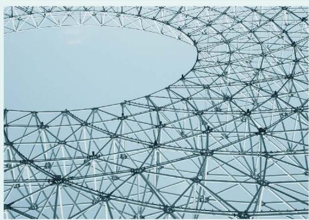

## 第四章 三角形

三角形是生活中常见的基本几何图形，它常常出现在建筑物上或一些物体的结构框架中。留心观察你所看到的各种事物，你发现各式各样的三角形了吗？

本章将进一步研究三角形的性质及三角形的全等关系。你将感受研究图形性质的基本方法，在一个个结论的获得过程中，慢慢体会如何有逻辑地说明它们的正确性；在用尺规作图的过程中，感受如何通过对图形的直观分析作出想要的图形。这些学习过程会帮助你积累更多研究图形的经验，发展几何直观和推理能力等。

  
  
  

在本章学习过程中，你可以持续思考以下问题：
💡本章是如何说明与三角形有关的结论的合理性的？
💡你认为可以从哪些方面研究平面图形以及它们之间的关系？

- [1 认识三角形](课本/【2024版】【北师大版】/【2024版】【北师大版】七年级下册数学/1%20认识三角形.md)
- [2 全等三角形](课本/【2024版】【北师大版】/【2024版】【北师大版】七年级下册数学/知识点/2%20全等三角形.md)
- [3 探索三角形全等的条件](课本/【2024版】【北师大版】/【2024版】【北师大版】七年级下册数学/知识点/3%20探索三角形全等的条件.md)
- [4 利用三角形全等测距离](课本/【2024版】【北师大版】/【2024版】【北师大版】七年级下册数学/知识点/4%20利用三角形全等测距离.md)
- [三角形 回顾与思考](课本/【2024版】【北师大版】/【2024版】【北师大版】七年级下册数学/知识点/三角形%20回顾与思考.md)
- [复习题 第四章 三角形](课本/【2024版】【北师大版】/【2024版】【北师大版】七年级下册数学/习题/复习题%20第四章%20三角形.md)
