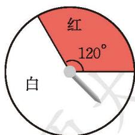
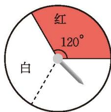
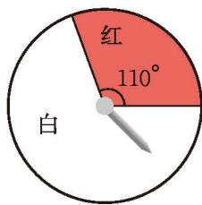
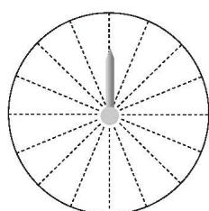

某商场为了吸引顾客，设立了一个可以自由转动的转盘，并将转盘等分成 20 个扇形，像图 3-6 那样涂上颜色。商场规定：顾客每购买 100元 商品，就能获得一次转动转盘的机会。如果转盘停止后，指针正好落在红色、黄色或绿色区域，顾客就可以分别获得 100 元、50 元、20 元的购物券。

  
   
  
图 3-6

(1) 自由转动转盘，当转盘停止时，指针落在不同扇形的可能的结果共有多少种？这些结果是等可能的吗？  
(2) 某顾客购物消费 120 元，获得一次转动转盘的机会。他获得 100 元、50 元、20 元购物券的概率分别是多少？他能获得购物券的概率是多少？

> [!question] 尝试·思考
> 所示的是一个可以自由转动的转盘。转动转盘，当转盘停止时，指针落在红色区域和白色区域的概率分别是多少？
> 

>   
>    
>   
图 3-7

> 

> 
>> [!success]- 小颖的想法
>> |  | 先把白色区域等分成 2 份（如图 3-8），这样转盘被等分成 3 个扇形，其中 1 个是红色，2 个是白色。  所以，$P(\text{落在红色区域}) = \frac{1}{3}$。  $P(\text{落在白色区域}) = \frac{2}{3}$。 |  **图 3-8** |
>> | :---: | :--- | :---: |
>> 你认为小颖的做法有道理吗？说说你的理由。

> [!question] 思考·交流
> 图 3-9 所示的是一个可以自由转动的转盘。转动转盘，当转盘停止时，指针落在红色区域和白色区域的概率分别是多少？你有什么求解方法？与同伴进行交流。
> 
> 

>   
>    
>   
图 3-9

> 

> [!summary] 回顾·反思
> 求等可能事件的概率时有什么需要注意的事项？你积累了哪些经验？
> 
>> [!success]- 答
>> 核心注意事项：
>> * 必须满足“等可能性”的前提：在使用公式 $P(A) = \frac{m}{n}$ 之前，必须确保每一种可能出现的结果发生的几率是完全均等的。如果结果本身不等可能，绝不能直接数个数来求概率。
>> * 确保 $n$ 和 $m$ 处于“同一层级”的计数标准：分子和分母必须在同一种划分标准下进行计数。如果分母把所有的对象进行了“标号等分”，分子计数时也必须对应到具体的标号个体上。
>> * 不重复、不遗漏地数清结果数：当面对涉及两步或多步的复杂等可能事件时，仅凭大脑空想极易漏掉或重复算某些情况。
>> 
>> 核心解题经验：
>> * 利用标号法破除模糊直觉：当面对数量不等的对象时，最有效的手段是化不规则为规则。球类问题可以将球全部打上不同的标签（如红 1、红 2、白 1、白 2、白 3），让每一个球都成为独立且等可能的个体；转盘问题可以利用等分法将面积不等的扇形化为面积完全相等的最小基本单元。
>> * 借助列表法与树状图法结构化思维：对于涉及两步或两步以上的随机试验，建立结构化辅助工具。列表法适合用于同时或先后进行两步的试验（如掷两枚骰子、摸两个球）；树状图法适合用于两步及两步以上（如连摸三球、抛三枚硬币）的试验，层层分支。
>> * 注意放回与不放回的陷阱：在摸球或抽牌的连续试验中，必须审清题目条件。放回试验中第二次试验时总数 $n$ 不变，各事件概率保持不变；不放回试验中第二次试验时总数 $n$ 会减少 1，且剩余个体的概率分布会发生改变。

---

##### 随堂练习
1. (1) 如图所示，一个转盘被等分成 16 个扇形。请为该转盘设计一个涂色方案，使得自由转动这个转盘，当它停止时，指针落在红色区域的概率是 $\frac{3}{8}$。

  
   
  
(第 1 题)

(2) 请再举出两个随机事件，它们发生的概率也是 $\frac{3}{8}$。

2. 请设计一个转盘：自由转动这个转盘，当它停止时，指针落在红色区域的概率是 $\frac{3}{8}$，落在白色区域的概率是 $\frac{3}{8}$，落在黄色区域的概率是 $\frac{1}{4}$。
