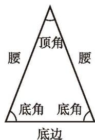
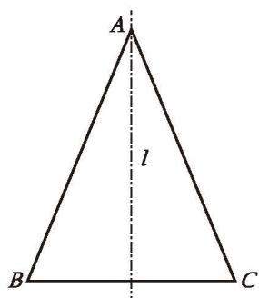
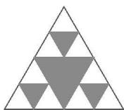
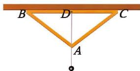

> [!info] 情景引入
> [等腰三角形](课本/【2024版】【北师大版】/【2024版】【北师大版】七年级下册数学/概念/等腰三角形.md)（如图 5-10）是比较常见的图形。你有哪些办法可以得到一个等腰三角形？与同伴进行交流。

> [!question] 思考·交流
>
> | (1) 等腰三角形是轴对称图形吗？如果是，沿它的对称轴折叠，你能发现哪些相等的线段和相等的角？  (2) 等腰三角形的对称轴是一条怎样的直线？你是如何描述的？  (3) 你认为等腰三角形有哪些特征？与同伴进行交流。 |  图 5-10 |
> | :--- | :---: |
>
> > [!success]- [等腰三角形的性质](课本/【2024版】【北师大版】/【2024版】【北师大版】七年级下册数学/概念/等腰三角形的性质.md)
> > 等腰三角形是轴对称图形。  
> > 等腰三角形顶角的平分线、底边上的中线、底边上的高重合（也称“三线合一”），它们所在的直线是等腰三角形的对称轴。  
> > 等腰三角形的两个底角相等。

> [!example]- 例 1
> 已知一个等腰三角形的底角是顶角的 2 倍，求它的各个内角的度数。
> 
> >> [!success]- 解
> >> 设这个等腰三角形顶角的度数为 $x^{\circ}$ ，则底角的度数为 $2x^{\circ}$ 。  
> >> 根据"三角形三个内角的和等于 $180^{\circ}$ "，得
> >> 
> >> $$
> >> \begin{array}{r l} 
> >> x + 2x + 2x & = 180^{\circ} \\ 
> >> 5x & = 180^{\circ} \\
> >> x & = 36^{\circ} \\ 
> >> 2 \times 36 & = 72^{\circ} 
> >> \end{array}
> >> $$
> >> 
> >> 所以，这个三角形的三个内角分别是 $36^{\circ}$ ， $72^{\circ}$ ， $72^{\circ}$ 。

> [!question] 尝试·思考
> 如图 5-11， $\triangle ABC$ 是一个等腰三角形，直线 $l$ 是它的对称轴。请在 $\triangle ABC$ 中画出以直线 $l$ 为对称轴的一组对应点、一组对应线段、一组对应角，你能发现哪些相等的线段、相等的角，以及形状、大小完全相同的图形？
> 
> 

>   
>    
>   
图 5-11

> 

> [!question] 思考·交流
> (1) 等边三角形有几条对称轴？  
> (2) 你能发现它的哪些特征？与同伴进行交流。

---

##### 随堂练习

1. 下面是由大小不同的等边三角形组成的图案，请找出它的对称轴。

  
  
   
  
(第 1 题) &emsp;&emsp;&emsp;&emsp;&emsp;&emsp;&emsp;&emsp;&emsp;&emsp;&emsp;&emsp;&emsp;&emsp;&emsp;&emsp; (第 2 题)

2. 墙上钉了一根木条，李叔叔想用一个如图所示的测平仪检验这根木条是否水平。在这个测平仪中，AB = AC，BC边的中点D处挂了一个重锤。李叔叔将BC边与木条重合，观察此时重垂线是否通过点A。如果重垂线过点A，那么这根木条就是水平的。请说明其中的道理。
