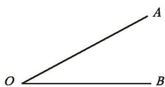
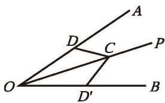
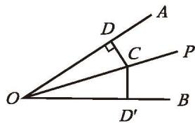
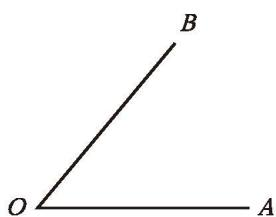
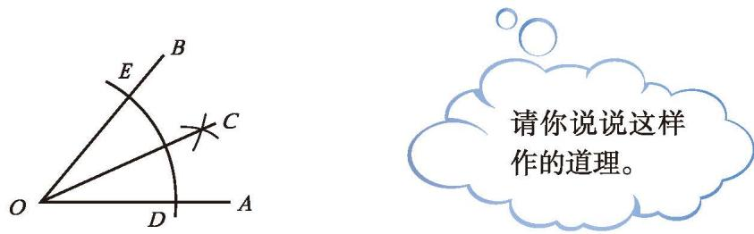
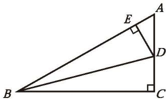

> [!info] 角的引入
> 角（如图 5-17、图 5-18）是生活中常见的图形。角是轴对称图形吗？如果是，请指出它的对称轴。
> 
> 

>   
>   
>    
>   
图 5-17 &emsp;&emsp;&emsp;&emsp;&emsp;&emsp;&emsp;&emsp;&emsp;&emsp;&emsp;&emsp;&emsp;&emsp;&emsp;&emsp; 图 5-18

> 

> [!summary] 角的对称轴
> 角是轴对称图形，角平分线所在的直线是它的对称轴。

---

> [!question] 尝试·思考
> 如图 5-19，OP 是 $\angle AOB$ 的平分线，点 $C$ 是 $OP$ 上的任意一点。在 $\angle AOB$ 的两边上画出以 $OP$ 所在直线为对称轴的一组对应点 $D$ 和 $D'$ ，连接 $CD$ 和 $CD'$ 。  
> (1) 你认为线段 $CD$ 和 $CD'$ 之间有什么关系？说说你的理由。  
> 
> 

>   
>   
>    
>   
图 5-19 &emsp;&emsp;&emsp;&emsp;&emsp;&emsp;&emsp;&emsp;&emsp;&emsp;&emsp;&emsp;&emsp;&emsp;&emsp;&emsp; 图 5-20

> 

> 
> (2) 特别地，当 $CD \perp OA$ 时（如图 5-20）， $CD'$ 与 $OB$ 有怎样的位置关系？为什么？此时，线段 $CD$ 和 $CD'$ 之间还有 (1) 中的关系吗？由此你能得到什么结论？
> 
> >> [!success]- 思考结论
> >> 角平分线上的点到这个角的两边的距离相等。

---

> [!question] 思考·交流
> 如图 5-21，已知 $\angle AOB$ ，如何作出它的平分线？  
> 
> 

>   
>    
>   
图 5-21

> 

> 
> 假设 $\angle AOB$ 的平分线已作出，请回答下列问题：  
> (1) 这条射线有什么特征？  
> (2) 如何确定这条射线上除端点之外的一个点？用三角尺、量角器、圆规等工具试一试。如果只用尺规呢？与同伴进行交流。
> 
> >> [!success]- 提示
> >> 需要确定的点是角的对称轴上的点，因此应当从角两边进行"对称"的操作。

[尺规做题 角平分线](课本/【2024版】【北师大版】/【2024版】【北师大版】七年级下册数学/知识点/尺规做题%20角平分线.md)

> [!example]- 例 3
> 如图 5-22，已知 $\angle AOB$ ，请用尺规作 $\angle AOB$ 的平分线。  
> 
> 作法：  
> 1. 在 $OA$ 和 $OB$ 上分别截取 $OD, OE$ ，使 $OD = OE$（如图 5-22）。  
> 2. 分别以点 $D$ 和点 $E$ 为圆心，以大于 $\frac{1}{2} DE$ 的长为半径作弧，两弧在 $\angle AOB$ 内相交于点 $C$ 。  
> 3. 作射线 $OC$ 。  
> 射线 OC 就是 $\angle AOB$ 的平分线。  
> 
> 

>   
>    
>   
图 5-22

> 

> 
> 请你说说这样作的道理。

---

> [!question] 思考·交流
> 过直线上一点作已知直线的垂线与作一个平角的平分线，这两种尺规作图方法有什么共同点？与同伴进行交流。

> [!summary] 回顾·反思
> 回顾研究等腰三角形、线段、角的过程，你运用了哪些方法？积累了哪些经验？

---

##### 随堂练习

1. 如图， $BD$ 是 Rt $\triangle ABC$ 的一条角平分线， $DE \perp AB$ ，垂足为 $E$ 。你认为 $DE$ 与 $DC$ 相等吗？为什么？  
2. 任意画一个角，用尺规将它四等分。

  
   
  
(第 2 题图)

