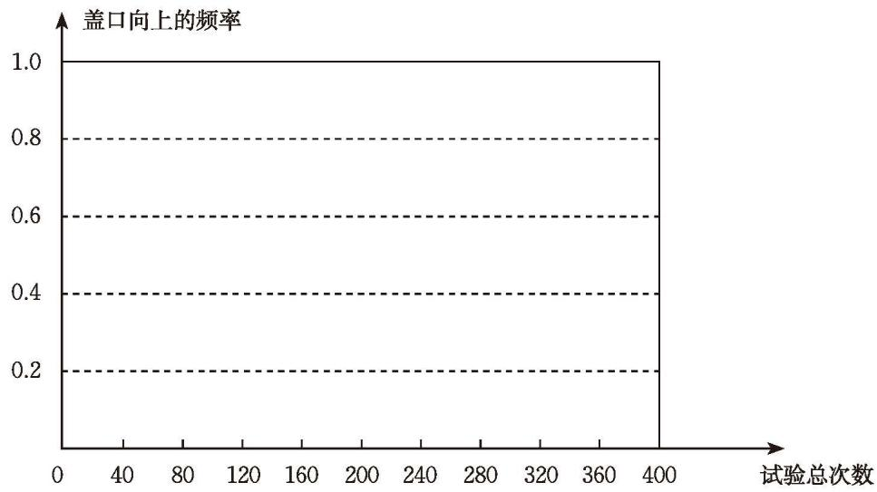

抛一个瓶盖，落地后会出现两种情况（如图 3-2）：

  
  
   
  
盖口向上 &emsp;&emsp;&emsp;&emsp;&emsp;&emsp;&emsp;&emsp; 盖口向下

  
图 3-2

你认为盖口向上和盖口向下的可能性一样大吗？
让我们用试验来验证吧。

> [!question] 操作·思考
> 1. 两人一组做 20 次抛瓶盖的试验，并将数据记录在下表中。
> 
> | 试验项目 | 记录数据 |
| :--- | :--- |
> | 试验总次数 | |
> | 盖口向上的次数 | |
> | 盖口向下的次数 | |
> | 盖口向上的频率（$\frac{\text{盖口向上的次数}}{\text{试验总次数}}$） | |
> | 盖口向下的频率（$\frac{\text{盖口向下的次数}}{\text{试验总次数}}$） | |
> 
>>[!tip] 在 $n$ 次重复试验中，事件 $A$ 发生了 $m$ 次，则比值 $\frac{m}{n}$ 称为事件 $A$ 发生的[频率](课本/【2024版】【北师大版】/【2024版】【北师大版】七年级下册数学/概念/频率.md)。
> 
> 2. 累计全班同学的试验结果，并将试验数据汇总填入下表。
> 
> | 试验总次数 $n$ | 40 | 80 | 120 | 160 | 200 | 240 | 280 | 320 | 360 | 400 |
| :---: | :---: | :---: | :---: | :---: | :---: | :---: | :---: | :---: | :---: | :---: |
| 盖口向上的次数 $m$ | | | | | | | | | | |
| 盖口向上的频率 $\frac{m}{n}$ | | | | | | | | | | |
> 
> 3. 根据表格，完成图 3-3 的折线统计图。
> 
> 

>   
>    
>   
图 3-3

> 

> 
> 4. 观察图 3-3 的折线统计图，盖口向上的频率的变化有什么规律？
> 
>> [!success]- 思考结论
>> 在试验次数很大时，盖口向上的频率都会在一个常数附近摆动，即盖口向上的频率具有稳定性。

---

##### 随堂练习

1. (1) 在刚才的抛瓶盖试验中，累计全班同学的试验结果，并将试验数据汇总填入下表。

| 试验总次数 $n$ | 40 | 80 | 120 | 160 | 200 | 240 | 280 | 320 | 360 | 400 |
| :---: | :---: | :---: | :---: | :---: | :---: | :---: | :---: | :---: | :---: | :---: |
| 盖口向下的次数 $m$ | | | | | | | | | | |
| 盖口向下的频率 $\frac{m}{n}$ | | | | | | | | | | |

(2) 根据上表，请你画出盖口向下的频率的折线统计图。由此，你发现盖口向下的频率的变化有什么规律？