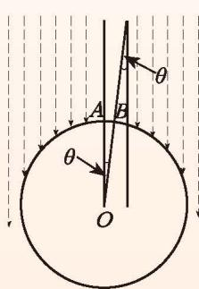

### 测量地球的周长
你听说过“坐地日行八万里”吗？这句话告诉我们地球的周长大约是 8 万里。可人们是怎么知道这个数据的呢？

大约在公元前 200 年，古希腊人埃拉托色尼（Eratosthenes，约前 276—前 194）就运用一些天文知识和数学知识，测得了地球的周长。他用的数学知识你们也知道，其中包括：**两条平行直线被第三条直线所截，内错角相等**。

  

    埃拉托色尼发现，在当时的城市塞恩（图 2-33 中的 $A$ 点），直立的杆子在某个时刻没有影子，而此时在 500 英里以外的亚历山大（图中的 $B$ 点），直立的杆子却偏离太阳光线 $7^{\circ}12'$ （图中 $\angle\theta=7^{\circ}12'$ ）。根据这个数据，可以算出地球的周长约等于 25 000 英里，这是因为“弧 $AB$ 的长 $\div 7^{\circ}12' = $ 地球周长 $\div 360^{\circ}$ ”的缘故，其中弧 $AB$ 的长大约为 500 英里。
  

  

    
    
图 2-33

  

由于 1 英里约为 $1.6\text{ km}$，所以，地球的周长约为 $40\text{ 000 km} = 80\text{ 000}$ 里。
