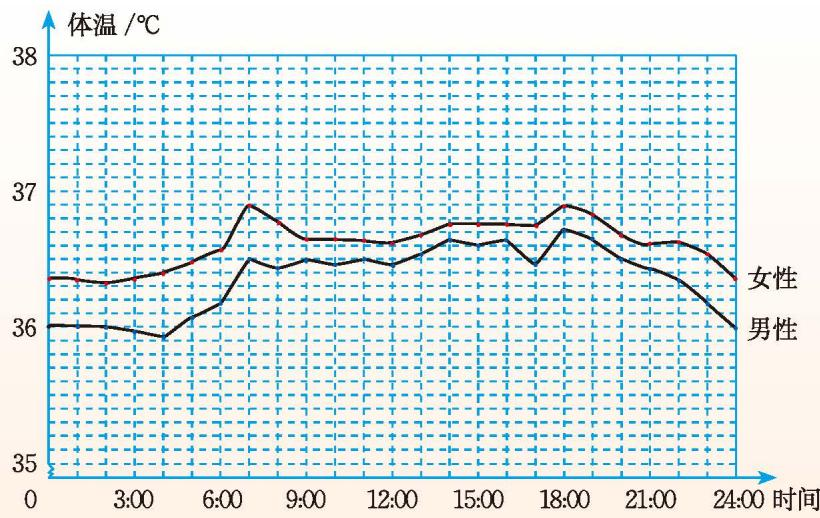

##### 阅读·欣赏

##### 人的体温的变化

我们知道，人的正常体温是 $36.5^{\circ} \mathrm{C}$ 左右，这是一个很粗略的说法。

你知道人的体温是随着时间的变化而变化的吗？一天之中，在 2:00 到 6:00 之间，人的体温最低；在 17:00 到 20:00 之间，人的体温最高。在正常情况下，人体温度变化的幅度大约是 $0.6^{\circ}$ C。如果变化幅度超过 $1^{\circ}$ C，那可就要考虑是否生病了。

另外，人的体温还存在一定的性别差异，女性的体温比男性的要稍微高一些。

读一读图 6-11，它可以帮助你更好地了解人的正常体温的变化情况。

  
   
  图 6-11

