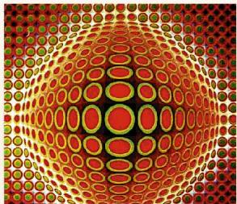

#### 艺术作品中的对称

法国画家维克托·瓦萨雷利（Victor Vasarely，1908—1997）于 1969 年创作了《委加·派尔》（如图 5-8），画中仅仅用了"圆"形图案，就形成了一幅动态的轴对称图形！

|                                                                                                                             |                                                                                                                             |
| :-------------------------------------------------------------------------------------------------------------------------: | :-------------------------------------------------------------------------------------------------------------------------: |
|  |  |
|                                                            图5-8                                                             |                                                            图5-9                                                             |

在我国，大量的剪纸作品都具有轴对称的特点（如图 5-9）。

实际上，在从古至今的艺术创作中，很多艺术家都会运用轴对称的手法。请你查阅资料，了解更多艺术作品中的轴对称。