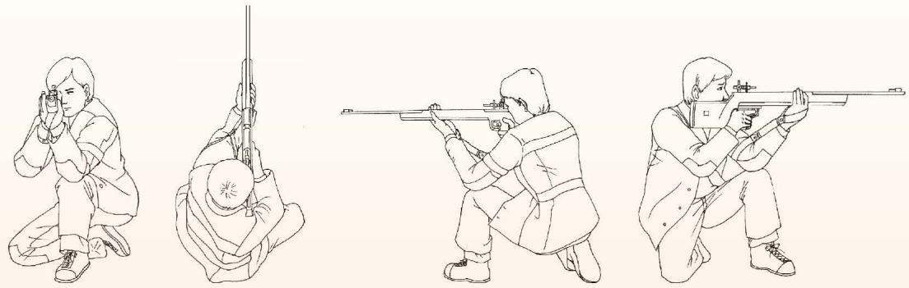

##### 阅读·欣赏

##### 跪姿射击的稳定性

图 4-25 是跪姿射击的情形。

  
   
  
图 4-25

我们可以看到，跪姿射击的动作构成了三个三角形。

1. 由右脚尖、右膝、左脚构成的三角形支撑面，它可以使射击者在射击过程中保持稳定。当然，射击者的体型不同，他所选择的支撑面形状也可能不同。

2. 由左手、左肘、左肩构成的托枪三角形，以及由左手、左肩、right肩构成的近乎水平的三角形。这两个三角形可以使射击者在射击过程中保持枪的稳定。

正是这样三个三角形，使射击者保持了姿势的稳定和枪的稳定。当然，要想射击准确，好的射姿只是一个方面，除此之外，射击者的技术水平、心理素质等也都是极为重要的因素。