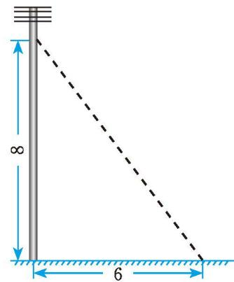

## 1 探索勾股定理

> [!info] 情景引入
> 如图 1-1，从电线杆离地面 8 m 处向地面拉一条钢索，如果这条钢索在地面的固定点距离电线杆底部 6 m，那么需要多长的钢索？
> 
> 

>   
>    
>   
图 1-1

> 

在直角三角形中，任意两条边确定了，第三条边也就随之确定，三条边之间存在着一种特定的数量关系。事实上，古人发现，直角三角形的三条边长度的平方之间存在一种特殊的关系。让我们一起探索吧！
[发现勾股定理](课本/【2024版】【北师大版】/【2024版】【北师大版】八年级上册数学/知识点/发现勾股定理.md)

---
> [!info] 情景引入
> 在上一课，我们通过测量和数格子的方法发现了勾股定理。如图1-4，分别以直角三角形的三条边（ $a < b$ ）为边向外作正方形，你能利用这个图说明勾股定理的正确性吗？你是如何说明的？与同伴进行交流。
> 
> 

>   
>    
>   
图 1-4

> 

[验证勾股定理](课本/【2024版】【北师大版】/【2024版】【北师大版】八年级上册数学/知识点/验证勾股定理.md)

---

[阅读·思考 漫话勾股世界](课本/【2024版】【北师大版】/【2024版】【北师大版】八年级上册数学/趣味阅读/阅读·思考%20漫话勾股世界.md)

---

[习题1.1](课本/【2024版】【北师大版】/【2024版】【北师大版】八年级上册数学/习题/习题1.1%20探索勾股定理.md)