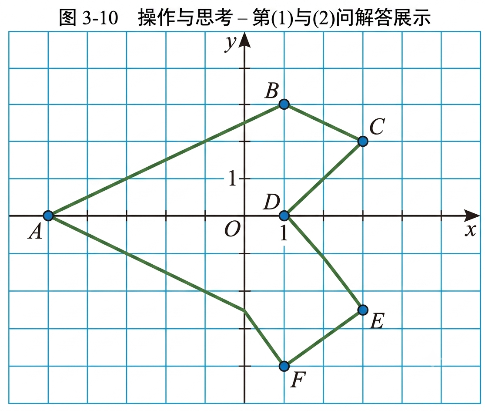

> [!info] 情景引入
> 图 3-4 呈现了北京市部分景点的大致位置，小亮和来访的朋友位于卢沟桥，小亮如何向来访的朋友介绍图中各个景点的位置呢？
> 
> 

>   
>    
>   
图3-4

> 

> 
> > [!success]- 答
> > 我们可以通过建立相对位置定位系统来解决。以小亮和朋友所在的**卢沟桥**作为观测中心（即参照物），利用“**方向**”和“**距离**”这两个数据，就能把其他各个景点的位置清晰地介绍给朋友。
> > 
> > > [!success]- 模拟介绍示例
> > > * **颐和园**：位于卢沟桥的北偏东大约 $18^{\circ}$ 方向，距离卢沟桥约 $18\text{ km}$ 处。
> > > * **故宫**：位于卢沟桥的东偏北大约 $15^{\circ}$ 方向，距离卢沟桥约 $15\text{ km}$ 处。
> > > * **天坛**：位于卢沟桥的东偏北大约 $5^{\circ}$ 方向，距离卢沟桥约 $14\text{ km}$ 处。

> [!question] 尝试·思考
> (1) 如图 3-5, 小亮在景点图上画上了方格, 标上数字, 并用 (0, 0) 表示卢沟桥的位置, 用 (11, 4) 表示天安门广场的位置, 那么北京奥林匹克公园的位置应如何表示？（5，12）表示哪个景点的位置？（6，5）呢？
> 
> 

>   
>    
>   
图 3-5

> 

> 
> > [!success]- 答
> > 这种利用一对有顺序的数字来确定位置的方法叫作数对定位。其中第一个数字表示水平方向的格数，第二个数字表示竖直方向的格数。
> >  * **北京奥林匹克公园的位置**：从原点 $(0, 0)$ 卢沟桥出发，向右数 11 个格，向上数 16 个格，因此应表示为 **$(11, 16)$**。
> >  * **$(5, 12)$ 表示的景点**：从原点向右 5 格，向上 12 格，对应的是**颐和园**。
> >  * **$(6, 5)$ 表示的景点**：从原点向右 6 格，向上 5 格，对应的是**大观园**。
> 
> (2) 如图 3-6, 如果小亮和他的朋友位于天安门广场, 并用 (0, 0) 表示天安门广场的位置, 那么你能分别表示北京奥林匹克公园、卢沟桥的位置吗?
> 
> 

>   
>    
>   
图 3-6

> 

> 
> >[!success]- 答
> >当基准点（原点）改变为天安门广场时，所有景点的相对位置数对也会发生改变：
> >* **北京奥林匹克公园的位置**：由于奥林匹克公园在天安门广场的垂直正上方 12 个格处（水平方向相同），因此表示为 **$(0, 12)$**。
> >* **卢沟桥的位置**：由于卢沟桥在天安门广场的向左 11 个格、向下 4 个格处，因此表示为 **$(-11, -4)$**。

在平面内，两条互相垂直且有公共原点的数轴组成[平面直角坐标系](课本/【2024版】【北师大版】/【2024版】【北师大版】八年级上册数学/概念/平面直角坐标系.md)（rectangular plane coordinates system）。通常，两条数轴分别置于水平位置与竖直位置，取向右与向上的方向分别为两条数轴的正方向。水平的数轴称为 $x$ 轴或横轴，竖直的数轴称为 $y$ 轴或纵轴， $x$ 轴和 $y$ 轴统称坐标轴，它们的公共原点 $O$ 称为平面直角坐标系的原点。

建立了平面直角坐标系，平面内的点就可以用一组有序实数对来表示了。

如图 3-7, 对于平面内任意一点 $P$ , 过点 $P$ 分别向 $x$ 轴、 $y$ 轴作垂线, 垂足在 $x$ 轴、 $y$ 轴上对应的数 $a$ , $b$ 分别称为点 $P$ 的横坐标、纵坐标, 有序实数对 $(a, b)$ 称为点 $P$ 的[坐标](课本/【2024版】【北师大版】/【2024版】【北师大版】八年级上册数学/概念/坐标.md)。

  

    
    
图 3-7

  

  

    
    
图 3-8

  

如图 3-8，在平面直角坐标系中，两条坐标轴将坐标平面分成了四部分。右上方的部分称为第一象限，其他三部分按逆时针方向依次称为第二象限、第三象限和第四象限。坐标轴上的点不在任何一个[象限](课本/【2024版】【北师大版】/【2024版】【北师大版】八年级上册数学/概念/象限.md)内。

> [!example]- **例1** 写出图 3-9 中的多边形 $ABCDEF$ 各个顶点的坐标。
>
> 

>   
>    
>   图3-9
> 

>
> > [!success]- 解
> > 如图3-9，各个顶点的坐标分别是 $A(-2,0), B(0,-3), C(3,-3), D(4,0), E(3,3), F(0,3)$ 。

> [!question] 操作·思考
> (1) 在图 3-10 所示的平面直角坐标系中, 描出下列各点:  
> $A(-5,0), \quad B(1,4), \quad C(3,3), \quad D(1,0), \quad E(3, -3), \quad F(1, -4)$  
> 
> (2) 依次连接 $A, B, C, D, E, F, A$ ，你得到什么图形？  
> 
> (3) 在平面直角坐标系中, 点与有序实数对之间有何关系?
> 
> 

>   
>    
>   
图 3-10

> 

> 
> > [!success]- 答
> > **向右飞翔的“小燕子”**（或小风筝、飞镖、箭头）。
> > 

> >   
> > 

> 
> > [!abstract]- [点与坐标的一一对应](课本/【2024版】【北师大版】/【2024版】【北师大版】八年级上册数学/概念/点与坐标的一一对应.md)
> > 在平面直角坐标系中，对于平面上的任意一点，都有唯一的一个有序实数对（即点的坐标）与它对应；反过来，对于任意一个有序实数对，都有平面上唯一的一点与它对应。

---

#### 随堂练习

1. 右面是某学校的示意图，以办公楼所在位置为原点，以图中小方格的边长为单位长度，建立平面直角坐标系。  
(1) 请写出教学楼、实验楼、图书馆的坐标；  
(2) 学校准备在 $(-3, -3)$ 处建一栋学生公寓，请你标出学生公寓的位置。

(第1题)