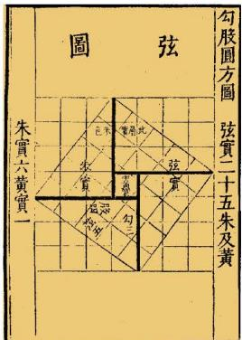

在上一课，我们通过测量和数格子的方法发现了勾股定理。如图1-4，分别以直角三角形的三条边（ $a < b$ ）为边向外作正方形，你能利用这个图说明勾股定理的正确性吗？你是如何说明的？与同伴进行交流。

  
   
  图 1-4

> [!question] 尝试·思考
> 为了计算图 1-4 中大正方形的面积，小明对这个大正方形适当割补后，分别得到图 1-5、图 1-6。
>
> 

>   <table><tr>
>     <td align="center">
>        
>       图1-5
>     </td>
>     <td align="center">
>        
>       图1-6
>     </td>
>   </tr></table>
> 

> 
> (1) 将所有三角形的面积和正方形的面积用含 $a, b, c$ 的式子表示出来。
> (2) 图 1-5、图 1-6 中正方形 $ABCD$ 的面积分别是多少? 你有哪些表示方式?
> (3) 你能分别利用图 1-5、图 1-6 验证勾股定理吗?

勾股定理在我国有着悠久的历史。汉末三国初数学家、天文学家赵爽（3世纪初）在给《周髀》作注时，给出了相对完整的表述："勾、股各自乘，并之为弦实。开方除之，即弦。"他利用"勾股圆方图"直观地论证了勾股定理。后人通常把图1-7称为"赵爽弦图"，2002年国际数学家大会会标的主要图案（如图1-8）就取材于此图。

  <table>
    <tr>
      <td align="center" style="vertical-align: bottom;">
        
      </td>
      <td align="center" style="vertical-align: bottom;">
        
      </td>
    </tr>
    <tr>
      <td align="center">图 1-7</td>
      <td align="center">图 1-8</td>
    </tr>
  </table>

> [!example]- **例**
> 在一次军事演习中，红方侦察员王叔叔在距离一条东西向公路 $400 \mathrm{~m}$ 处侦察，发现一辆蓝方汽车在这条公路上疾驶。他用红外测距仪测得汽车与他相距 $400 \mathrm{~m}$ ；过了 $10 \mathrm{~s}$ ，测得汽车与他相距 $500 \mathrm{~m}$ 。你能帮王叔叔计算蓝方汽车这 $10 \mathrm{~s}$ 的平均速度吗？
>
> > [!tip]- 分析
> > 你能根据题意画出图形吗？在你画的图形中存在一个怎样的三角形？
>
> > [!success]- 解
> >  

> >   
> >    
> >   图 1-9
> > 

> > 
> > 根据题意, 可以画出图 1-9, 其中点 $A$ 表示王叔叔所在位置, 点 $C$ , 点 $B$ 表示两个时刻蓝方汽车的位置。由于王叔叔距离公路 $400 \mathrm{~m}$ , 因此 $\angle C$ 是直角。由勾股定理, 可得
> >
> > $$
> > AB^2 = BC^2 + AC^2,
> > $$
> > 也就是
> >
> > $$
> > 500^2 = BC^2 + 400^2 \text { 。}
> > $$
> > 所以 $BC = 300\ \mathrm{m}$ 。
> >
> > 蓝方汽车 10 s 行驶了 300 m，那么它平均每秒行驶
> >
> > $$
> > 300 \div 10 = 30\ (\mathrm{m}) 。
> > $$
> > 因此，蓝方汽车这 10 s 的平均速度为 30 m/s。

> [!question] 思考·交流
> 如果一个三角形是钝角三角形或锐角三角形，那么它的三边长仍然满足"最长边长的平方等于另外两边长的平方和"吗？以图1-10为例（方格纸中每个小方格的边长均为1），说说你的判断和理由，并与同伴进行交流。
> 
> 

>   
>    
>   
图1-10

> 

也可以用数学软件验证你的判断。

#### 随堂练习

1. 右图是某沿江地区交通平面图的一部分（单位：km），为了加快经济发展，该地区拟修建一条连接 M, O, Q 三城市的沿江高速公路，已知沿江高速公路的建设成本是 5000 万元/km，该沿江高速公路的建设成本预计是多少？

  
   
  (第1题)

