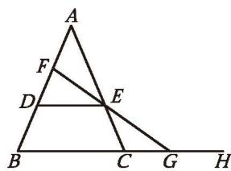
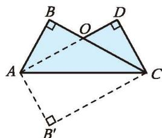
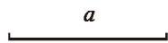
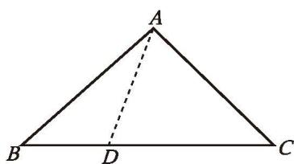
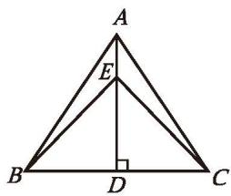
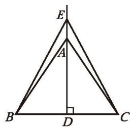
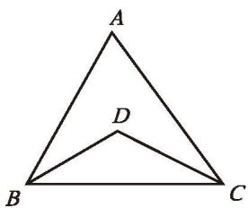
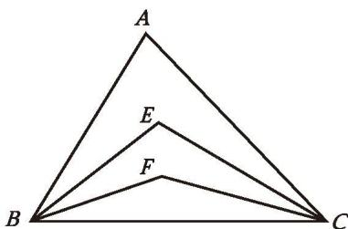
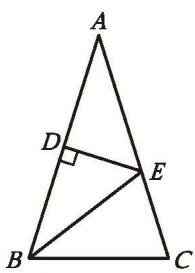
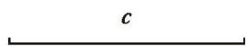

### 三角形的证明及其应用 复习题

###### 知识技能

1. 如图，在 $\triangle ABC$ 中，点 $D$、$E$ 分别在边 $AB$ 和 $AC$ 上，$DE \parallel BC$ ，$\angle A = 56^{\circ}$ ，$\angle C = 69^{\circ}$ ，$\angle DBE = 30^{\circ}$ ，求 $\angle BED$ 的度数。

(第1题)

2. 分别确定一般三角形、四边形、五边形、六边形……的内角和，以及正三角形、正四边形、正五边形、正六边形……每个内角的度数，并填入下表。

| 边数 | 3 | 4 | 5 | 6 | ... |
|:---:|:---:|:---:|:---:|:---:|:---:|
| 多边形的内角和 | | | | | |
| 正多边形每个内角的度数 | | | | | |

3. 过多边形某个顶点的所有对角线，将这个多边形分成7个三角形，这个多边形是几边形？

4. 已知：如图，在 $\triangle ABC$ 中，$AB = AC$ ，点 $D$、$E$ 分别在边 $AC$ 和 $AB$ 上，且 $\angle ABD = \angle ACE$ ，$BD$ 与 $CE$ 相交于点 $O$ 。求证：
   (1) $OB = OC$ ;
   (2) $BE = CD$ 。

(第4题)

(第5题)

5. 已知：如图，BD，CE 是 $\triangle ABC$ 的高，且 BD = CE。
   求证：$\triangle ABC$ 是等腰三角形。

6. 已知：如图，在 $\triangle ABC$ 中，点 $D$、$E$ 分别在边 $AB$ 和 $AC$ 上，$DE \parallel BC$ ，$F$ 是线段 $AD$ 上的一点，$FE$ 的延长线交 $BC$ 的延长线于点 $G$ 。
   求证：$\angle EGH > \angle ADE$ 。

(第6题)

(第7题)

7. 把长方形纸片 $AB'CD$ 沿对角线 AC 折叠，得到如图所示的图形，已知 $\angle BAO = 30^{\circ}$ ，求 $\angle AOC$ 和 $\angle BAC$ 的度数。

8. 在 $\triangle ABC$ 中，已知 $\angle A,\ \angle B,\ \angle C$ 的度数之比是 $1:2:3$ ，$AB = \sqrt{3}$ ，求 $AC$ 的长。

9. 已知：如图，$AN \perp OB$ ，$BM \perp OA$ ，垂足分别为 N, M，OM = ON，BM 与 AN 相交于点 P。
   求证：PM = PN。

(第9题)

10. 如图，已知线段 $a$ ，用尺规作底边等于 $a$ 、高等于 $2a$ 的等腰三角形。

(第10题)

###### 数学理解

11. 如图，$\triangle ABC$ 的高 $BD$ 与 $CE$ 相交于点 $O$ ，$OD = OE$ ，$AO$ 的延长线交 $BC$ 于点 $M$ 。
    (1) 从图中找出几对全等直角三角形，并给出证明。
    (2) 求证：$\triangle ABC$ 是等腰三角形。

(第11题)

(第12题)

12. 已知：如图，在 $\triangle ABC$ 中，$BC > AC$ 。
    求证：$\angle BAC > \angle B$ 。
    
    证明：由 $BC > AC$ ，可在 $BC$ 边上截取 $CD = AC$ ，连接 $AD$ 。……
    
    请你完成证明过程。

13. 在 $\triangle ABC$ 中，$AB = AC$ ，$AD \perp BC$ ，垂足为 $D$ 。
    (1) 如图 (1)，点 $E$ 在线段 $AD$ 上，连接 $BE$ 、$CE$ 。请找出图中所有相等的角，并说明理由。
    (2) 如图 (2)，点 $E$ 在线段 $DA$ 的延长线上，连接 $BE$ 、$CE$ 。请找出图中所有相等的线段、相等的角，并说明理由。
    (3) 你还可以提出哪些问题？

(1)

(第13题) (2)

14. 如图，在 $\triangle ABC$ 中，$\angle C = 90^{\circ}$ ，$\angle A = 30^{\circ}$ ，$AB$ 的垂直平分线分别交 $AB$ 、$AC$ 于点 $D$ 、$E$ 。求证：$AE = 2CE$ 。

(第14题)

(第15题)

15. 如图，在四边形 $BCDE$ 中，$\angle C = \angle BED = 90^{\circ}$ ，$\angle B = 60^{\circ}$ ，延长 $CD$ 、$BE$ ，两线相交于点 $A$ 。已知 $CD = 2$ ，$DE = 1$ ，求 Rt $\triangle ABC$ 的面积。

16. 如图，已知 $\angle ACB = \angle BDA = 90^{\circ}$ ，要使 $\triangle ACB \cong \triangle BDA$ ，还需要添加什么条件？请你选择其中一个加以证明。

17. 求证：等腰三角形的底角必为锐角。

(第16题)

18. 如图，在 $\triangle ABC$ 中，$\angle B = 64^{\circ}$ ，$\angle BAC = 72^{\circ}$ ，$D$ 为边 $BC$ 上的一点，$DE$ 交 $AC$ 于点 $F$ ，且 $AB = AD = DE$ ，连接 $AE$ ，$\angle E = 55^{\circ}$ 。请判断 $\triangle AFD$ 的形状，并说明理由。

(第18题)

###### 问题解决

19. (1) 如图 (1)，在 $\triangle ABC$ 中，$BD$ 平分 $\angle ABC$ ，$CD$ 平分 $\angle ACB$ ，试确定 $\angle A$ 和 $\angle D$ 的数量关系；
    (2) 如图 (2)，在 $\triangle ABC$ 中，$BE$ 平分 $\angle ABC$ ，$CE$ 平分外角 $\angle ACM$ ，试确定 $\angle A$ 和 $\angle E$ 的数量关系；
    (3) 如图 (3)，在 $\triangle ABC$ 中，$BF$ 平分外角 $\angle CBP$ ，$CF$ 平分外角 $\angle BCQ$ ，试确定 $\angle A$ 和 $\angle F$ 的数量关系。

(1)

(第19题) (2)

(3)

※20. 如图，在 $\triangle ABC$ 中，$BE$ 和 $BF$ 三等分 $\angle ABC$ ，$CE$ 和 $CF$ 三等分 $\angle ACB$ ，$\angle A = 75^{\circ}$ 。求 $\angle BEC$ 和 $\angle BFC$ 的度数。

(第20题)

21. 如图，在 $\triangle ABC$ 中，$AB = AC$ ，$AB$ 的垂直平分线交 $AB$ 于点 $D$ ，交 $AC$ 于点 $E$ 。已知 $\triangle BCE$ 的周长为 8，$AC - BC = 2$ ，求 $AB$ 和 $BC$ 的长。

22. 如图，在等边三角形 $ABC$ 的三边上分别取点 $D,\ E,\ F$ ，使 $AD = BE = CF$ 。试判定 $\triangle DEF$ 的形状，并说明理由。

(第21题)

(第22题)

(第23题)

23. 一块菜地的形状如图所示，其中 $BD = 3\ \mathrm{m}$ ，$CD = 4\ \mathrm{m}$ ，$AB = 12\ \mathrm{m}$ ，$AC = 13\ \mathrm{m}$ ，且 $BD \perp CD$ 。求这块菜地的面积。

24. 已知等腰三角形的底边和腰的长分别为 6 和 5，求这个等腰三角形的面积。

25. 回忆研究三角形内角和的过程与方法，你有哪些心得体会？撰写一篇小短文，并在班级内分享。

###### 联系拓广

26. 如图，已知线段 $c$ ，用尺规作等腰直角三角形，使它的斜边等于 $c$ 。

(第26题)

27. 两边分别相等且其中一组等边的对角（对角是钝角）相等的两个三角形全等吗？如果不全等，请举一反例；如果全等，请加以证明。

28. 已知：$a,\ b,\ c$ 是三角形的三边，且满足 $(a + b + c)^{2} = 3(a^{2} + b^{2} + c^{2})$ 。求证：这个三角形是等边三角形。

---
