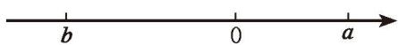

### 不等式与不等式组 复习题

##### #

##### > 知识技能

1. 在不等式 $ax + b > 0$ 中, $a, b$ 是常数, 且 $a \neq 0$ 。当 $\underline{\hspace{2cm}}$ 时, 不等式的解集是 $x > -\frac{b}{a}$ ; 当 $\underline{\hspace{2cm}}$ 时, 不等式的解集是 $x < -\frac{b}{a}$ 。

2. 解下列不等式，并把它们的解集分别表示在数轴上：  
(1) $2x + 3 < -1$ ; (2) $-2x + 1 < x + 4$ ;  
(3) $2(-3 + x) - 3(x + 2) < 0$ ; (4) $\frac{x}{2} \geqslant 1 + \frac{x - 1}{3}$ ;  
(5) $\frac{2x + 1}{3} \leqslant -\frac{x + 5}{2}$ ;  
(6) $x+\frac{x}{2}+\frac{x}{3}>11;$  
(7) $\frac{7x + 5}{7} - 2 > 2(x + 1)$ ;

$$
\frac {1 + 2 x}{4} - \frac {1 - 3 x}{10} > - \frac {1}{5} 。 \tag {8}
$$

3. 根据下列条件分别列不等式（组）:  
(1) $x+1$ 是负数；  
(2) x 的 2 倍与 -3 的差小于零;  
(3) $a$ 的 5 倍与 3 的差不小于 10，且不大于 20。

4. 解下列不等式组，并把它们的解集分别表示在数轴上：  
(1) $-5 < 2x + 1 < 6$ ; (2) $-2 < 1 - \frac{1}{5} x < \frac{3}{5}$ ;  
(3) $\left\{ \begin{array}{l} 8x + 5 > 9x + 6, \\ 2x - 1 < 7; \end{array} \right.$ (4) $\left\{ \begin{array}{l} 2x + 3 \leqslant 5, \\ 3x - 2 \geqslant 4. \end{array} \right.$

5. 已知函数 $y = 3x + 5$ 。  
(1) 当 $x$ 取哪些值时, $y > 0$ ? (2) 当 $x$ 取什么值时, $y = 0$ ? (3) 当 $x$ 取哪些值时, $y < 0$ ?

6. 求不等式 $5(x - 2) \leqslant 28 + 2x$ 的正整数解。

7. 解下列不等式组:  
(1) $\left\{ \begin{array}{l} \frac{2x - 1}{3} - \frac{5x + 1}{2} \leqslant 1, \\ 5x - 1 < 3(x + 1); \end{array} \right.$ (2) $\left\{ \begin{array}{l} 2x - 7 < 3(x - 1), \\ \frac{4}{3} x + 3 \geqslant 1 - \frac{2}{3} x_{.} \end{array} \right.$

##### 数学理解

8. 判断正误:  
(1) 由 $2a > 3$ ，得 $a > \frac{3}{2}$ ;  
(2) 由 $2 - a < 0$ ，得 $2 < a$ ;  
(3) 由 a < b，得 2a < 2b；  
(4) 由 a > b，得 $a + m > b + m$ ; ()  
(5) 由 a > b，得 -3a > -3b；  
(6) 由 $-\frac{1}{2} > -1$ ，得 $-\frac{a}{2} > -a$ 。 （）

9. $a, b$ 两个实数在数轴上的对应点如图所示:

(第9题)

用“<”或“>”填空：  
(1) $a$ \_\_\_\_ $b$ ; (2) $|a|$ \_\_\_\_ $|b|$ ;  
(3) $a + b$ 0; (4) $a - b$ 0;  
(5) $a + b$ \_\_\_\_ $a - b$ ; (6) $ab$ \_\_\_\_ $a$ 。

&emsp;※10. 已知不等式组 $\left\{\begin{array}{l} x+8<4x-1, \\ x>m \end{array}\right.$ 的解集是 x>3，求 m 的取值范围。

&emsp;※11. 设 a > b > 0，用“<”“>”填空：  
(1) $b - a \_\_ 0;$ (2) $a^2 - b^2 \_\_ 0;$  
(3) $\sqrt{a} - \sqrt{b}$ \_\_\_\_ 0。

##### 问题解决

12. 暑假期间，两位老师计划带领若干名学生外出参加社会实践活动，他们联系了报价均为每人500元的甲、乙两家旅行社。经协商，甲旅行社的优惠条件是：两位老师全额收费，学生都按七折收费。乙旅行社的优惠条件是：老师、学生都按八折收费。他们选择哪家旅行社支付的费用较少？

13. 某大型超市从生产基地购进一批水果，运输过程中质量损失 5%，假设不计超市其他费用。  
(1) 如果超市在进价的基础上提高 $5 \%$ 作为售价, 那么请你通过计算说明超市是否亏本;  
(2) 如果超市至少要获得 $20\%$ 的利润, 那么这批水果的售价最低应提高百分之几 (结果精确到 $0.1\%$ ) ?

14. 已知关于 $x$ 的方程 $3 x + a = x - 7$ 的根是正数, 求实数 $a$ 的取值范围。

15. 某工厂要生产 A, B 两种零件共 150 个, A, B 两种零件的生产成本分别为 $1500$ 元 / 个和 $3000$ 元 / 个。现要求 B 种零件个数不少于 A 种零件个数的 2 倍, 那么生产 A 种零件多少个时, 可使生产成本最少?

16. 通过本章的学习，你对一元一次方程、[一元一次不等式](../概念/一元一次不等式.md)、一次函数之间的关系有什么感悟？请以此为主题结合实例写一篇小短文。

17. (1) 用“<”“>”或“=”填空:

$5^{2} + 3^{2}$ \_\_\_\_ $2 \times 5 \times 3$ ;

$3^{2} + 3^{2}$ \_\_\_\_ $2 \times 3 \times 3$ ;

$(-3)^{2} + 2^{2}$ \_\_\_\_ $2\times (-3)\times 2;$

$(-4)^{2} + (-4)^{2}$ 2×(-4)×(-4)。  
(2) 观察 (1) 中各式, 你能发现它们有什么规律吗? 请用一个含有字母 $a, b$ 的式子表示上述规律。

&emsp;※（3）运用所学的知识说明你在（2）中发现的规律的正确性。

18. 已知不等式组

$$
\left\{ \begin{array}{l} 2 x - a <   1, \\ x - 2 b > 3 \end{array} \right.
$$

的解集是 $-1 < x < 1$ ，则 $(a + 1)(b - 1)$ 的值等于多少？

19. 你知道不等号的由来吗？请查阅资料，写一篇小短文介绍你了解到的信息。
