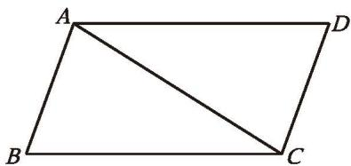
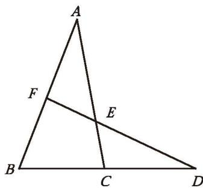
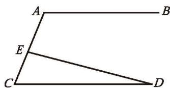
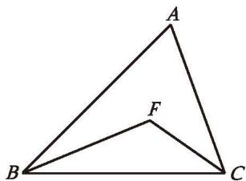
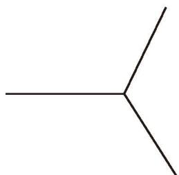
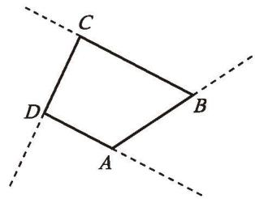
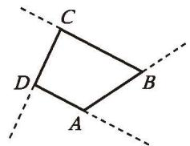
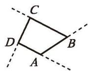
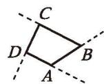
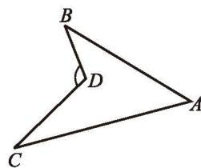

##### 习题 1.1

###### 知识技能

1. 在 $\triangle ABC$ 中，已知 $\angle A$、$\angle B$、$\angle C$ 的度数之比为 $4:3:2$，求 $\angle A$、$\angle B$ 和 $\angle C$ 的度数。

2. 如图，在 $\triangle ABC$ 和 $\triangle CDA$ 中，$AB \parallel CD$ ，$\angle B = \angle D$ ，$AB = 3$ ，求 $CD$ 的长。

(第2题)

(第3题)

3. 如图，$\angle ACD$ 是 $\triangle ABC$ 的一个外角，过点 $D$ 的直线分别交 $AC$ 和 $AB$ 于点 $E$、$F$ 。下列哪个结论一定不正确？
   (1) $\angle B > \angle ACD$ ;
   (2) $\angle B + \angle ACB = 180^{\circ} - \angle A$ ;
   (3) $\angle B + \angle ACB < 180^{\circ}$ ;
   (4) $\angle FEC > \angle B$ 。

4. 已知：如图，D 是 $\triangle ABC$ 的边 BC 上的一点，$\angle DAC = \angle B$ 。
   求证：$\angle ADC = \angle BAC$ 。

(第4题)

5. 过某个多边形一个顶点的所有对角线，将这个多边形分成 5 个三角形。这个多边形是几边形？它的内角和是多少？

6. 一个多边形的内角和等于 $1080^{\circ}$ ，它是几边形？

7. 一个多边形的每个外角都等于与它相邻的内角，这个多边形是几边形？它的每个外角等于多少度？

8. 是否存在一个多边形，它的每个外角都等于相邻内角的 $\frac{1}{5}$ ？简述你的理由。

9. 若两个多边形的边数相差 1，则它们的内角和、外角和分别有什么异同？

###### 数学理解

10. 已知：如图，在 Rt $\triangle ABC$ 中，$\angle ACB = 90^{\circ}$ ，$CD \perp AB$ ，垂足为 D。
    求证：$\angle A = \angle DCB$ 。

(第10题)

(第11题)

11. 已知：如图，$AB \parallel CD$ ，点 E 在 AC 上。求证：$\angle A = \angle CED + \angle D$ 。

12. 如图，在 $\triangle ABC$ 中，$BF$ 平分 $\angle ABC$ ，$CF$ 平分 $\angle ACB$ ，$\angle A = 65^{\circ}$ ，求 $\angle F$ 的度数。

(第12题)

(第13题)

13. 图中所示的是由三个完全相同的正多边形拼成的无缝隙、不重叠的图形的一部分。
    (1) 这种正多边形是几边形？为什么？
    (2) 你能借助这种正多边形拼一个漂亮的图案吗？画出你拼成的图案。

14. 下图中的四边形是同一个四边形不断缩小（保持形状不变）的结果。

(第14题)

(1)

(1) 在图中标出各个四边形的外角。
(2) 在缩小的过程中，四边形对应的各个外角的大小是否发生了变化？
(3) 如果保持四边形的形状不变，将四边形不断缩小下去，请你想象一下最终的形状，并借助这一变化过程说明四边形的外角和。
(4) 请用类似 (3) 的方法说明五边形、六边形……一般[多边形的外角和](../概念/多边形的外角和.md)。

※15. 在四边形的四个内角中，最多能有几个钝角？最多能有几个锐角？简述你的理由。

###### 问题解决

16. 如图，$AD$、$AE$ 分别是 $\triangle ABC$ 的角平分线和高。
    (1) 已知 $\angle B = 40^{\circ}$ 、$\angle C = 60^{\circ}$ ，求 $\angle DAE$ 的度数。你还能求出哪些角的度数？
    ※(2) $\angle DAE$ 与 $\angle B$、$\angle C$ 有怎样的关系？为什么？

(第16题)

###### 联系拓广

17. 已知：如图，点 D 在 $\angle BAC$ 的内部。求证：
    (1) $\angle BDC > \angle A$ ;
    (2) $\angle BDC = \angle B + \angle C + \angle A$ 。

(第17题)

※18. 在上题中，如果点 $D$ 在线段 $BC$ 的另一侧，又会有怎样的结论？

---
