##### 习题 1.2

###### 知识技能

1. 如图，在 $\triangle ABC$ 中，$AB = AC$ ，$AD$ 是 $\triangle ABC$ 的高，$\angle BAC = 108^{\circ}$ ，求 $\angle BAD$ 的度数。

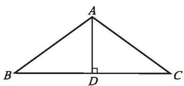

(第1题)

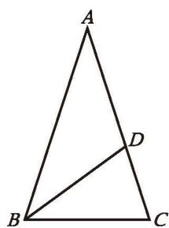

(第2题)

2. 如图，在 $\triangle ABC$ 中，$AB = AC$ ，$BD$ 平分 $\angle ABC$ ，交 $AC$ 于点 $D$ 。若 $BD = BC$ ，则 $\angle A$ 等于多少度？

3. 已知：如图，在 $\triangle ABC$ 中，$AB = AC$ ，$D$ 为 $BC$ 的中点，点 $E$、$F$ 分别在 $AB$ 和 $AC$ 上，并且 $AE = AF$ 。求证：$DE = DF$ 。

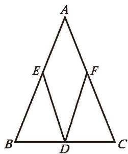

(第3题)

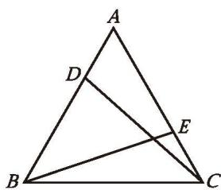

(第4题)

4. 已知：如图，D，E 分别是等边三角形 ABC 的两边 AB，AC 上的点，且 AD = CE。求证：CD = BE。

5. 等腰三角形两个底角的平分线有怎样的数量关系？请证明自己结论的正确性。

6. 已知：如图，$\angle CAE$ 是 $\triangle ABC$ 的外角，$AD \parallel BC$ ，且 $\angle 1 = \angle 2$ 。
   求证：$AB = AC$

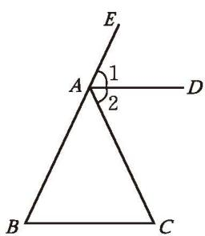

(第6题)

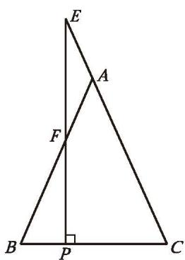

(第7题)

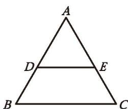

(第8题)

7. 已知：如图，在 $\triangle ABC$ 中，$AB = AC$ ，点 $E$ 在 $CA$ 的延长线上，$EP \perp BC$ ，垂足为 $P$ ，$EP$ 交 $AB$ 于点 $F$ 。求证：$\triangle AEF$ 是等腰三角形。

8. 已知：如图，$\triangle ABC$ 是等边三角形，与 BC 平行的直线分别交 AB 和 AC 于点 D，E。求证：$\triangle ADE$ 是等边三角形。

9. 某屋架的一部分如图所示，其中 $BC \perp AC$ ，$\angle A = 30^{\circ}$ ，$AB = 7.4\ \mathrm{m}$ ，点 $D$ 是 $AB$ 的中点，且 $DE \perp AC$ ，垂足为 $E$ ，求 $BC$、$DE$ 的长。

10. 用两个完全相同的含 $45^{\circ}$ 角的三角尺拼成一个三角形，要求不重叠、不留缝隙。
    (1) 拼一拼，并画出所拼的图形。
    (2) 通过 (1) 中的拼图，你能获得怎样的结论？请证明你得到的结论。

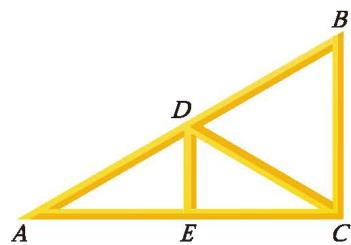

(第9题)

###### 数学理解

11. (1) 如图 (1)，已知 $\angle a$ 和线段 $a$ ，请用尺规作一个等腰三角形，使它的一个内角等于 $\angle a$ ，腰长等于 $a$ 。

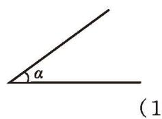

(1)

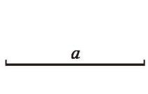

(第11题)

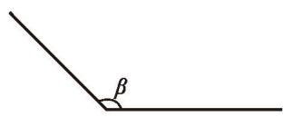

(2)

(2) 在 (1) 中，如果把 $\angle \alpha$ 变成图 (2) 中的 $\angle \beta$ ，其他条件不变呢？

###### 问题解决

12. 如图，一艘轮船从 $A$ 处出发，以 $18\ \mathrm{kn}$ 的速度向正北航行，经过 $10\ \mathrm{h}$ 到达 $B$ 处。分别从 $A$、$B$ 处望灯塔 $C$ ，测得 $\angle NAC = 42^{\circ},\ \angle NBC = 84^{\circ}$ 。求从 $B$ 处到灯塔 $C$ 的距离。

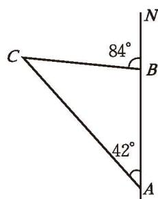

(第12题)

###### 联系拓广

13. (1) 如图，$\triangle ABC$ 是等边三角形，过它的三个顶点分别作对边的平行线，得到一个新的 $\triangle DEF$ ，$\triangle DEF$ 是等边三角形吗？你还能找到哪些其他的等边三角形？点 $A, B, C$ 分别是 $EF, ED, FD$ 的中点吗？请证明你的结论。

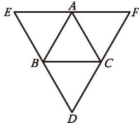

(第13题)

(2) 如果 $\triangle DEF$ 是等边三角形，点 A, B, C 分别是 $EF, ED, FD$ 的中点，那么 $\triangle ABC$ 是等边三角形吗？请证明你的结论。

※14. 证明：在直角三角形中，如果一条直角边等于斜边的一半，那么这条直角边所对的锐角等于 $30^{\circ}$ 。

※15. 如图，$ABCD$ 是一张长方形纸片，且 $AD = 2AB$ ，沿过点 $D$ 的折痕将 $A$ 角翻折，使得点 $A$ 落在 $BC$ 上（如图中的点 $A'$），折痕交 $AB$ 于点 $G$ ，那么 $\angle ADG$ 等于多少度？请证明你的结论（提示：利用第 14 题的结论）。

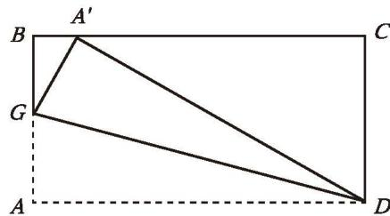

(第15题)

---
