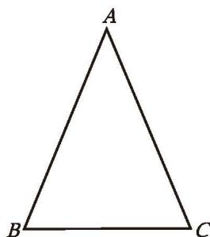
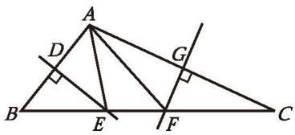
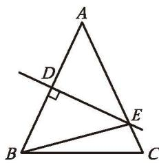
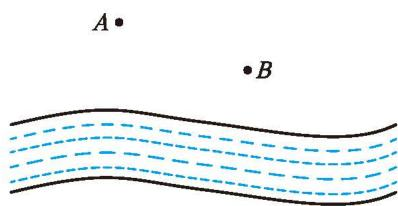
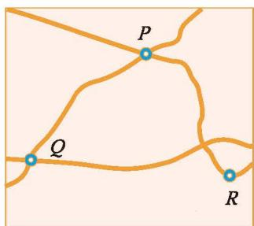
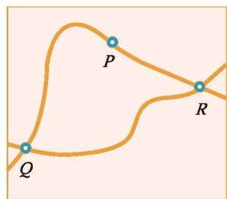
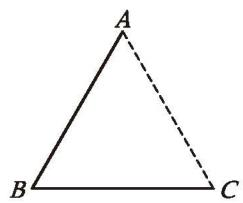
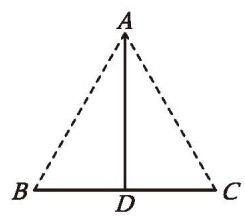
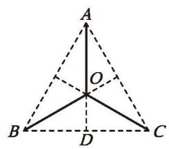

##### 习题 1.4

###### 知识技能

1. 如图，在 $\triangle ABC$ 中，$AB = AC$ ，$\angle BAC = 120^{\circ}$ 。
   (1) 用尺规作线段 $AB$ 的垂直平分线，分别交 $AB$ 和 $BC$ 于点 $E$、$F$ ;
   (2) 在上述图中连接 $AF$ ，求 $\angle AFC$ 的度数。

(第1题)

(第2题)

2. 如图，在 $\triangle ABC$ 中，$AB = AC,\ AB > BC$ ，完成下列尺规作图：
   (1) 作 $AC$ 边上的高 $BD$ ;
   (2) 作 $\triangle ACE$ ，使 $\triangle ACE \cong \triangle ABD$ ，且点 $E$ 在 $AB$ 边上。

###### 数学理解

3. 在以线段 $AB$ 为底边的所有等腰三角形中，它们顶角的顶点的位置有什么共同特征？

###### 问题解决

4. 如图，在 $\triangle ABC$ 中，$BC = 2$ ，$\angle BAC > 90^{\circ}$ ，$AB$ 的垂直平分线交 $BC$ 于点 $E$ ，$AC$ 的垂直平分线交 $BC$ 于点 $F$ ，垂足分别为 $D$、$G$ 。请找出图中相等的线段，并求 $\triangle AEF$ 的周长。

(第4题)

(第5题)

5. 如图，在 $\triangle ABC$ 中，已知 $AC = 27$ ，$AB$ 的垂直平分线交 $AB$ 于点 $D$ ，交 $AC$ 于点 $E$ ，$\triangle BCE$ 的周长等于 50，求 $BC$ 的长。

6. 如图，$A$、$B$ 表示两个仓库，要在 $A$、$B$ 一侧的河岸边建造一个码头，使它到两个仓库的距离相等，码头应建造在什么位置？

7. 某市打算修建一个大型体育中心。在选址过程中，有人建议该体育中心所在位置到该市的三个城镇中心（图中以 $P,\ Q,\ R$ 表示）的距离应相等。

(第6题)

(1) 根据上述建议，试在图 (1) 中画出体育中心 $G$ 的位置。
(2) 如果这三个城镇中心的位置如图 (2) 所示，$\angle RPQ$ 是一个钝角，那么根据上述建议，体育中心 $G$ 应建在什么位置？

(1)

(第7题) (2)

(3) 你对上述建议有何评论？你对选址有什么建议？

8. 如图，某市三个城镇中心 $A,\ B,\ C$ 恰好分别位于一个等边三角形的三个顶点处，在三个城镇中心之间铺设通信光缆，以城镇中心 $A$ 为出发点设计了三种连接方案：
   (1) $AB + BC$ ;
   (2) $AD + BC$ ( $D$ 为 $BC$ 的中点);
   (3) $OA + OB + OC$ ( $O$ 为 $\triangle ABC$ 三边的垂直平分线的交点)。

要使铺设的光缆长度最短，应选哪种方案？

(1)

(2)

(第8题) (3)

---
