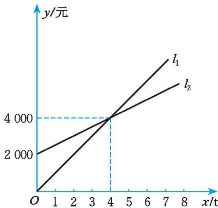
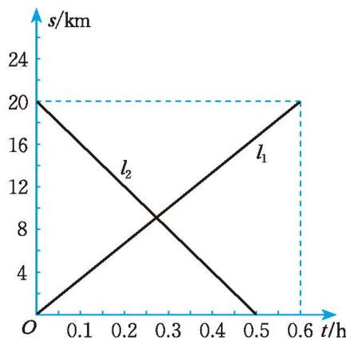

##### 习题 2.3

##### > 知识技能

1. 已知 $y_{1} = -x - 2$ , $y_{2} = 2x + 1$ ，当 x 取哪些值时， $y_{1} < y_{2}$ ?

##### 问题解决

2. 如图, $l_{1}$ 表示某产品的销售收入与销售量之间的关系, $l_{2}$ 表示该产品的销售成本与销售量之间的关系。该产品的销售量达到多少吨时, 生产该产品才能赢利?

(第2题)

3. 甲、乙两辆摩托车从相距 $20 \mathrm{~km}$ 的 A, B 两地同时相向而行, 图中 $l_{1}, l_{2}$ 分别表示甲、乙两辆摩托车到 A 地的距离与行驶时间之间的关系。  
(1) 哪辆摩托车的行驶速度较快?  
(2) 何时甲摩托车到 B 地的距离大于乙摩托车到 B 地的距离?

4. 某公司计划购买若干台电脑，现从两家商场了解到同一型号的电脑每台报价均

(第3题)

为 6 000 元，并且多买都有一定的优惠。两家商场的优惠条件见下表：

<table><tr><td>商场</td><td>优惠条件</td></tr><tr><td>甲商场</td><td>第一台按原报价收费,其余每台优惠25%</td></tr><tr><td>乙商场</td><td>每台优惠20%</td></tr></table>  
(1) 该公司到哪家商场购买电脑更合算?  
(2) 该公司准备购买 7 台该型号的电脑, 到乙商场购买更合算吗?

5. 甲、乙两家育种场为响应国家政策，鼓励农民多种粮、种好粮，计划优惠出售一批小麦良种。甲育种场的优惠方式是：若购买小麦良种累计不超过500元，则按原价收费；若超过500元，则超出500元的部分按原价的80%收费。乙育种场的优惠方式是：若购买小麦良种累计不超过300元，则按原价收费；若超过300元，则超出300元的部分按原价的85%收费。假设甲、乙两家育种场小麦良种的单价相同，你认为购买哪家的小麦良种更合算？
