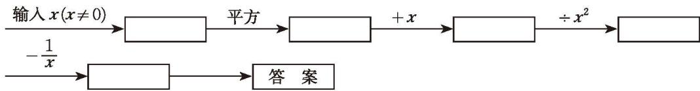

##### 习题5.2

##### > 知识技能

1. 计算：  
(1) $\frac{bc}{a^2} \cdot \frac{2a}{b^2c}$ ;  
(2) $(\frac{2a}{b})^3 \div \frac{6a}{b}$ ;  
(3) $\frac{b}{a^2 - 9} \cdot \frac{a + 3}{b^2 - b}$ ;  
(4) $\frac{x^2 + xy}{x - y} \div \frac{xy}{x - y}$ ;  
(5) $\frac{a}{a - b} \cdot \left(\frac{b - a}{b}\right)^2$ ;  
(6) $\frac{4x^2 - 4xy + y^2}{2x + y} \div (4x^2 - y^2)$ 。

2. 计算：  
(1) $\frac{m - 1}{x} + \frac{n - m}{x}$ ;  
(2) $\frac{3}{mn} - \frac{5}{nm}$ ;  
(3) $\frac{a^2}{a + b} + \frac{b^2 + 2ab}{a + b}$ ;  
(4) $\frac{x + 2y}{2x - y} - \frac{3y - x}{2x - y}$ ;  
(5) $\frac{2n - m}{m - n} + \frac{n}{n - m}$ ;  
(6) $\frac{x^2 + 5}{x - 2} - \frac{1 + 4x}{2 - x}$ 。

3. 先化简，再求值：

$\frac{x^{2}+1}{x+1}-\frac{2}{x+1}$ ，其中 $x=\frac{1}{100}$ 。

4. 计算：  
(1) $\frac{x}{a}+\frac{y}{b};$ (2) $\frac{a+b}{ab}-\frac{b+c}{bc};$ (3) $\frac{1}{x-y}+\frac{x}{2x-2y};$ (4) $\frac{1}{x-1}+\frac{1}{x^{2}-2x+1};$ (5) $\frac{12}{m^{2}-9}-\frac{2}{m-3};$ (6) $\frac{3x}{(x-3)^{2}}-\frac{x}{3-x^{\circ}}$

5. 用两种方法计算 $\left(\frac{3x}{x-2}-\frac{x}{x+2}\right)\cdot\frac{x^2-4}{x}$ 。

6. 计算：  
(1) $\frac{2}{x-3}-\frac{6}{x^{2}-9};$ (2) $1-\frac{a+1}{a}\div\frac{a^{2}-1}{a^{2}+a};$ (3) $(1-\frac{1}{a-1})\cdot\frac{a-1}{a^{2}-4a+4};$ (4) $(a+2+\frac{1}{a})\div(a-\frac{1}{a})$ 。

7. 先化简，再求值：  
(1) 已知 r=100，求 $\frac{2r+2}{r^{2}+2r+1}+\frac{r-1}{r+1}+r$ 的值；  
(2) 已知 $m = \frac{1}{5} n$ , 求 $\frac{2n}{m + 2n} + \frac{m}{2n - m} + \frac{4mn}{4n^2 - m^2}$ 的值。

##### > 数学理解

8. 对于 $a \div b \cdot \frac{1}{b}$ , 小明是这样计算的: $a \div b \cdot \frac{1}{b} = a \div 1 = a$ 。他的计算过程正确吗? 为什么?

9. 按下列程序计算，把答案填写在表格内，并回答下列问题：

<table><tr><td>输入x</td><td>3</td><td>2</td><td>-2</td><td> $\frac{1}{3}$ </td><td>...</td></tr><tr><td>输出答案</td><td>1</td><td>1</td><td></td><td></td><td>...</td></tr></table>  
(1) 由上述计算你发现了什么规律?  
(2) 请说明 (1) 中规律的正确性。

##### > 问题解决

10. 由甲地到乙地的一条铁路全程为 $s \mathrm{~km}$ , 火车全程运行时间为 $a \mathrm{~h}$ ; 由甲地到乙地的公路全程为这条铁路全程的 $m$ 倍, 汽车全程运行时间为 $b \mathrm{~h}$ 。  
(1) 火车速度是汽车速度的多少倍?  
(2) 根据这一情境提出一个问题, 并解决这个问题。

11. 某人用电脑录入汉字的速度相当于手写的 3 倍, 设他手写的速度为 $a$ 字/h, 那么他录入 3000 字比手写少用多长时间?

12. 甲、乙两地之间的航行距离为 $50 \mathrm{~km}$ , 一艘轮船先从甲地顺流航行至乙地, 再从乙地逆流航行返回甲地。已知水流速度为 $4 \mathrm{~km} / \mathrm{h}$ , 如果这艘轮船在静水中的速度为 $x \mathrm{~km} / \mathrm{h}$ , 那么它从甲地到乙地所需的航行时间比从乙地到甲地所需的航行时间少多少?

13. 一项工程，甲单独做 $a \mathrm{~h}$ 完成，乙单独做 $b \mathrm{~h}$ 完成，甲、乙两人一起完成这项工程需要多长时间？

14. 某蓄水池装有 A, B 两个进水管, 每小时可分别进水 $a \mathrm{~m}^{3}, b \mathrm{~m}^{3}$ 。若单独开放 A 进水管, $p \mathrm{~h}$ 可将该蓄水池注满。如果同时开放 A, B 两个进水管, 那么能提前多长时间将该蓄水池注满?

##### 联系拓广

&emsp;※15. 有一杯糖水的含糖量为 $\frac{a}{b} (a < b)$ , 往杯中加入 $c (c > 0) \mathrm{~g}$ 糖, 经验告诉我们现在糖水的含糖量比原来高了。试用所学的数学知识解释其中的道理。
