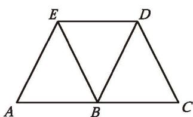
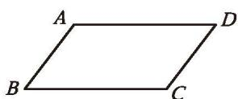
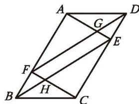
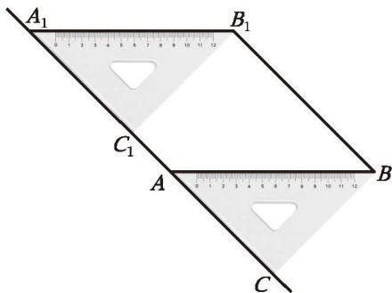
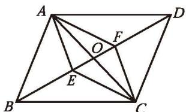
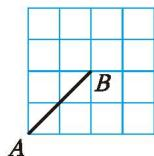
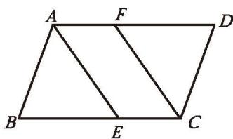
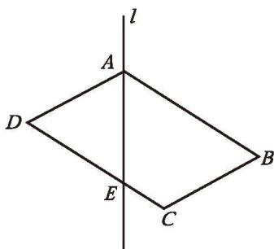

##### 习题6.2

##### 知识技能

1. 如图, $AC \parallel DE$ , 点 $B$ 在 $AC$ 上, 且 $AB = DE = BC$ 。找出图中的[平行四边形](../概念/平行四边形.md), 并说明理由。

(第1题)

2. 已知：如图，在四边形 ABCD 中， $\angle B = \angle D, \angle 1 = \angle 2$ 。求证：四边形 ABCD 是平行四边形。

3. 已知：如图,在四边形 $ABCD$ 中, $AB \parallel CD$ , $\angle B = \angle D$ 。

求证: 四边形 $ABCD$ 是平行四边形。

(第2题)

(第3题)

(第4题)

4. 已知：如图，在 $\square ABCD$ 中， $E, F$ 分别是边 $AB$ 和 $CD$ 上的点， $AE = CF, M, N$ 分别是线段 $DE$ 和 $BF$ 的中点。

求证: 四边形 $ENFM$ 是平行四边形。

5. 已知：如图，在 □ABCD 中，E，F 分别是边 CD 和 AB 上的点，AE∥CF，BE 交 CF 于点 H，DF 交 AE 于点 G。求证：EG = FH。

(第5题)

##### 数学理解

6. 小明是这样画平行四边形的: 如图, 将三角尺 $ABC$ 的一边 $AC$ 贴着直尺推移到 $A_{1} B_{1} C_{1}$ 的位置, 这时四边形 $ABB_{1} A_{1}$ 就是平行四边形。请解释小明这样做的道理。

(第6题)

7. 如图, $\square ABCD$ 的对角线 $AC$ 与 $BD$ 相交于点 $O$ , 点 $E$ , $F$ 分别在 $OB$ 和 $OD$ 上。请你添加适当的条件, 使四边形 $AECF$ 是平行四边形, 并说明理由。

(第7题)

(第8题)

8. 如图, 为了检验一块木板相对的两个边缘是否平行, 木工师傅常常把两把曲尺的一边紧靠木板一个边缘, 再看木板另一个边缘对应曲尺上的刻度是否相等, 如果刻度相等, 那么木工师傅就判断木板相对的两个边缘平行。请解释木工师傅这样做的道理。

9. 如图, 在 $4 \times 4$ 方格纸中, 每个小方格的边长均为 1, A, B 两点在格点上, 请在图中格点上找到点 $C$ , 使得 $\triangle ABC$ 的面积为 2。满足条件的点 $C$ 有几个?

(第9题)

##### > 问题解决

10. 求证：两组对角分别相等的四边形是平行四边形。

11. 一张平行四边形纸片 $ABCD, AD > AB$ 。  
(1)如图,折叠平行四边形纸片 $ABCD$ ,可以得到 $\angle BAD$ 和 $\angle BCD$ 的平分线,其中 $\angle BAD$ 的平分线交 $BC$ 于点 $E$ , $\angle BCD$ 的平分线交 $AD$ 于点 $F$ 。请证明: 四边形 $AECF$ 是平行四边形。  
(2) 你还有哪些方法能折出一个平行四边形？选择其中一种，说明你的方法的正确性。

(第11题)

&emsp;※12.《几何原本》中有这样一道作图题：作一个平行四边形，使它的一个内角等于给定角，面积等于给定多边形的面积。如图，已知四边形ABCD和 $\angle \alpha$ ，如何作 $\square MNGK$ ，使 $\angle N = \angle \alpha$ ，且 $\square MNGK$ 的面积等于四边形ABCD的面积？  
(1) 如何确定□MNGK 的一条边长及这条边上的高?  
(2) 请用尺规作 □MNGK。

(第12题)

13. 如图, 在 $\square ABCD$ 中, 对角线 $AC$ 与 $BD$ 相交于点 $O$ , 点 $E, F, G, H$ 分别在线段 $AO, BO, CO, DO$ 上。  
(1) 如果 $AE = \frac{1}{2} AO$ , $BF = \frac{1}{2} BO$ , $CG = \frac{1}{2} CO$ , $DH = \frac{1}{2} DO$ , 那么四边形 $EFGH$ 是平行四边形吗? 请证明你的结论。  
(2) 如果 $AE = \frac{1}{3} AO$ , $BF = \frac{1}{3} BO$ , $CG = \frac{1}{3} CO$ , $DH = \frac{1}{3} DO$ , 那么四边形 $EFGH$ 是平行四边形吗? 请证明你的结论。  
(3) 如果 $AE = \frac{1}{n} AO$ , $BF = \frac{1}{n} BO$ , $CG = \frac{1}{n} CO$ , $DH = \frac{1}{n} DO$ , 其中 $n$ 为大于 1 的正整数, 那么上述结论还成立吗?

(第13题)

14. 如图，小刚在做作业时，发现一道题中有部分文字被污染了。请在被污染的位置补充适当条件，并完成证明。

已知：如图,在四边形 ${ABCD}$ 中,点 $E,F$ 在对角线 ${AC}$ 上,

$$
\angle 1 = \angle 2, \angle 3 = \angle 4 。
$$

求证: 四边形 $ABCD$ 是平行四边形。

(第14题)

##### 联系拓广

&emsp;※15. 如图, 四边形 $ABCD$ 是平行四边形, 过点 $A$ 作直线 $l$ , 交 $CD$ 边于点 $E$ 。  
(1) 点 $B$ 、点 $C$ 、点 $D$ 到直线 $l$ 的距离之间有怎样的关系？你是怎么发现的？请证明你的结论。  
(2) 将□ABCD绕点A按顺时针方向[旋转](../概念/旋转.md)，你还能发现哪些结论？选择其中一个结论加以证明。

(第15题)
