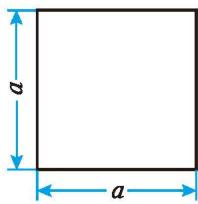
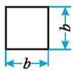
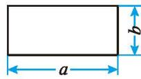

### 因式分解 复习题

##### > 知识技能

1. 把下列各式[因式分解](../概念/因式分解.md)：  
(1) $3a^{2}-3b^{2}$ ;  
(3) $(x + y + z)^2 - (x - y - z)^2$ ;  
(5) $a^{2}b^{2}-0.01;$  
(7) $(a^{2} + 4)^{2} - 16a^{2}$ ;  
(9) $2x^{2}+2x+\frac{1}{2};$  
(2) $y^{2}-9(x+y)^{2}$ ;  
(4) $(x + y)^2 - 14(x + y) + 49$ ;  
(6) $x^{2}y - 2xy^{2} + y^{3}$ ;  
(8) $x^{2} - xy + \frac{1}{4} y^{2};$  
(10) $(x + 1)(x + 2) + \frac{1}{4}$ 。

2. 先因式分解, 再计算求值:  
(1) $9x^{2}+12xy+4y^{2}$ ，其中 $x=\frac{4}{3}$ ， $y=-\frac{1}{2}$ ;  
(2) $\left(\frac{a+b}{2}\right)^{2}-\left(\frac{a-b}{2}\right)^{2}$ ，其中 $a=-\frac{1}{8}$ ，b=2。

##### > 数学理解

3. 利用因式分解说明： $25^{7}-5^{12}$ 能被120整除。

&emsp;※4. 已知 $x + y = 1$ , 求 $\frac{1}{2} x^{2} + xy + \frac{1}{2} y^{2}$ 的值。

##### > 问题解决

5. 利用因式分解计算：  
(1) $3^{2027}-3^{2026}$ ;  
(2) $(-2)^{101}+(-2)^{100}+2^{99}$

6. 如图, 某农场修建一座小型水库, 需要一种空心混凝土管道, 它的规格是内径 $d = 45 \mathrm{~cm}$ , 外径 $D = 75 \mathrm{~cm}$ , 长 $l = 300 \mathrm{~cm}$ 。利用因式分解计算浇制一节这样的管道大约需要多少立方米的混凝土 ( $\pi$ 取 3.14, 结果精确到 $0.01 \mathrm{~m}^{3}$ )。

(第6题)

&emsp;※7. 已知 $a, b, c$ 是 $\triangle ABC$ 的三边，且满足 $a^2 - b^2 + ac - bc = 0$ ，请判断 $\triangle ABC$ 的形状，并说明理由。

&emsp;※8. 当 $x$ 取何值时, 多项式 $x^{2} + 2x + 1$ 取得最小值?

&emsp;※9. 正方形Ⅰ的周长比正方形Ⅱ的周长长 96 cm，它们的面积相差 $960 \, cm^{2}$ 。求这两个正方形的边长。

##### > 联系拓广

&emsp;※10. $2^{48} - 1$ 可以被60和70之间的某两个数整除，求这两个数。

&emsp;※11. 计算下列各式:  
(1) $1 - \frac{1}{2^2} =$ \_\_\_\_; (2) $\left(1 - \frac{1}{2^2}\right)\left(1 - \frac{1}{3^2}\right) =$ \_\_\_\_;  
(3) $\left(1 - \frac{1}{2^2}\right)\left(1 - \frac{1}{3^2}\right)\left(1 - \frac{1}{4^2}\right) =$ \_\_\_\_。

试根据所学知识找到计算上面算式的简便方法，并利用你找到的简便方法计算下面的算式：

$$
\left(1 - \frac {1}{2 ^ {2}}\right) \left(1 - \frac {1}{3 ^ {2}}\right) \left(1 - \frac {1}{4 ^ {2}}\right) \dots \left(1 - \frac {1}{9 ^ {2}}\right) \left(1 - \frac {1}{10 ^ {2}}\right) \dots \left(1 - \frac {1}{n ^ {2}}\right) _ {.}
$$

12. 如图, 有①②③三种不同型号的卡片若干, 其中型号①②分别是边长为 $a$ 和 $b$ 的正方形卡片, 型号③是长为 $a\text{、宽为} b$ 的长方形卡片。

①

②

③  
(第12题)  
(1) 请用这些卡片分别拼出面积为 $2a^{2} + ab, a^{2} + 4ab + 4b^{2}$ 的长方形，并画出图形。

&emsp;※(2)你能拼出面积为 $3a^{2}+4ab+b^{2}$ 的长方形吗? 如果能, 请画出图形; 如果不能, 请说明理由。  
(3)请再提出一个问题,并加以解答。

&emsp;※13. 如果 ab = 0，那么 a = 0 或 b = 0。利用所学知识，尝试求解方程 $x^{2} - 2x = 0$ 。
