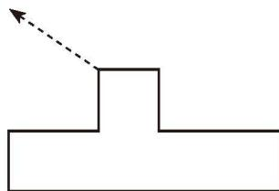
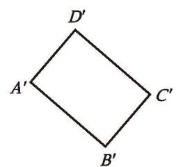
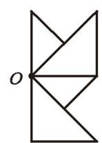
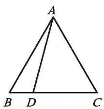
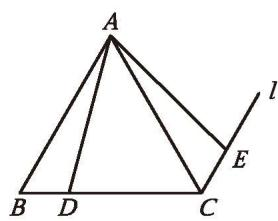
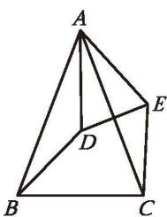
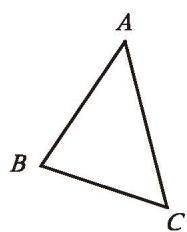
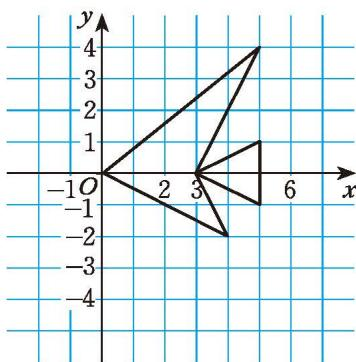
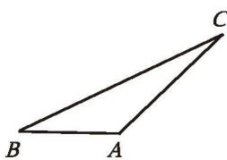
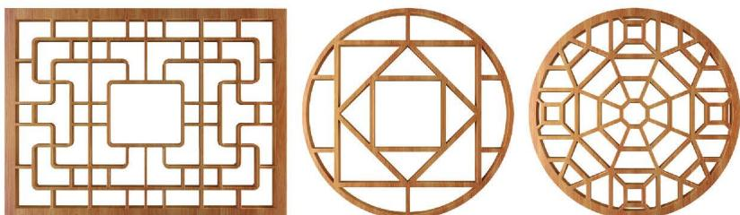

### 图形的平移与旋转 复习题

##### > 知识技能

1. 如图所示的图形向箭头所指方向[平移](../概念/平移.md)了 $4 \mathrm{~cm}$ , 请画出平移后的图形。

2. 在平面直角坐标系中, 将坐标为 $(0, 0), (2, 4), (2, 0), (4, 4)$ 的点用线段依次连接起来, 得到一个图案 $N$ 。

(第1题)

  
(1) 将图案 N 向左平移 3 个单位长度，画出平移后的图案；  
(2) 将图案 N 向下平移 4 个单位长度, 画出平移后的图案;  
(3) 将图案 N 先向左平移 3 个单位长度, 再向下平移 4 个单位长度, 画出第二次平移后的图案;  
(4) 画出图案 N 关于横轴对称的图案;  
(5) 画出图案 N 关于纵轴对称的图案;  
(6)以原点为对称中心,画出与图案 $\mathrm{N}$ 成[中心对称](../概念/中心对称.md)的图案。

3. 在平面直角坐标系中, 将坐标为 $(2, 0), (2, 2), (0, 2), (0, 3), (2, 5), (3, 5), (2, 2), (5, 3), (5, 2), (3, 0), (2, 0)$ 的点用线段依次连接起来, 得到一个图案。  
(1) 每个点的纵坐标保持不变, 横坐标分别加 5 , 再将所得到的各个点用线段依次连接起来, 所得的图案与原图案相比有什么变化?  
(2) 如果横坐标保持不变, 纵坐标分别加 7 呢?  
(3) 如果横坐标分别加 7, 纵坐标分别加 5 呢?  
(4) 如果纵坐标保持不变, 横坐标分别乘 -1 呢?  
(5) 如果横坐标保持不变, 纵坐标分别乘 -1 呢?  
(6) 如果横、纵坐标都分别乘 -1 呢?

4. 将一个正三角形绕它的一个顶点按逆时针方向[旋转](../概念/旋转.md)，分别画出旋转下列角度后的图形：  
(1) $30^{\circ}$ ; (2) $60^{\circ}$ ; (3) $90^{\circ}$ ; (4) $120^{\circ}$ 。

5. 画一个 $\triangle ABC$ , 其中 $\angle B = 90^{\circ}$ , 分别画出 $\triangle ABC$ 按如下条件旋转或平移后的三角形:  
(1)以点 $B$ 为[旋转中心](../概念/旋转中心.md), 按逆时针方向旋转 $30^{\circ}$ ;  
(2)以点 $B$ 为旋转中心,按逆时针方向旋转 ${180}^{ .  }$ ；  
(3) 以 $\triangle ABC$ 外一点 $P$ 为旋转中心, 按逆时针方向旋转 $180^{\circ}$ ;  
(4) 将 $\triangle ABC$ 平移, 使点 $B$ 的对应点为点 $A$ 。

6. 如图, 长方形 $A'B'C'D'$ 是长方形 $ABCD$ 绕点 $O$ 按顺时针方向旋转 $70^{\circ}$ 后得到的, 请画出旋转前的长方形 $ABCD$ 。

(第6题)

(第7题)

7. 如图，以点 O 为对称中心，画出与如图所示图形成中心对称的图形。

8. 已知点 $A(2,7)$ , $B(-5,0)$ , $C(0,-1)$ , 在平面直角坐标系中以原点为对称中心, 画出与 $\triangle ABC$ 成中心对称的图形。

##### > 数学理解

9. 如图（1），点 D 在正三角形 ABC 的边 BC 上，将 $\triangle ABD$ 绕点 A 旋转，使得旋转后点 B 的对应点为点 C。  
(1) 在图 (1) 中画出旋转后的图形。  
(2) 小明是这样做的: 如图 (2), 过点 $C$ 作 $BA$ 的平行线 $l$ , 在 $l$ 上取点 $E$ , 使 $CE = BD$ , 连接 $AE$ , 则 $\triangle ACE$ 即为旋转后的图形。请说明小明这样做的道理。

(1)

(2)

  
(第9题)

10. 如图, $\triangle ABC$ 和 $\triangle ADE$ 都是顶角为 $42^{\circ}$ 的等腰三角形, $BC$ 和 $DE$ 分别是底边, 图中的哪两个三角形可以通过怎样的旋转而相互得到?

(第10题)

(第11题)

&emsp;※11. 如图, $\triangle ABC$ 经过一次旋转得到 $\triangle A'B'C'$ , 请找出这一旋转的旋转中心。

12. 判断正误:  
(1) 在同一平面内, 半径相等的两个圆中的一个可以看成是由另一个平移得到的;  
(2) 形状、大小完全相同的两个图形中的一个可以看成是由另一个平移得到的; (   )  
(3) 图形经过旋转, 对应线段平行且相等; (   )  
(4)[中心对称图形](../概念/中心对称图形.md)上每一对对应点所连成的线段都被对称中心平分。（）

##### 问题解决

\*13. 如图所示的“鱼”是将坐标为 $(0,0)$ , $(5,4)$ , $(3,0)$ , $(5,1)$ , $(5,-1)$ , $(3,0)$ , $(4,-2)$ , $(0,0)$ 的点用线段依次连接而成的。将这条“鱼”绕原点 $O$ 按顺时针方向旋转 $90^{\circ}$ 。  
(1) 画出旋转后的新 “鱼”;  
(2) 写出旋转后新 “鱼” 各顶点的坐标。

(第13题)

##### > 联系拓广

14. 如图, 将 $\triangle ABC$ 绕点 $A$ 按顺时针方向旋转 $60^{\circ}$ , 得到 $\triangle AB'C'$ 。试判断 $\triangle ABB'$ 和 $\triangle ACC'$ 的形状。

15. 花窗是中国古代园林建筑中窗的一种形式，既具备实用功能又带有装饰效果。如图所示的花窗图案中大量运用了图形的平移、旋转、轴对称。请你设计一个类似的花窗图案。

(第14题)  

(第15题)
