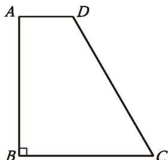
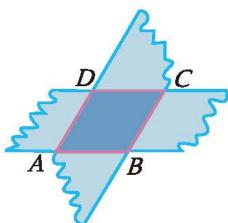
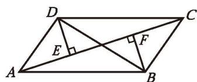
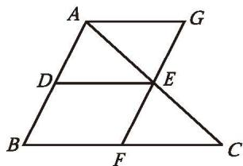
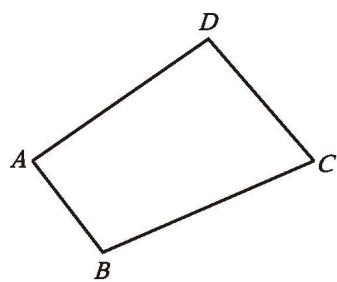

### 平行四边形 复习题

###### 知识技能

1. 在 $\square ABCD$ 中，已知 $AB = 6$ ，$AD$ 为 $\square ABCD$ 周长的 $\frac{2}{7}$ ，求 $BC$ 的长度。

2. 在四边形 $ABCD$ 中，$\angle A = 30^{\circ}$ ，$\angle B = 150^{\circ}$ ，$\angle C = 30^{\circ}$ ，$AB = 2$ ，求 $DC$ 的长度。

3. 如图，在 $\square ABCD$ 中，点 $E,\ H,\ F,\ G$ 分别在边 $AB,\ BC,\ CD,\ AD$ 上，$EF \parallel AD$ ，$GH \parallel CD$ ，$EF$ 与 $GH$ 相交于点 $O$ ，图中共有多少个[平行四边形](../概念/平行四边形.md)？

(第3题)

(第4题)

4. 已知：如图，在 $\square ABCD$ 中，AE $\perp$ BD，CF $\perp$ BD，垂足分别为 E，F。
   求证：$\angle BAE = \angle DCF$ 。

5. 已知：如图，点 E 在 $\square ABCD$ 的边 BC 的延长线上，且 CE = BC。
   求证：四边形 ACED 是平行四边形。

(第5题)

(第6题)

6. 如图，在[梯形](../概念/梯形.md) $ABCD$ 中，$AD \parallel BC$ ，$\angle B = 90^{\circ}$ ，$AD = 2$ ，$BC = 5$ ，$\angle C = 60^{\circ}$ ，求 $CD$ 的长度。

7. 如图，剪两张对边平行的纸条，随意交叉叠放在一起，转动其中一张，重合的部分构成了一个四边形。线段 $AB$ 和 $CD$ 的长度有什么关系？

(第7题)

(第8题)

8. 如图，在 $\square ABCD$ 中，已知 $AB = 4\ \mathrm{cm}$ ，$BC = 9\ \mathrm{cm}$ ，$\angle B = 30^{\circ}$ ，求 $\square ABCD$ 的面积。

9. 画一个 $\square ABCD$，使 $\angle B = 45^{\circ}$，AB = 2 cm，BC = 3 cm。

10. 已知：如图，四边形 ABCD 是平行四边形，P, Q 是对角线 BD 上的两点，且 BP = DQ。求证：$AP \parallel CQ$ 。

(第10题)

11. 已知：如图，在 $\square ABCD$ 中，$\angle ABC$ 的平分线交 $AD$ 于点 $E$ ，$\angle BCD$ 的平分线交 $AD$ 于点 $F$ ，交 $BE$ 于点 $G$ 。求证：$AF = DE$ 。

(第11题)

(第12题)

12. 如图，$\triangle ABC$ 的三边长分别为 $a,\ b,\ c$ ，以它的三边中点为顶点组成一个新三角形，再以这个新三角形三边中点为顶点又组成一个小三角形。求这个小三角形的周长。

13. 已知：如图，点 O 是 $\square ABCD$ 的对角线 BD 的中点，E，F 分别是边 BC 和 AD 上的点，且 $AE \parallel FC$ 。求证：EF 经过点 O。

(第13题)

(第14题)

14. 已知：如图，在四边形 ABCD 中，$DE \perp AC$ ，$BF \perp AC$ ，垂足分别为 E，F，DE = BF，$\angle ADB = \angle CBD$ 。求证：四边形 ABCD 是平行四边形。

###### 数学理解

15. 如图，$DE$ 是 $\triangle ABC$ 的中位线，过点 $E$ 作 $AB$ 的平行线，交 $BC$ 于点 $F$ ，过点 $A$ 作 $BC$ 的平行线，交直线 $EF$ 于点 $G$ 。请利用这个图形证明[三角形的中位线](../概念/三角形的中位线.md)定理。

(第15题)

16. 用六个全等的正三角形拼成如图所示的图形，请找出图中所有的平行四边形，并选择其中之一加以证明。

(第16题)

(第17题)

17. 已知：如图，直线 $MN$ 与 $\square ABCD$ 的对角线 $AC$ 平行，延长 $DA,\ CB,\ AB,\ DC$ ，分别交 $MN$ 于点 $E,\ F,\ G,\ H$ 。求证：$EF = GH$ 。

###### 问题解决

18. 小华要做一个平行四边形木框，他有七根木条，长度分别为：①3cm，②5cm，③3cm，④6cm，⑤5cm，⑥8cm，⑦9cm。请你帮他选一选，用哪四根木条可以组成一个平行四边形木框？请说明理由。

19. 如图，在平行四边形纸片 $ABCD$ 中，$AB = 3\ \mathrm{cm}$ ，将纸片沿对角线 $AC$ 折叠，$BC$ 与 $AD$ 交于点 $E$ ，此时 $\triangle CDE$ 恰为等边三角形。
    (1) 求 $AD$ 的长;
    (2) 求重叠部分的面积。

(第19题)

(第20题)

20. 如图，某村有一个四边形池塘，它的四个顶点 $A,\ B,\ C,\ D$ 处均有一棵大树，村里准备开挖池塘建鱼塘，想使池塘的面积扩大一倍，又想保持大树在池塘边不动，并要求扩建后的池塘成平行四边形的形状，请问能否实现这一设想？若能，请你设计出所要求的平行四边形；若不能，请说明理由。

21. 人们往往借助三角形来研究平行四边形或一般的多边形。对此你有哪些感悟？请写一篇小短文与同学分享。

###### 联系拓广

22. 如图，点 M，N 分别在 $\square ABCD$ 的边 AB 和 CD 上。
    (1) 已知 $AM = \frac{1}{2} AB,\ CN = \frac{1}{2} CD$ ，求证：四边形 $AMCN$ 是平行四边形；
    (2) 当 $AM = \frac{1}{3} AB$ ，$CN = \frac{1}{3} CD$ 时，四边形 AMCN 是平行四边形吗？如果 $AM = \frac{1}{m} AB$ ，$CN = \frac{1}{m} CD\ (m > 1)$ 呢？你能得出一个一般性的结论吗？试一试！

(第22题)

23. 已知：如图，将 $\square ABCD$ 纸片折叠，使得点 C 落在点 A 的位置，折痕为 EF，连接 CE。求证：四边形 AFCE 是平行四边形。

(第23题)

---
