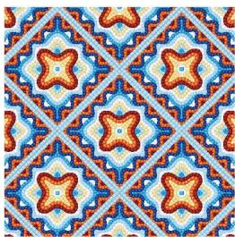
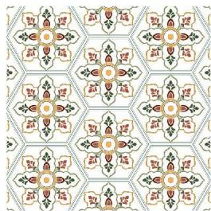
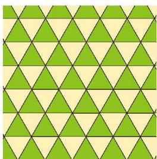
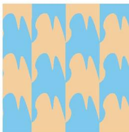

### 设计美丽的镶嵌图案

我们常常在地面、墙面、服装面料上见到由一种或几种形状相同的图形拼接而成的图案（如图1）。像这样，用形状、大小完全相同的一种或几种平面图形进行拼接，彼此之间不留空隙、不重叠地铺成一片，就是平面图形的**镶嵌**。荷兰艺术家埃舍尔（Maurits Cornelis Escher，1898—1972）运用镶嵌创造了许多令人印象深刻的艺术作品。组成合作小组，一起探索图形镶嵌的奥秘，设计独特的镶嵌图案吧。

图 1

##### 设计方案

1. 查阅并欣赏埃舍尔运用镶嵌设计的一些作品，说说这些作品中的图案是如何形成的，其中运用了哪些数学原理。

2. 小组合作，讨论设计镶嵌图案的步骤与分工，制订研究方案。

##### 实施方案

1. 观察图 2，你有哪些发现？

2. 如果把图 2 中的一只"鸟"看作基本图形，那么这个基本图形具有哪些特征？它如何由一个正方形演变而成？

图 2

3. 小组合作，仿照埃舍尔的方法，设计一个镶嵌图案。

##### 评估反思

1. 回顾研究过程，你们遇到了哪些困难？是怎样克服的？积累了哪些经验？

2. 在设计镶嵌图案过程中，数学知识发挥了什么作用？

##### 成果展示

1. 在班级内展示并交流设计的镶嵌图案，说明图案的形成过程及所运用的数学知识。

2. 查阅资料，了解更多镶嵌图案，撰写一篇镶嵌图案形成过程的分析报告。

- 整理本学期学过的知识与方法，用一张图把它们表示出来，并与同伴进行交流。
- 在自己经历过的解决问题活动中，选择一个最有挑战性的问题，写出解决它的过程，包括遇到的困难、克服困难的方法与过程，以及所获得的体会，并解释选择这个问题的原因。
- 通过本学期的数学学习，你有哪些收获？有哪些需要改进的地方？

##### 你的回顾：

北师大版

##### 后记

本套教科书依据《义务教育课程方案（2022年版）》和《义务教育数学课程标准（2022年版）》编写，在2012年版教科书（2021年获首届全国教材建设奖全国优秀教材一等奖1项、二等奖2项）基础上继承创新。

本套教科书基于核心素养精选素材，注重思想性、科学性、适宜性与时代性；内容的组织体现"课程内容结构化"，注重内容间的内在联系；学与教的活动设计体现"学生认知过程结构化"，引导学习方式和教学方式的变革。本套教科书充分体现数学课程标准的基本理念，帮助学生获得数学的基础知识、基本技能、基本思想、基本活动经验，提升发现和提出问题的能力、分析和解决问题的能力，提高学习数学的兴趣，增强学好数学的信心，养成良好的学习习惯，形成质疑问难、自我反思和勇于探索的科学精神。

本套教科书编写组成员（按姓氏笔画为序排列）：马复、王永会、王建波、刘晓玫、安志军、张惠英、胡赵云、顾继玲、凌晓牧、章飞、章巍、程燕云、綦春霞。

王瑞霖、冯艳萍、乔雪峰、齐栋超、范宇、贾燕军（按姓氏笔画为序排列）参与了本册教科书的修改与讨论。此外，各地教研员、一线教师在教科书试教试用期间提供了宝贵的修改意见和建议，有效提升了教科书质量，在此一并表示感谢！

真诚希望广大师生在使用过程中提出宝贵意见，以便我们进一步修改和完善。欢迎来电来函与我们联系：北京师范大学出版社初中数学编辑室（100088），010-58802832，czsx@bnupg.com。

北京师范大学出版社

北师大版

---
