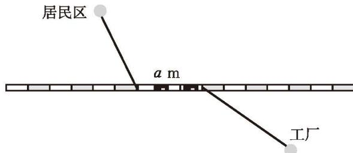
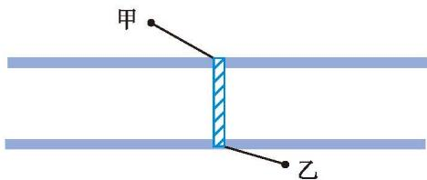

### ☆ 问题解决活动：最短距离

问题 如图 3-32, 居民区和工厂分别在一条城铁线路的南、北两侧, 现要沿着城铁线路修建一条地下通道, 居民区的居民经过该地下通道去工厂上班。已知该地下通道长度为 $a \mathrm{~m}$ ,

那么地下通道的两个出入口应该设计在何处，才能使居民经过该地下通道去工厂上班的路线最短？请画出这条最短路线并说明理由（不考虑地面到地下通道地面的高度）。

##### 理解问题

图3-32

上述问题可以抽象成怎样的数学问题？试着写一写、画一画。

##### 拟订计划  
(1) 你以前遇到过类似的问题吗?  
(2) 解决这个问题最大的困难是什么?  
(3) 地下通道将居民区到工厂的路从中间分成了两段, 你能设法将居民区、通道或工厂 “移动” 位置, 让前后两段路连起来吗?

##### 实施计划  
(1) 写出你的解决方案。  
(2) 说明你的方案的合理性。

##### 回顾反思

通过解决上述问题，你获得了哪些经验？你认为解决这类问题的关键是什么？

请你解决下列问题。

1. 如图 3-33, 某工厂甲、乙两个单位分别位于厂内一条封闭式道路的两旁, 现规划修建一座过路天桥, 要求天桥与道路垂直。那么, 天桥建在何处才能使由甲到乙的路线最短?

图3-33

2. (1) 如图 3-34, 某工厂计划在一条笔直的道路上新设两个储物点, 两个储物点的间距固定, 工作人员每天进入工厂大门后, 先到甲储物点取物品, 然后沿道路走到乙储物点取物品, 最后到道路另一侧的车间。请画图说明, 两个储物点设在何处, 工作人员所走的路程最短。  
(2) 第 (1) 题与本课研究的问题有什么联系和区别?

图3-34

