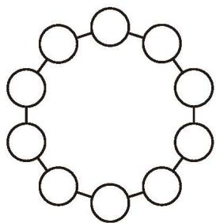

### ☆ 问题解决策略：反思

**问题** 证明：等腰三角形两腰上的中线相等。

已知：如图 1-41，在 $\triangle ABC$ 中，AB = AC，BD 和 CE 分别是边 AC，AB 上的中线。

求证：BD = CE。

##### 理解问题

已知条件是什么？目标是什么？将条件标注到图形中，你发现了哪些相等关系？

图 1-41

##### 拟订计划

(1) 证明两条线段相等有哪些常用的方法？
(2) 以 $BD$ 为边的三角形有哪些？以 $CE$ 为边的三角形呢？其中哪些三角形有可能全等？
(3) 找出两个有可能全等的三角形，要证明这两个三角形全等，已知哪些边或角相等？还需要证明哪些边或角相等？
(4) 整理你的思路，并与同伴进行交流。

##### 实施计划

按照下述思路写出证明过程，并说明每一步的理由。
(1) 通过 $\triangle ABD \cong \triangle ACE$ ，证明 BD = CE。
(2) 通过 $\triangle CBD \cong \triangle BCE$ ，证明 $BD = CE$ 。

##### 回顾反思

(1) 比较两种证明方法，你更喜欢哪种方法？说说你的理由。
(2) 根据题目的条件，你还能得到哪些结论？与同伴进行交流。
(3) 适当改变题目的条件，你还能得到哪些结论？
(4) 本题证明了等腰三角形两腰上的中线相等。反过来，如果一个三角形两边上的中线相等，那么这个三角形是等腰三角形吗？
(5) 你认为还可以研究哪些问题？与同伴进行交流。

解决问题之后，还可以继续进行思考与尝试：①条件不变，尝试寻找更多可能成立的结论；②适当改变条件（如将条件变成更一般的条件或类似的条件），探究结论是否仍然成立；③研究是否可以将一些条件和结论互换。

请你解答下列问题。

1. (1) 证明：全等三角形对应边上的中线相等；
   (2) 参考上述命题提出几个新的命题，并说明它们与原来命题的联系和区别。

2. (1) 将 $0 \sim 9$ 这 10 个数字填写到图 1-42 中 10 个圆圈内，使得相邻两数差的绝对值的和最大；
   (2) 参考上述问题提出几个新的问题，并说明它们与原来问题的联系和区别。

图 1-42

