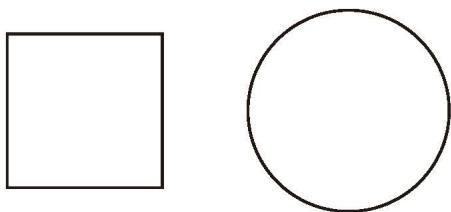
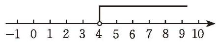
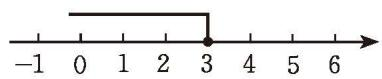
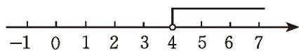
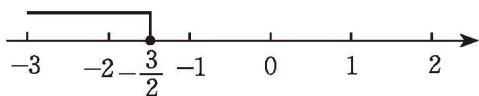
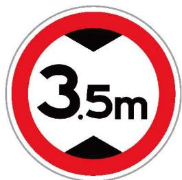
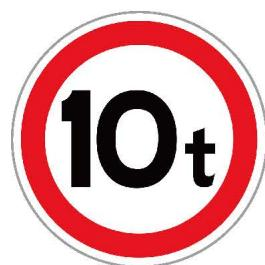

## 1 不等式及其基本性质

如图 2-1, 用两根长度均为 $l \mathrm{~cm}$ 的绳子分别围成一个正方形和一个圆。

图2-1
  
(1) 如果要使正方形的面积不大于 $25 \mathrm{~cm}^{2}$ , 那么绳长 $l$ 应满足怎样的关系式?  
(2) 如果要使圆的面积不小于 $100 \mathrm{~cm}^{2}$ , 那么绳长 $l$ 应满足怎样的关系式?  
(3) 当 $l = 8$ 时, 正方形和圆的面积哪个大? 如果 $l = 12$ 呢? 改变 $l$ 的取值再试一试, 由此你能得到什么猜想?

> [!think] 尝试·思考  
(1) 铁路部门对旅客随身携带的行李有如下规定: 每件行李外部尺寸的长、宽、高之和不得超过 $160 \mathrm{~cm}$ 。设行李外部尺寸的长、宽、高分别为 $a \mathrm{~cm}, b \mathrm{~cm}, c \mathrm{~cm}$ , 请你列出行李外部尺寸的长、宽、高满足的关系式。  
(2) 通过测量一棵树的树围 (树干的周长) 可以估算出它的树龄。通常规定以树干离地面 $1.5 \mathrm{~m}$ 的地方为测量部位。某树栽种时的树围为 $6 \mathrm{~cm}$ , 在一定生长期内每年增加约 $1 \mathrm{~cm}$ , 设经过 $x$ 年后这棵树的树围超过 $10 \mathrm{~cm}$ , 请你列出 $x$ 满足的关系式。

> [!observe] 观察·交流
由上述问题分别得到如下关系式：

$$
\pi \cdot (\frac {l}{2 \pi}) ^ {2} > (\frac {l}{4}) ^ {2}, a + b + c \leqslant 1 6 0, 6 + x > 1 0,
$$

观察这几个关系式，它们有什么共同特点？与同伴进行交流。

一般地，用符号“<”（或“≤”），“>”（或“≥”）连接的式子叫作不等式（inequality）。

> [!tip] 尝试·交流
生活中存在许多不等关系，请你举几个用不等式表示的例子，并与同伴进行交流。

##### 随堂练习

1. 用适当的符号表示下列关系：  
(1) $a$ 是非负数;  
(2) 直角三角形斜边 c 比它的两直角边 a, b 都长;  
(3) $x$ 与 17 的和比 $x$ 的 5 倍小;  
(4) 两数的平方和不小于这两数积的 2 倍。

2. 根据下列信息, 写出有关不等式: 2021年, 我国自主研制的“海斗一号”全海深自主遥控潜水器打破了多项无人潜水器的世界纪录, 包括最大下潜深度达到 $10908 \mathrm{~m}$ , 海底连续作业时间超过 $8 \mathrm{~h}$ , 近海底航行距离超过 $14 \mathrm{~km}$ 。

在上一课由树围估算树龄的问题中，我们得到不等式： $6 + x > 10$ 。你能找到满足这个不等式的 x 的一些值吗？

> [!think] 尝试·思考  
(1) $x = 3, 4, 5, 5.5$ 能使不等式 $6 + x > 10$ 成立吗?  
(2)你能找出多少个使不等式 $6 + x > 10$ 成立的 $x$ 值？你是怎样找的？

在一个含有未知数的不等式中，能使不等式成立的未知数的值，叫作不等式的解。

一个含有未知数的不等式的所有解，组成这个不等式的解集（solution set）。

例如：5是不等式 $6+x>10$ 的一个解，4.2，5.5，6，7，8，…也是这个不等式的解，不等式 $6+x>10$ 的解集是x>4；不等式 $x-1\leqslant2$ 的解集是 $x\leqslant3$ ；不等式 $x^{2}>0$ 的解集是所有非零实数。

求不等式解集的过程叫作解不等式。

> [!think] 思考·交流
你能在数轴上表示不等式 $6 + x > 10$ 的解集吗？不等式 $x - 1 \leqslant 2$ 的解集又该如何表示呢？与同伴进行交流。

不等式 $6 + x > 10$ 的解集 $x > 4$ 可以用数轴上表示4的点右边的部分来表示（如图2-2），在数轴上表示4的点的位置上画空心圆圈，表示4不在这个解集内。

图2-2

图2-3

不等式 $x - 1 \leqslant 2$ 的解集 $x \leqslant 3$ 可以用数轴上表示 3 的点及其左边的部分来表示（如图 2-3），在数轴上表示 3 的点的位置上画实心圆点，表示 3 在这个解集内。

##### 随堂练习

1. 判断正误:  
(1) 不等式 $x > \frac{2}{3}$ 的解有无数个；  
(2) x=4 是不等式 $x+5>10$ 的解。

2. 将下列不等式的解集分别表示在数轴上:  
(1) $x > 4$ ; (2) $x < -1$ ;  
(3) $x \geqslant -2$ ; (4) $x \leqslant 6$ 。

根据等式的基本性质可以对方程进行变形，进而求解方程。类似地，为了对不等式进行变形，就需要研究不等式的基本性质。

我们不难理解以下结论：  
(1) 如果 a > b，那么 b < a。  
(2) 如果 a < b, b < c，那么 a < c。

除此之外，你认为不等式还有哪些性质呢？

> [!tip] 尝试·交流  
(1) 如果在不等式的两边都加或都减同一个数, 那么不等式还成立吗? 请你举例说明。如果在不等式的两边都加或都减同一个代数式呢?  
(2) 如果在不等式的两边都乘同一个不等于 0 的数, 那么不等式还成立吗? 请你举例说明, 并与同伴进行交流。

不等式的基本性质1 不等式的两边都加（或减）同一个代数式，不等号的方向不变。

不等式的基本性质 2 不等式的两边都乘（或除以）同一个正数，不等号的方向 \_\_\_\_。

不等式的基本性质 3 不等式的两边都乘（或除以）同一个负数，不等号的方向 \_\_\_\_。

不等式的基本性质用字母可以表示为:

如果 a > b，那么 $a \pm c$ \_\_\_\_ $b \pm c$ ;

如果 a > b, c > 0，那么 ac \_\_\_\_ bc, $a \div c$ \_\_\_\_ $b \div c$ ;

如果 a > b, c < 0，那么 ac \_\_\_\_ bc, $a \div c$ \_\_\_\_ $b \div c$ 。

> [!think] 尝试·思考
在前面的学习中，我们猜想，无论绳长 l 取何值，圆的面积总大于正方形的面积，即 $\frac{l^{2}}{4\pi} > \frac{l^{2}}{16}$ 。你相信这个结论吗？你能利用不等式的基本性质解释这一结论吗？

例 根据不等式的基本性质解下列不等式，并将解集表示在数轴上：  
(1) $x - 5 > -1$ ; (2) $-2x \geqslant 3$ 。
解: (1) 根据不等式的基本性质 1, 两边都加 5, 得

$$
x > - 1 + 5,
$$
即

$$
x > 4 _ {\circ}
$$

这个不等式的解集在数轴上的表示如图 2-4 所示。

图2-4
  
(2) 根据不等式的基本性质 3, 两边都除以 -2 , 得

$$
x \leqslant - \frac {3}{2} \circ
$$

这个不等式的解集在数轴上的表示如图 2-5 所示。

图2-5

> [!think] 思考·交流
不等式的基本性质与等式的基本性质有什么联系和区别？与同伴进行交流。

##### 随堂练习

1. 已知 $x > y$ ，下列不等式一定成立吗？为什么？  
(1) $x - 6 <   y - 6;$  
(2) $3x < 3y$ ;  
(3) $-2x < -2y$ ;  
(4) $2x + 1 > 2y + 1$ 。

2. 解下列不等式，并将解集表示在数轴上：  
(1) $x - 1 > 2$ ;  
(3) $\frac{1}{2} x < 3$ 。  
(2) $-x < \frac{5}{6}$ ;

##### 习题2.1

##### 知识技能

1. 用适当的符号表示下列关系：  
(1) x 的 3 倍与 8 的和比 x 的 5 倍大； (2) $x^{2}$ 是非负数；  
(3)地球上海洋面积大于陆地面积;  
(4) 老师的年龄比你年龄的 2 倍还大;  
(5) 铅球的质量比篮球的质量大;  
(6) 中国人民解放军海军福建舰的满载排水量比山东舰的满载排水量大。

2. 在 $0, -4, 3, -3, \frac{1}{5}, -5, 4, -10$ 中，\_\_\_\_是方程 $x + 4 = 0$ 的解；\_\_\_\_是不等式 $x + 4 \geqslant 0$ 的解；\_\_\_\_是不等式 $x + 4 < 0$ 的解。

3. 将下列不等式的解集分别表示在数轴上:  
(1) $x \leqslant 0$ ;  
(2) $x > -2.5$ ;  
(3) $x < \frac{2}{3}$ ;  
(4) $x \geqslant 4$ 。

4. 已知 $a < b$ , 用“<”或“>”填空:  
(1) $a - 3$ \_\_\_\_ $b - 3$ ;  
(2) 6a\_\_\_\_6b;  
(3) $-a$ \_\_\_\_ -b;  
(4) $a - b$ \_\_\_\_ 0。

5. 解下列不等式，并将解集表示在数轴上：  
(1) $x+3<-1;$ (2)3x>27;  
(3) $-\frac{x}{3}>5;$ (4)5x<4x-6。

##### 数学理解

6. 请给下列不等式赋予不同的实际背景：  
(1) $x+y\leqslant5$ ; (2) $2x+1\geqslant3$ 。

7. (1) 不等式 $x < \frac{10}{3}$ 有多少个解？请找出几个。  
(2) 不等式 $x < \frac{10}{3}$ 有多少个正整数解？请一一写出来。

8.（1）比较 $a$ 与 $a + 2$ 的大小； (2）比较2与 $2 + a$ 的大小；
&emsp;※(3) 比较 a 与 2a 的大小。

##### 问题解决

9. 用甲、乙两种原料调制成 $10 \mathrm{~kg}$ 某种饮料, 这两种原料的维生素 C 含量及购买这两种原料的价格见下表:

<table><tr><td>原料</td><td>甲</td><td>乙</td></tr><tr><td>维生素C的含量/(单位/kg)</td><td>600</td><td>100</td></tr><tr><td>原料价格/(元/kg)</td><td>8</td><td>4</td></tr></table>  
(1) 如果要求 $10 \mathrm{~kg}$ 这种饮料中至少含有 4200 单位的维生素 C, 那么所需甲种原料的质量 $x$ (单位: $\mathrm{kg}$ ) 应满足怎样的不等式?  
(2) 如果要求调制 $10 \mathrm{~kg}$ 这种饮料的原料费用不超过 72 元, 那么所需甲种原料的质量 $x$ (单位: $\mathrm{kg}$ ) 又满足怎样的不等式?

10. 某弹簧测力计的测量范围是 $0 \sim 50 \mathrm{~N}$ 。小明未注意弹簧测力计的测量范围,用弹簧测力计测量一个物体,取下物体后,发现弹簧没有恢复原状。你知道这个物体所受的重力在什么范围吗?

##### 联系拓广

11. 在通过桥洞时, 我们往往会看到如图 (1) 所示的标志, 它表示禁止车货总体外廓高度超过标志所示数值的车辆通行。在通过桥面时, 我们往往会看到如图 (2) 所示的标志, 它表示禁止装载总质量超过标志所示数值的车辆通行。请用不等式分别表示可通过该桥洞车辆的车货总体外廓高度 $x$ (单位: $\mathrm{m}$ ) 的范围, 以及可通过该桥面车辆的装载总质量 $y$ (单位: t) 的范围。

(1)

(2)
  
(第11题)

12. 利用不等式的基本性质证明：一个数加一个正数，所得的结果比原来的数大。

