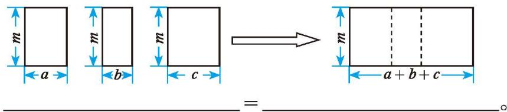
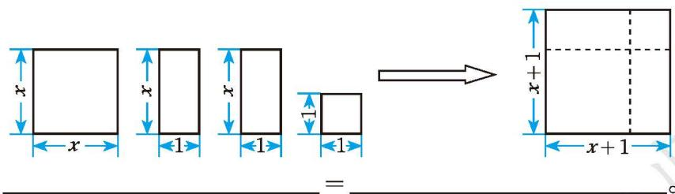
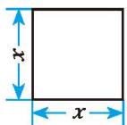
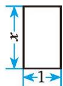
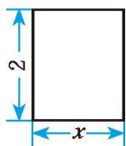
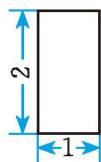

## 1 因式分解

$99^{3}-99$ 能被100整除吗？你是怎样想的？与同伴进行交流。

小明是这样做的:

$$
\begin{array}{r l} & 9 9 ^ {3} - 9 9 \\ & = 9 9 \times 9 9 ^ {2} - 9 9 \times 1 \\ & = 9 9 \times (9 9 ^ {2} - 1) \\ & = 9 9 \times 9 8 0 0 \\ & = 9 8 \times 9 9 \times 1 0 0 _ {\circ} \\ & \text {所以，} 9 9 ^ {3} - 9 9 \text {能被} \end{array}
$$

$99^{3}-99$ 还能被哪些正整数整除?
所以， $99^{3} - 99$ 能被100整除。

在这里，解决问题的关键是把一个数式化成了几个数乘积的形式。

> [!tip] 尝试·交流
你能把 $a^3 - a$ 化成几个整式乘积的形式吗？与同伴进行交流。

> [!observe] 观察·思考
观察下面拼图过程，写出相应的代数式。等号两边的代数式有什么不同？  
(1)

(2)

把一个多项式化成几个整式乘积的形式，这种变形叫作因式分解（factorization）。例如， $a^{3}-a=a(a+1)(a-1)$ ， $am+bm+cm=m(a+b+c)$ ， $x^{2}+2x+1=(x+1)^{2}$ 都是因式分解。因式分解也可称为分解因式。

##### 操作·思考

1. 计算下列各式:  
(1) $3x(x-1)=$ \_\_\_\_;  
(2) $m(a + b - 1) =$  
(3) $(m + 4)(m - 4) =$  
(4) $(y-3)^{2}=$ \_\_\_\_。

2. 根据上面的算式进行因式分解:  
(1) $3x^{2} - 3x = (\quad)$ ( );  
(2) $ma + mb - m = (\quad)$ ( );  
(3) $m^2 - 16 = (\quad)$ ( );  
(4) $y^{2}-6y+9=(\quad)(\quad)$ 。

3. 因式分解与整式乘法有什么关系？请举例说明。

##### 随堂练习

1. 连一连：

$$
x ^ {2} - y ^ {2}
$$

$$
(x + 3) ^ {2}
$$

$$
9 - 2 5 x ^ {2}
$$

$$
y (x - y)
$$

$$
x ^ {2} + 6 x + 9
$$

$$
(3 + 5 x) (3 - 5 x)
$$

$$
x y - y ^ {2}
$$

$$
(x + y) (x - y)
$$

2. 下列由左边到右边的变形，哪些是因式分解？为什么？  
(1) $(a + 3)(a - 3) = a^2 - 9$ ; (2) $m^2 - 4 = (m + 2)(m - 2)$ ;  
(3) $a^{2}-b^{2}+1=(a+b)(a-b)+1;$  
(4) $2mR + 2mr = 2m(R + r)$ 。

##### #

##### 习题 4.1

##### > 数学理解

1. 下列由左边到右边的变形，哪些是因式分解？  
(1) $a(x + y) = ax + ay;$  
(2) $10x^{2} - 5x = 5x(2x - 1)$ ;  
(3) $y^{2}-4y+4=(y-2)^{2};$  
(4) $t^2 - 16 + 3t = (t + 4)(t - 4) + 3t$

2. 求代数式 $IR_{1} + IR_{2} + IR_{3}$ 的值，其中 $R_{1} = 24.2, R_{2} = 36.4, R_{3} = 39.4, I = 2.5$ 。

3. 将下列四个图形拼成一个大长方形，再据此写出一个多项式的因式分解。

①

②

(第3题)
  
③

④

##### 问题解决

4. (1) $1999^{2} + 1999$ 能被 1999 整除吗? 能被 2000 整除吗?  
(2) $16.9 \times \frac{1}{8} + 15.1 \times \frac{1}{8}$ 能被4整除吗?

