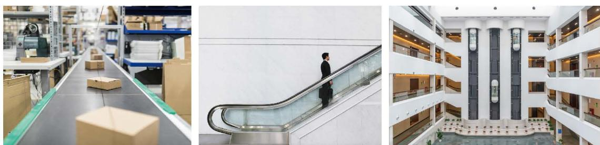

## 1 图形的平移

> [!info] 情景引入
>
> 图 3-1 反映的是日常生活中物体运动的一些场景，这些物体的运动有什么共同特点？你还能举出一些类似的例子吗？与同伴进行交流。
>
> 
>
>
>
> 图3-1
>
>
>

[图形的平移](图形的平移.md)

---

> [!info] 情景引入
> 如果将原来的“鱼”向左[平移](../概念/平移.md)4个单位长度呢？请你先想一想，再具体做一做。

[坐标系中的图形平移](坐标系中的图形平移.md)

---

[习题3.1 图形的平移](../习题/习题3.1 图形的平移.md)
