## 2 图形的旋转

图 3-11 反映的是日常生活中物体运动的一些场景，这些物体的运动有什么共同特点？你还能举出一些类似的例子吗？与同伴进行交流。

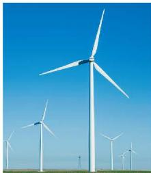
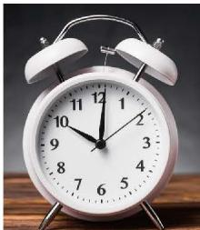

图3-11

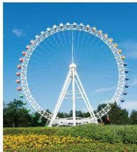

在平面内，将一个图形绕一个定点按某个方向转动一个角度，这样的图形运动称为旋转（rotation），这个定点称为旋转中心，转动的角称为旋转角。旋转不改变图形的形状和大小。

如图 3-12, $\triangle ABC$ 绕点 $O$ 按顺时针方向旋转一个角度, 得到 $\triangle DEF$ , 点 $A, B, C$ 分别旋转到了点 $D, E, F$ 。点 $A$ 与点 $D$ 是一组对应点, 线段 $AB$ 与线段 $DE$ 是一组对应线段, $\angle BAC$ 与 $\angle EDF$ 是一组对应角。在这一旋转过程中, 点 $O$ 是旋转中心, $\angle AOD$ , $\angle BOE$ , $\angle COF$ 都是旋转角。
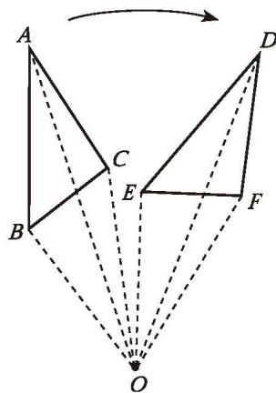

图3-12

##### 操作·思考

如图 3-13, 两张透明纸上的四边形 $ABCD$ 和四边形 $EFGH$ 完全重合, 在纸上选取旋转中心 $O$ , 并将其固定。把其中一张纸片绕点 $O$ 旋转一定角度 (如图 3-14)。

.0  
.0  
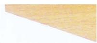
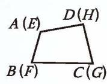

图3-13

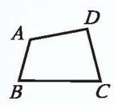

图3-14

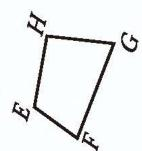

(1)
 观察图 3-14 中的两个四边形, 你能发现哪些相等的线段和相等的角?  
(2) 连接 $AO, BO, CO, DO, EO, FO, GO, HO$ , 你又能发现哪些相等的线段和相等的角?  
(3) 在图 3-14 中再取一些对应点, 画出它们与旋转中心所连成的线段,你又能发现什么?

改变透明纸上所画图形的形状，再试一试。

也可以用数学软件进行探索。

一个图形和它经过旋转所得的图形中，对应点到旋转中心的距离相等，任意一组对应点与旋转中心的连线所成的角都等于旋转角，对应线段相等，对应角相等。

> [!observe] 观察·思考
在图 3-15（1）～（4）的四个三角形中，哪个不能由 $\triangle ABC$ 经过平移或旋转得到？

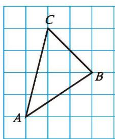
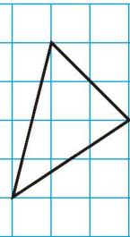

(1)

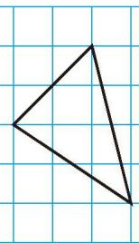

(2)
  
图3-15
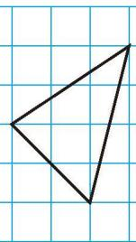

(3)

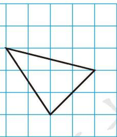

(4)

##### 随堂练习

1. 如图, 四边形 $ABCD$ 经过旋转后与四边形 $ADEF$ 重合。  
(1) 指出这一旋转的旋转中心和旋转角;  
(2) 写出图中相等的线段和相等的角。
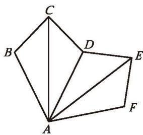

(第1题)

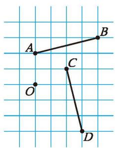

(第2题)

2. 如图, 你能绕点 $O$ 旋转, 使得线段 $A B$ 与线段 $C D$ 重合吗? 为什么?

我们已经学习了平面内图形旋转的概念和性质，怎样才能画出一个图形按一定条件旋转后的图形呢？

> [!example]- 例1 在图 3-16 中，画出线段 $AB$ 绕点 $A$ 按顺时针方向旋转 $60^{\circ}$ 后的线段。
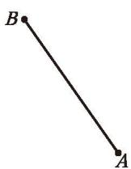

图3-16

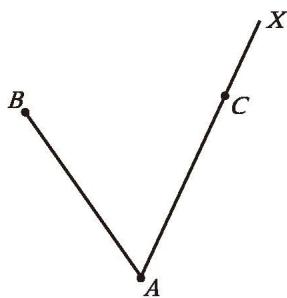

图3-17

解：（1）如图 3-17，以 AB 为一边按顺时针方向画 $\angle BAX$ ，使 $\angle BAX = 60^{\circ}$ 。  
(2) 在射线 ${AX}$ 上取点 $C$ ,使 ${AC} = {AB}$ 。

线段 $AC$ 就是线段 $AB$ 绕点 $A$ 按顺时针方向旋转 $60^{\circ}$ 后的线段。

> [!todo] 操作·交流
如图 3-18, $\bigtriangleup  {ABC}$ 绕点 $O$ 按逆时针方向旋转后,顶点 $A$ 旋转到了点 $D$ 。  
(1) 指出这一旋转的旋转角。  
(2) 画出旋转后的三角形。  
(3) 与同伴交流你的画法, 你们的画法都一样吗? 还有其他画法吗?
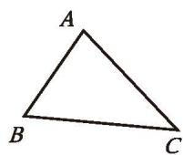

图3-18

> [!think] 思考·交流
确定一个图形旋转后的位置，需要哪些条件？你的依据是什么？与同伴进行交流。

> [!think] 尝试·思考
观察图 3-19，甲图案进行怎样的运动变化，可以与乙图案重合？写出你的操作过程。
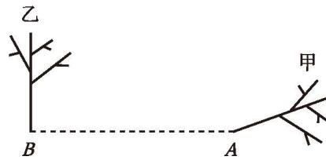

图3-19

##### 随堂练习

1. 在图中画出线段 $AB$ 绕点 $O$ 按顺时针方向旋转 $50^{\circ}$ 后的线段。

(第1题)

2. 将如图所示的五边形绕点 O 按顺时针方向旋转 $90^{\circ}$ ，画出旋转后的图形。

(第2题)

观察图 3-20，图（1）经过怎样的运动变化就可以与图（2）重合？观察图 3-21，再试一试。你还能举出一些类似的例子吗？与同伴进行交流。
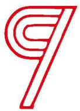

(1)

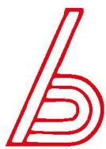

(2)
  
图3-20
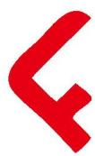

(1)

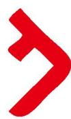

(2)
  
图3-21

如果把一个图形绕着某一点旋转 $180^{\circ}$ , 它能够与另一个图形重合, 那么就说这两个图形关于这个点对称或成中心对称 (central symmetry), 这个点叫作它们的对称中心 (centre of symmetry)。如图 3-22, $\triangle ABC$ 与 $\triangle A'B'C'$ 成中心对称, 点 $O$ 是它们的对称中心。
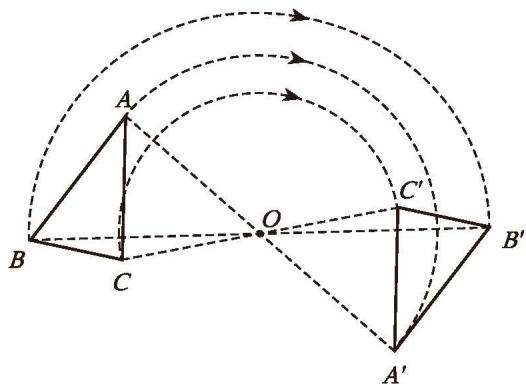

图3-22

> [!think] 尝试·思考  
(1)自己画一个图形，选取一个旋转中心，把所画的图形绕旋转中心旋转 $180^{\circ}$ 。  
(2) 连接旋转前后一组对应点, 你发现了什么? 再选几组对应点试一试。

也可以利用数学软件进行操作，请你试一试。

成中心对称的两个图形中，对应点所连线段经过对称中心，且被对称中心平分。

> [!example]- 例2 如图 3-23, 点 $O$ 是线段 $AE$ 的中点, 以点 $O$ 为对称中心, 画出与五边形 $ABCDE$ 成中心对称的图形。
解：如图 3-24，连接 BO 并延长至 $B'$ ，使 $OB' = OB$ ;
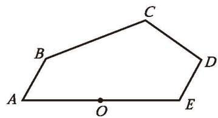

图3-23

连接 ${CO}$ 并延长至 ${C}^{\prime }$ ,使 $O{C}^{\prime } = {OC}$ ；
连接 DO 并延长至 $D'$ ，使 $OD' = OD$ ;

顺次连接 $E, B', C', D', A$ 。

图形 $EB'C'D'A$ 就是以点 $O$ 为对称中心、与五边形 $ABCDE$ 成中心对称的图形。
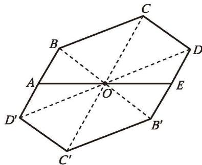

图3-24

> [!observe] 观察·交流
观察图 3-25，这些图形有什么共同特征？你还能举出一些类似的图形吗？与同伴进行交流。

图3-25

把一个图形绕某个点旋转 $180^{\circ}$ , 如果旋转后的图形能与原来的图形重合, 那么这个图形叫作中心对称图形, 这个点叫作它的对称中心。

> [!observe] 观察·思考  
(1) 观察你所学过的平面图形, 哪些图形是中心对称图形?  
(2) 在上面例 2 中, 图形 $ABCDEB'C'D'$ 是中心对称图形吗?

##### 随堂练习

1. 下面哪些图形是中心对称图形？
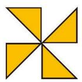

(1)

(2)

(第1题)
  
(3)
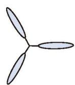

(4)

2. 下面扑克牌中, 哪些牌的牌面是中心对称图形?

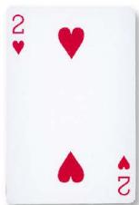

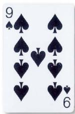
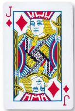

(第2题)

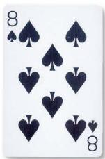

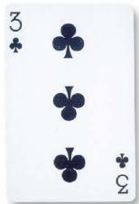

##### 旋转对称图形

观察图 3-26 中的等边三角形，点 O 是它的角平分线的交点，将这个三角形绕着点 O 旋转 $120^{\circ}$ ，可以发现，旋转后的图形与旋转前的图形重合。

类似地, 观察图 3-27 中的正六边形, 点 $O$ 是它的内角平分线的交点, 将这个正六边形绕着点 $O$ 旋转 $60^{\circ}$ , 旋转后的图形也与旋转前的图形重合。
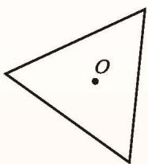

图3-26

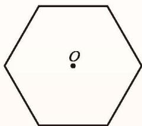

图3-27

一般地, 如果把一个图形绕着某一点旋转一定角度 (小于 $360^{\circ}$ ) 后, 能与原来的图形重合, 那么这个图形叫作旋转对称图形, 这个点叫作它的对称中心。

等边三角形和正六边形都是旋转对称图形，图 3-28 所示的图形也都是旋转对称图形。
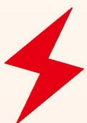

(1)

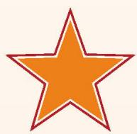

(2)
  
图3-28

(3)

想一想，在你所学过的几何图形中，哪些图形是旋转对称图形？你能设计一个旋转对称图形吗（要求它不是中心对称图形）？请你试一试。

##### 习题 3.2

##### 知识技能

1. 如图, 在 $\triangle ABC$ 中, $\angle C = 90^{\circ}$ , $\angle A = 50^{\circ}$ , 点 $D$ 在斜边 $AB$ 上。如果 $\triangle ABC$ 经过旋转后与 $\triangle EBD$ 重合, 那么这一旋转的旋转中心是哪个点? 旋转角是多少度?

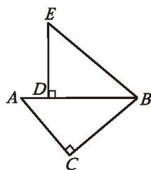

2. 如图, $\triangle ABC$ 绕点 $C$ 旋转后, 顶点 $A$ 旋转到了点 $D$ 。  
(1) 指出这一旋转的旋转角；
(第1题)  
(2) 画出旋转后的三角形。

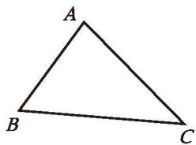
$D$  
(第2题)
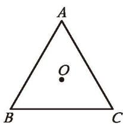

(第3题)

3. 如图, $\triangle ABC$ 为等边三角形, 点 $O$ 是 $\triangle ABC$ 角平分线的交点。将 $\triangle ABC$ 绕点 $O$ 按逆时针方向旋转, 分别画出旋转 $30^{\circ}, 60^{\circ}, 90^{\circ}$ 后的图形。

4. 如图，图案（1）进行怎样的运动变化，可以与图案（2）重合？写出你的操作过程。
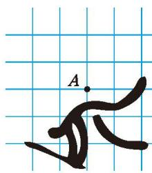

(1)
  
(第4题)
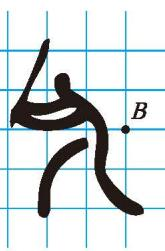

(2)

5. 在如图所示的 26 个英文大写正体字母中, 哪些字母是中心对称图形?

(第5题)

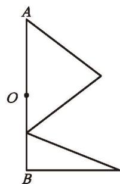

(第6题)

6. 以线段 $AB$ 的中点 $O$ 为对称中心, 画出与如图所示图形成中心对称的图形。

##### 数学理解

7. 在吊扇运转过程中,相同时间内吊扇上每个点运动的路程是否都一样?

8. 举出现实生活中旋转的一些实例。

9. 如图所示的四个四边形形状、大小完全相同。图（2）～（4）中，哪个图形可以由图（1）经过平移或旋转得到？
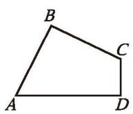

(1)

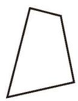

(2)

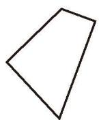

(第9题)
  
(3)
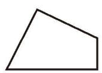

(4)

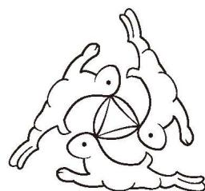

(第10题)

10. 敦煌莫高窟中有如图所示的三兔造型。图中的一只“兔子”经过旋转能够与相邻的“兔子”重合，请指出旋转中心，并写出旋转的方向和角度。

11. 有的图形是轴对称图形但不是中心对称图形，有的图形既是轴对称图形又是中心对称图形。请分别举例说明。

##### 问题解决

12. 如图, 在 $\triangle ABC$ 中, $AB = AC$ 。请你用两个与 $\triangle ABC$ 全等的三角形拼成一个四边形, 并说明在你拼成的图形中, 其中一个三角形经过怎样的运动变化就可以得到另一个三角形。
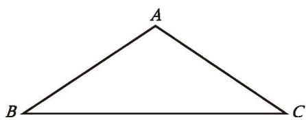

(第12题)

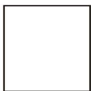

(第13题)

13. 在图中的空白正方形内部设计一个图案，使得设计的图案和正方形构成的整体是一个既中心对称又轴对称的图案，并说明你所设计图案的含义。

14. 请将图中的一个空白小方格涂上阴影，使它与现有三个带有阴影的小方格一起组成一个中心对称图形。你有几种涂法？

(第14题)

(第15题)

15. 如图, 将 $\triangle ABC$ 绕边 $AC$ 的中点 $E$ 旋转 $180^{\circ}$ , 请画出旋转后的三角形。设点 $B$ 的对应点是点 $D$ , 结合旋转过程, 请写出至少两条关于四边形 $ABCD$ 的边或角的性质。

