## 2 平行四边形的判定

如图 6-8，要画出一个以线段 AB，AD 为邻边，以 $\angle BAD$ 为一个内角的 $\square ABCD$ ，你有哪些画法？与同伴进行交流。
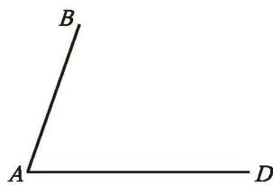

图6-8

> [!think] 思考·交流
依据定义，两组对边分别平行的四边形是平行四边形。除此之外，你还能发现平行四边形的哪些判定条件？你是怎样想到的？与同伴进行交流。

我们发现：两组对边分别相等的四边形是平行四边形。请你尝试证明这一结论。

已知：如图 6-9 (1)，在四边形 ABCD 中，AB = CD，AD = CB。

求证: 四边形 $ABCD$ 是平行四边形。
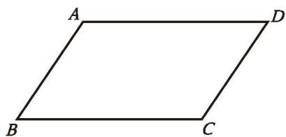

(1)

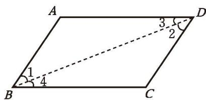

图6-9
  
(2)
证明：如图 6-9（2），连接 BD。

在 $\triangle ABD$ 和 $\triangle CDB$ 中，

$$
\because A B = C D, A D = C B, B D = D B,
$$

$$
\therefore \quad \triangle A B D \cong \triangle C D B _ {\circ}
$$

$$
\therefore \angle 1 = \angle 2, \angle 3 = \angle 4 。
$$

$$
\therefore \quad A B \parallel C D, A D \parallel C B 。
$$
∴ 四边形 ABCD 是平行四边形（平行四边形的定义）。

定理 两组对边分别相等的四边形是平行四边形。

我们还发现：一组对边平行且相等的四边形是平行四边形。请你尝试证明这一结论。

已知：如图 6-10（1），在四边形 ABCD 中， $AB \parallel^{①} CD$ 。

求证: 四边形 $ABCD$ 是平行四边形。
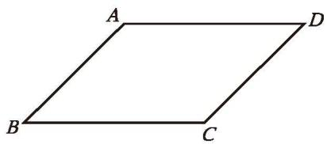

(1)

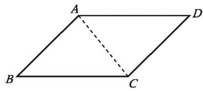

图6-10
  
(2)
证明：如图6-10（2），连接 $AC$ 。\$\because AB \parallel CD,\$
\$\therefore \angle BAC = \angle DCA\$。
又\$\because AB = CD, AC = CA,\$
\$\therefore \triangle ABC \cong \triangle CDA\$。
\$\therefore BC = DA\$。

你还有其他证法吗？与同伴进行交流。
∴ 四边形 ABCD 是平行四边形（两组对边分别相等的四边形是平行四边形）。

定理 一组对边平行且相等的四边形是平行四边形。

> [!example]- 例1 已知：如图 6-11，在 □ABCD 中，E，F 分别为 AD 和 CB 的中点。
求证: 四边形 $BFDE$ 是平行四边形。
证明：∵ 四边形 ABCD 是平行四边形，

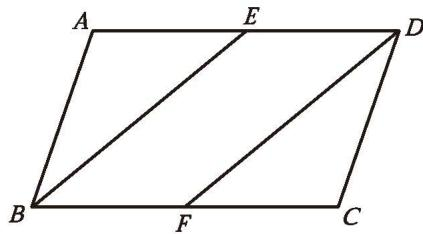
∴ AD = CB（平行四边形的对边相等）， $AD \parallel CB$ （平行四边形的定义）。

图 6-11
∵ E, F 分别为 AD 和 CB 的中点，

$$
\therefore E D = \frac {1}{2} A D, F B = \frac {1}{2} C B _ {\circ}
$$

$$
\therefore \quad E D = F B, E D / / F B _ {\circ}
$$
∴ 四边形 BFDE 是平行四边形（一组对边平行且相等的四边形是平行四边形）。

##### 随堂练习

1. 如图, 线段 ${AD}$ 是由线段 ${BC}$ 经过平移得到的,分别连接 ${AB}$ , ${CD}$ ,四边形 ${ABCD}$ 是平行四边形吗？请说明理由。
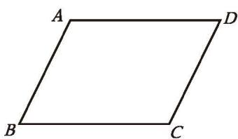

(第1题)

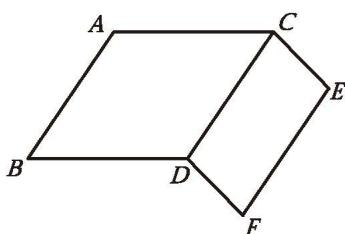

(第2题)

2. 如图, $AC = BD$ , $AB = CD = EF$ , $CE = DF$ 。图中有哪些互相平行的线段? 请说明理由。

通过上一课 “思考·交流” 的讨论, 我们还发现: 对角线互相平分的四边形是平行四边形。请你尝试证明这一结论。

已知：如图 6-12，四边形 ABCD 的两条对角线 AC 与 BD 相交于点 O，并且 OA = OC，OB = OD。

求证: 四边形 $ABCD$ 是平行四边形。
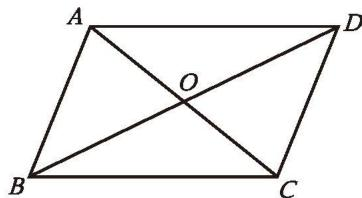

图6-12

证明：∵ OA = OC, OD = OB, $\angle AOD = \angle COB,$ ∴ $\triangle AOD \cong \triangle COB_{\circ}$ ∴ AD = CB, $\angle ADO = \angle CBO_{\circ}$ ∴ $AD \parallel CB_{\circ}$
∴ 四边形 ABCD 是平行四边形（一组对边平行且相等的四边形是平行四边形）。

定理 对角线互相平分的四边形是平行四边形。

> [!example]- 例2 已知：如图 6-13（1），E，F 是 □ABCD 对角线 AC 上的两点，且 AE = CF。
求证: 四边形 $BFDE$ 是平行四边形。
分析：要证明一个四边形是平行四边形，如果从对角线的角度考虑，需要满足什么条件？如果从对边的角度考虑呢？
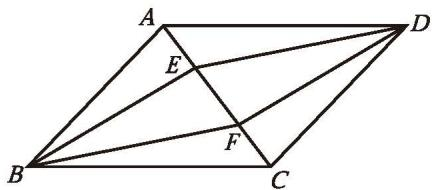

(1)

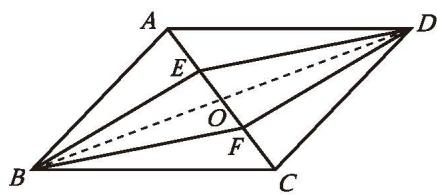

图6-13
  
(2)
证明：如图 6-13（2），连接 BD，交 AC 于点 O。
∵ 四边形 ABCD 是平行四边形，

$\therefore {OA} = {OC},{OB} = {OD}$ (平行四边形的对角线互相平分)。

$$
\because A E = C F,
$$

$$
\therefore O A - A E = O C - C F,
$$
即 $OE = OF$ 。
∴ 四边形 BFDE 是平行四边形（对角线互相平分的四边形是平行四边形）。

还有其他证法吗？

> [!think] 思考·交流
比较平行四边形的性质定理和判定定理，它们有怎样的关系？与同伴进行交流。

> [!summary] 回顾·反思
回顾平行四边形性质定理和判定定理的证明过程，你积累了哪些分析证明思路的经验？

##### 随堂练习

1. 如图，在 □ABCD 中，对角线 AC 与 BD 相交于点 O，点 E，F 分别是 OA 和 OC 的中点，四边形 BFDE 是平行四边形吗？请说明理由。

(第1题)

如图 6-14，在笔直的铁轨下，夹在两根铁轨之间的平行枕木是否一样长？你能说明理由吗？与同伴进行交流。

图6-14

> [!example]- 例3 已知：如图 6-15，直线 $a \parallel b$ ， $A$ ， $B$ 是直线 $a$ 上任意两点， $AC \perp b$ ， $BD \perp b$ ，垂足分别为 $C$ ， $D$ 。
求证： $AC = BD$ 。
证明：∵ $AC \perp CD,\ BD \perp CD,$

$$
\therefore \angle 1 = \angle 2 = 9 0 ^ {\circ} 。
$$

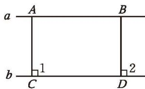

$$
\therefore A C \parallel B D _ {\circ}
$$

图6-15

$$
\because \quad A B \parallel C D,
$$
∴ 四边形 ACDB 是平行四边形（平行四边形的定义）。

$\therefore AC=BD$ (平行四边形的对边相等)。

如果两条直线互相平行，那么其中一条直线上任意一点到另一条直线的距离都相等，这个距离称为平行线之间的距离。

##### 操作·思考

夹在两条平行线间的平行线段一定相等吗？为什么？画一画，想一想。

> [!tip] 尝试·交流
每人准备一张方格纸，以方格纸的格点为顶点画出几个平行四边形，并与同伴讨论各自画图的正确性。

> [!example]- 例4 已知：如图 6-16，在 □ABCD 中，点 M，N 分别在边 AD 和 BC 上，点 E，F 在对角线 BD 上，且 DM = BN，DF = BE。
求证: 四边形 ${MENF}$ 是平行四边形。
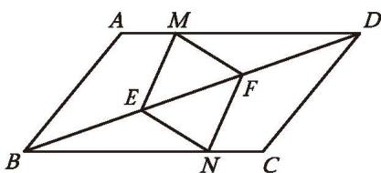

图6-16

证明：∵ 四边形 ABCD 是平行四边形，
∴ $AD \parallel BC$ (平行四边形的定义)。

$$
\therefore \angle M D F = \angle N B E _ {\circ}
$$

$$
\because D M = B N, D F = B E,
$$

$$
\therefore \quad \triangle M D F \cong \triangle N B E _ {\circ}
$$

还有其他证法吗？

$$
\therefore M F = N E, \angle M F D = \angle N E B _ {\circ}
$$

$$
\therefore \quad \angle M F E = \angle N E F _ {\circ}
$$

$$
\therefore M F \parallel N E _ {\circ}
$$
∴ 四边形 MENF 是平行四边形（一组对边平行且相等的四边形是平行四边形）。

##### 随堂练习

1. 如图, 在 $\square ABCD$ 中, $\angle ABC = 70^{\circ}$ , $\angle ABC$ 的平分线交 $AD$ 于点 $E$ , 过点 $D$ 作 $BE$ 的平行线交 $BC$ 于点 $F$ , 求 $\angle CDF$ 的度数。
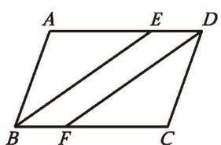

(第1题)

##### 阅读·思考

##### 生活中的平行四边形

平行四边形是日常生活中常见的图形，如扶梯护栏、居民小区大门的栅栏道闸等。此外，如图 6-17 所示的缩放尺的结构也是平行四边形。

实际上，平行四边形连杆是机械结构中常见的一种部件。这种连杆在移动时，两对边始终保持平行，能方便地进行往复运动。
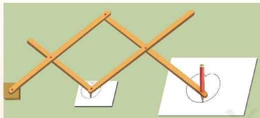

图6-17

下面有三组平行四边形连杆机械的实例设计图（如图6-18）： $(\mathrm{A}_{1})(\mathrm{A}_{2})$ 是指针式弹簧秤； $(\mathrm{B}_{1})(\mathrm{B}_{2})$ 是活动工具箱； $(\mathrm{C}_{1})(\mathrm{C}_{2})$ 是儿童荡板。每一组设计图中有一幅是合理的，有一幅有一点问题。你知道哪一幅有问题吗？
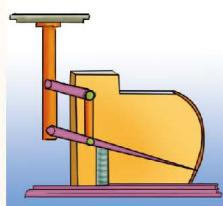

(A₁)

$(A_{2})$

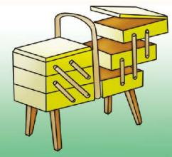
$(B_{1})$

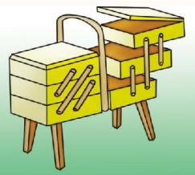
$(B_{2})$

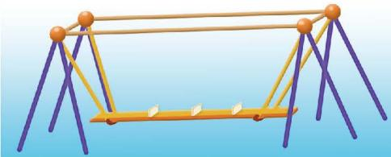
$(C_{1})$
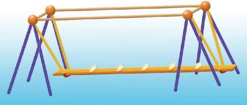

图6-18
  
$\left( {\mathrm{C}}_{2}\right)$

##### 习题6.2

##### 知识技能

1. 如图, $AC \parallel DE$ , 点 $B$ 在 $AC$ 上, 且 $AB = DE = BC$ 。找出图中的平行四边形, 并说明理由。

(第1题)

2. 已知：如图，在四边形 ABCD 中， $\angle B = \angle D, \angle 1 = \angle 2$ 。求证：四边形 ABCD 是平行四边形。

3. 已知：如图,在四边形 $ABCD$ 中, $AB \parallel CD$ , $\angle B = \angle D$ 。

求证: 四边形 $ABCD$ 是平行四边形。
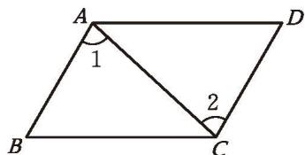

(第2题)

(第3题)

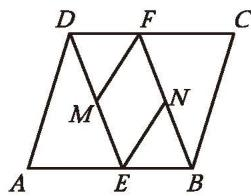

(第4题)

4. 已知：如图，在 $\square ABCD$ 中， $E, F$ 分别是边 $AB$ 和 $CD$ 上的点， $AE = CF, M, N$ 分别是线段 $DE$ 和 $BF$ 的中点。

求证: 四边形 $ENFM$ 是平行四边形。

5. 已知：如图，在 □ABCD 中，E，F 分别是边 CD 和 AB 上的点，AE∥CF，BE 交 CF 于点 H，DF 交 AE 于点 G。求证：EG = FH。

(第5题)

##### 数学理解

6. 小明是这样画平行四边形的: 如图, 将三角尺 $ABC$ 的一边 $AC$ 贴着直尺推移到 $A_{1} B_{1} C_{1}$ 的位置, 这时四边形 $ABB_{1} A_{1}$ 就是平行四边形。请解释小明这样做的道理。

(第6题)

7. 如图, $\square ABCD$ 的对角线 $AC$ 与 $BD$ 相交于点 $O$ , 点 $E$ , $F$ 分别在 $OB$ 和 $OD$ 上。请你添加适当的条件, 使四边形 $AECF$ 是平行四边形, 并说明理由。

(第7题)

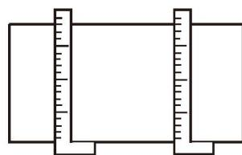

(第8题)

8. 如图, 为了检验一块木板相对的两个边缘是否平行, 木工师傅常常把两把曲尺的一边紧靠木板一个边缘, 再看木板另一个边缘对应曲尺上的刻度是否相等, 如果刻度相等, 那么木工师傅就判断木板相对的两个边缘平行。请解释木工师傅这样做的道理。

9. 如图, 在 $4 \times 4$ 方格纸中, 每个小方格的边长均为 1, A, B 两点在格点上, 请在图中格点上找到点 $C$ , 使得 $\triangle ABC$ 的面积为 2。满足条件的点 $C$ 有几个?

(第9题)

##### > 问题解决

10. 求证：两组对角分别相等的四边形是平行四边形。

11. 一张平行四边形纸片 $ABCD, AD > AB$ 。  
(1)如图,折叠平行四边形纸片 $ABCD$ ,可以得到 $\angle BAD$ 和 $\angle BCD$ 的平分线,其中 $\angle BAD$ 的平分线交 $BC$ 于点 $E$ , $\angle BCD$ 的平分线交 $AD$ 于点 $F$ 。请证明: 四边形 $AECF$ 是平行四边形。  
(2) 你还有哪些方法能折出一个平行四边形？选择其中一种，说明你的方法的正确性。

(第11题)

&emsp;※12.《几何原本》中有这样一道作图题：作一个平行四边形，使它的一个内角等于给定角，面积等于给定多边形的面积。如图，已知四边形ABCD和 $\angle \alpha$ ，如何作 $\square MNGK$ ，使 $\angle N = \angle \alpha$ ，且 $\square MNGK$ 的面积等于四边形ABCD的面积？  
(1) 如何确定□MNGK 的一条边长及这条边上的高?  
(2) 请用尺规作 □MNGK。
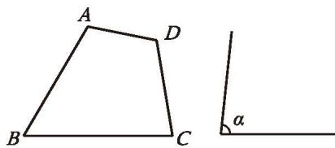

(第12题)

13. 如图, 在 $\square ABCD$ 中, 对角线 $AC$ 与 $BD$ 相交于点 $O$ , 点 $E, F, G, H$ 分别在线段 $AO, BO, CO, DO$ 上。  
(1) 如果 $AE = \frac{1}{2} AO$ , $BF = \frac{1}{2} BO$ , $CG = \frac{1}{2} CO$ , $DH = \frac{1}{2} DO$ , 那么四边形 $EFGH$ 是平行四边形吗? 请证明你的结论。  
(2) 如果 $AE = \frac{1}{3} AO$ , $BF = \frac{1}{3} BO$ , $CG = \frac{1}{3} CO$ , $DH = \frac{1}{3} DO$ , 那么四边形 $EFGH$ 是平行四边形吗? 请证明你的结论。  
(3) 如果 $AE = \frac{1}{n} AO$ , $BF = \frac{1}{n} BO$ , $CG = \frac{1}{n} CO$ , $DH = \frac{1}{n} DO$ , 其中 $n$ 为大于 1 的正整数, 那么上述结论还成立吗?
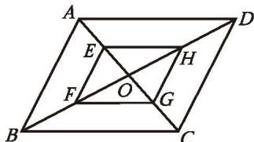

(第13题)

14. 如图，小刚在做作业时，发现一道题中有部分文字被污染了。请在被污染的位置补充适当条件，并完成证明。

已知：如图,在四边形 ${ABCD}$ 中,点 $E,F$ 在对角线 ${AC}$ 上,

$$
\angle 1 = \angle 2, \angle 3 = \angle 4 。
$$

求证: 四边形 $ABCD$ 是平行四边形。
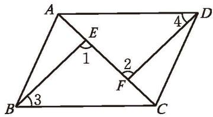

(第14题)

##### 联系拓广

&emsp;※15. 如图, 四边形 $ABCD$ 是平行四边形, 过点 $A$ 作直线 $l$ , 交 $CD$ 边于点 $E$ 。  
(1) 点 $B$ 、点 $C$ 、点 $D$ 到直线 $l$ 的距离之间有怎样的关系？你是怎么发现的？请证明你的结论。  
(2) 将□ABCD绕点A按顺时针方向旋转，你还能发现哪些结论？选择其中一个结论加以证明。

(第15题)

