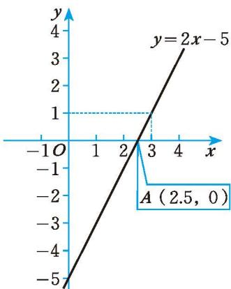

## 3 一元一次不等式与一次函数

> [!info] 情景引入
>
> 函数 $y = 2x - 5$ 的图象如图2-8所示，观察图象回答下列问题：  
> (1) $x$ 取什么值时, $2 x - 5 = 0$ ?  
> (2) $x$ 取哪些值时, $2 x - 5 > 0$ ?  
> (3) x 取哪些值时，2x - 5 < 0？  
> (4) $x$ 取哪些值时, $2 x - 5 > 1$ ?
>
> 你是怎样思考的？与同伴进行交流。
>
> 
>

[一元一次不等式与一次函数](一元一次不等式与一次函数.md)

---

[习题2.3 一元一次不等式与一次函数](../习题/习题2.3 一元一次不等式与一次函数.md)
