## 3 三角形的中位线

你能将任意一个三角形分成四个全等的三角形吗？你能通过剪拼的方式，将一个三角形拼成一个与其面积相等的平行四边形吗？

> [!think] 思考·交流
> 小明的做法是：如图 6-19（1），在 $\triangle ABC$ 中，连接每两边的中点，看上去就得到了四个全等的三角形。如图 6-19（2），将 $\triangle ADE$ 绕点 $E$ 按顺时针方向旋转 $180^{\circ}$ 到 $\triangle CFE$ 的位置，这样就得到了一个与 $\triangle ABC$ 面积相等的 $\square DBCF$ 。

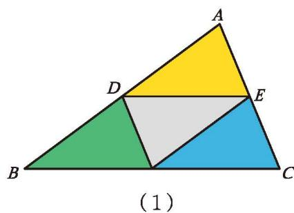

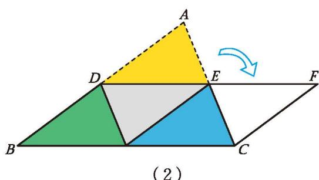

图 6-19

从小明的上述做法中，你能猜想出三角形两边中点的连线与第三边有怎样的关系吗？与同伴进行交流。

连接三角形两边中点的线段叫作三角形的**中位线**。

可以发现：三角形的中位线平行于第三边，且等于第三边的一半。请你尝试证明这一结论。

已知：如图 6-20（1），DE 是 $\triangle ABC$ 的中位线。

求证：$DE \parallel BC$ ，$DE = \frac{1}{2} BC$ 。

分析：为证明一条线段等于另一条线段的一半，可否把问题先转化为证明与之有关的某两条线段相等？怎样获得与目标线段相等的线段？前面小明的做法对你有哪些启发？

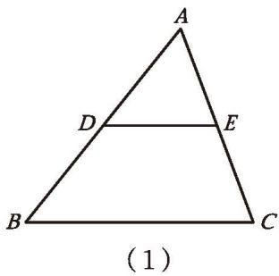

图 6-20

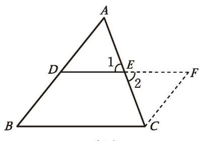

证明：如图 6-20（2），延长 DE 至 F，使 FE = DE，连接 CF。

在 $\triangle ADE$ 和 $\triangle CFE$ 中，

$$
\because AE = CE,\ \angle 1 = \angle 2,\ DE = FE,
$$

$$
\therefore \angle A = \angle ECF,\ AD = CF .
$$

$$
\therefore CF \parallel AB .
$$

$$
\because BD = AD,
$$

$$
\therefore CF = BD .
$$

∴ 四边形 DBCF 是平行四边形（一组对边平行且相等的四边形是平行四边形）。
∴ $DF \parallel BC$ (平行四边形的定义)，

DF = BC（平行四边形的对边相等）。

$$
\therefore DE \parallel BC,\ DE = \frac{1}{2} BC .
$$

**三角形的中位线定理** 三角形的中位线平行于第三边，且等于第三边的一半。

利用三角形的中位线定理可以证明小明分割的四个小三角形全等。

例如图 6-21，$\square ABCD$ 的对角线 AC 与 BD 相交于点 O，E 为 AB 的中点，$\angle ADB = 90^{\circ}$，AC = 6，OE = 1。求 AD 和 BD 的长度。

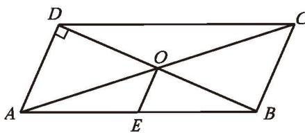

图 6-21

解：∵ $\square ABCD$ 的对角线 AC 与 BD 相交于点 O，
∴ OA = OC, OD = OB (平行四边形的对角线互相平分)。
∵ E 为 AB 的中点，

$\therefore OE$ 是 $\triangle ADB$ 的中位线（三角形的中位线的定义）。

$\therefore AD = 2OE = 2$ （三角形的中位线定理）。

$$
\because AC = 6,\ OA = OC,
$$

$$
\therefore OA = \frac{1}{2} AC = \frac{1}{2} \times 6 = 3 .
$$

在 Rt $\triangle ADO$ 中，由勾股定理可得

$$
OD = \sqrt{OA^{2} - AD^{2}} = \sqrt{3^{2} - 2^{2}} = \sqrt{5} .
$$

$$
\therefore BD = 2OD = 2\sqrt{5} .
$$

##### 随堂练习

1. 已知三角形的各边长分别为 $8\ \mathrm{cm},\ 10\ \mathrm{cm}$ 和 $12\ \mathrm{cm}$ ，求以各边中点为顶点的三角形的周长。

2. 如图，$A$、$B$ 两地被池塘隔开，小明通过下面的方法估测出了 $A$、$B$ 间的距离：先在 $AB$ 外选一点 $C$ ，然后步测出 $AC$、$BC$ 的中点 $M$、$N$ ，并步测出 $MN$ 的长，由此他就知道了 $A$、$B$ 间的距离。请解释其中的道理。

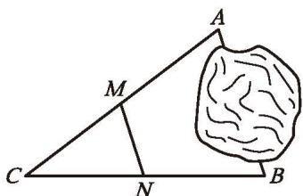

(第2题)

##### 习题 6.3

###### 知识技能

1. 已知：在 $\triangle ABC$ 中，$D,\ E,\ F$ 分别是边 $BC,\ CA,\ AB$ 的中点。
   求证：四边形 $AFDE$ 的周长等于 $AB + AC$ 。

2. 求证：三角形的一条中位线与第三边上的中线互相平分。

###### 数学理解

3. 如图，在四边形 $ABCD$ 中，$E,\ F,\ G,\ H$ 分别是 $AB,\ CD,\ AC,\ BD$ 的中点。四边形 $EGFH$ 是平行四边形吗？请证明你的结论。

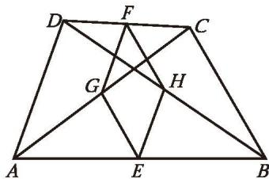

(第3题)

###### 问题解决

4. 在本节随堂练习第2题中，如果 $M,\ N$ 两点之间还有阻隔，你有什么解决办法？请说明理由。

### 平行四边形 回顾与思考

1. 平行四边形是轴对称图形吗？是中心对称图形吗？此外，平行四边形还有哪些性质？

2. 一个四边形满足什么条件时是平行四边形？这些结论与平行四边形的性质之间有什么样的关系？

3. 回顾平行四边形的研究过程，你积累了哪些经验？与同伴进行交流。

4. 你是怎样得到三角形的中位线定理的？

5. 梳理本章内容，用适当的方式呈现全章知识结构，并与同伴进行交流。

### 平行四边形 复习题

###### 知识技能

1. 在 $\square ABCD$ 中，已知 $AB = 6$ ，$AD$ 为 $\square ABCD$ 周长的 $\frac{2}{7}$ ，求 $BC$ 的长度。

2. 在四边形 $ABCD$ 中，$\angle A = 30^{\circ}$ ，$\angle B = 150^{\circ}$ ，$\angle C = 30^{\circ}$ ，$AB = 2$ ，求 $DC$ 的长度。

3. 如图，在 $\square ABCD$ 中，点 $E,\ H,\ F,\ G$ 分别在边 $AB,\ BC,\ CD,\ AD$ 上，$EF \parallel AD$ ，$GH \parallel CD$ ，$EF$ 与 $GH$ 相交于点 $O$ ，图中共有多少个平行四边形？

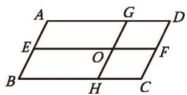

(第3题)

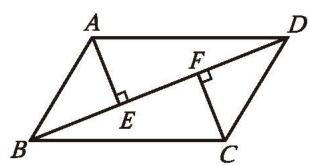

(第4题)

4. 已知：如图，在 $\square ABCD$ 中，AE $\perp$ BD，CF $\perp$ BD，垂足分别为 E，F。
   求证：$\angle BAE = \angle DCF$ 。

5. 已知：如图，点 E 在 $\square ABCD$ 的边 BC 的延长线上，且 CE = BC。
   求证：四边形 ACED 是平行四边形。

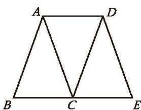

(第5题)

(第6题)

6. 如图，在梯形 $ABCD$ 中，$AD \parallel BC$ ，$\angle B = 90^\circ$ ，$AD = 2$ ，$BC = 5$ ，$\angle C = 60^\circ$ ，求 $CD$ 的长度。

7. 如图，剪两张对边平行的纸条，随意交叉叠放在一起，转动其中一张，重合的部分构成了一个四边形。线段 $AB$ 和 $CD$ 的长度有什么关系？

(第7题)

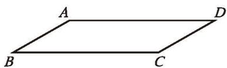

(第8题)

8. 如图，在 $\square ABCD$ 中，已知 $AB = 4\ \mathrm{cm}$ ，$BC = 9\ \mathrm{cm}$ ，$\angle B = 30^{\circ}$ ，求 $\square ABCD$ 的面积。

9. 画一个 $\square ABCD$，使 $\angle B = 45^{\circ}$，AB = 2 cm，BC = 3 cm。

10. 已知：如图，四边形 ABCD 是平行四边形，P, Q 是对角线 BD 上的两点，且 BP = DQ。求证：$AP \parallel CQ$ 。

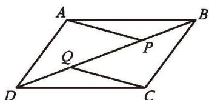

(第10题)

11. 已知：如图，在 $\square ABCD$ 中，$\angle ABC$ 的平分线交 $AD$ 于点 $E$ ，$\angle BCD$ 的平分线交 $AD$ 于点 $F$ ，交 $BE$ 于点 $G$ 。求证：$AF = DE$ 。

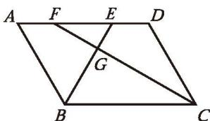

(第11题)

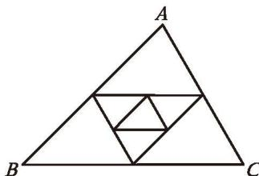

(第12题)

12. 如图，$\triangle ABC$ 的三边长分别为 $a,\ b,\ c$ ，以它的三边中点为顶点组成一个新三角形，再以这个新三角形三边中点为顶点又组成一个小三角形。求这个小三角形的周长。

13. 已知：如图，点 O 是 $\square ABCD$ 的对角线 BD 的中点，E，F 分别是边 BC 和 AD 上的点，且 $AE \parallel FC$ 。求证：EF 经过点 O。

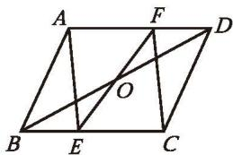

(第13题)

(第14题)

14. 已知：如图，在四边形 ABCD 中，$DE \perp AC$ ，$BF \perp AC$ ，垂足分别为 E，F，DE = BF，$\angle ADB = \angle CBD$ 。求证：四边形 ABCD 是平行四边形。

###### 数学理解

15. 如图，$DE$ 是 $\triangle ABC$ 的中位线，过点 $E$ 作 $AB$ 的平行线，交 $BC$ 于点 $F$ ，过点 $A$ 作 $BC$ 的平行线，交直线 $EF$ 于点 $G$ 。请利用这个图形证明三角形的中位线定理。

(第15题)

16. 用六个全等的正三角形拼成如图所示的图形，请找出图中所有的平行四边形，并选择其中之一加以证明。

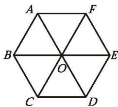

(第16题)

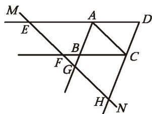

(第17题)

17. 已知：如图，直线 $MN$ 与 $\square ABCD$ 的对角线 $AC$ 平行，延长 $DA,\ CB,\ AB,\ DC$ ，分别交 $MN$ 于点 $E,\ F,\ G,\ H$ 。求证：$EF = GH$ 。

###### 问题解决

18. 小华要做一个平行四边形木框，他有七根木条，长度分别为：①3cm，②5cm，③3cm，④6cm，⑤5cm，⑥8cm，⑦9cm。请你帮他选一选，用哪四根木条可以组成一个平行四边形木框？请说明理由。

19. 如图，在平行四边形纸片 $ABCD$ 中，$AB = 3\ \mathrm{cm}$ ，将纸片沿对角线 $AC$ 折叠，$BC$ 与 $AD$ 交于点 $E$ ，此时 $\triangle CDE$ 恰为等边三角形。
    (1) 求 $AD$ 的长;
    (2) 求重叠部分的面积。

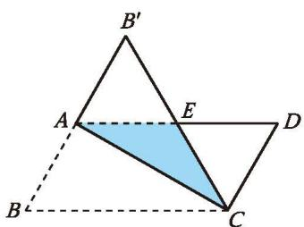

(第19题)

(第20题)

20. 如图，某村有一个四边形池塘，它的四个顶点 $A,\ B,\ C,\ D$ 处均有一棵大树，村里准备开挖池塘建鱼塘，想使池塘的面积扩大一倍，又想保持大树在池塘边不动，并要求扩建后的池塘成平行四边形的形状，请问能否实现这一设想？若能，请你设计出所要求的平行四边形；若不能，请说明理由。

21. 人们往往借助三角形来研究平行四边形或一般的多边形。对此你有哪些感悟？请写一篇小短文与同学分享。

###### 联系拓广

22. 如图，点 M，N 分别在 $\square ABCD$ 的边 AB 和 CD 上。
    (1) 已知 $AM = \frac{1}{2} AB,\ CN = \frac{1}{2} CD$ ，求证：四边形 $AMCN$ 是平行四边形；
    (2) 当 $AM = \frac{1}{3} AB$ ，$CN = \frac{1}{3} CD$ 时，四边形 AMCN 是平行四边形吗？如果 $AM = \frac{1}{m} AB$ ，$CN = \frac{1}{m} CD\ (m > 1)$ 呢？你能得出一个一般性的结论吗？试一试！

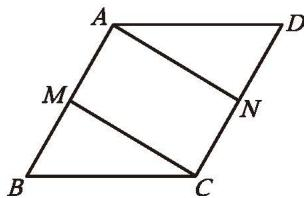

(第22题)

23. 已知：如图，将 $\square ABCD$ 纸片折叠，使得点 C 落在点 A 的位置，折痕为 EF，连接 CE。求证：四边形 AFCE 是平行四边形。

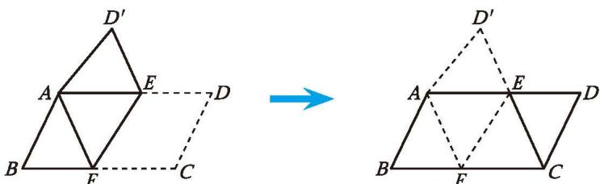

(第23题)

---

## 概念总结

### 定义

- **三角形的中位线**：连接三角形两边中点的线段

### 核心定理

| 序号 | 名称 | 内容 |
|:---:|------|------|
| 1 | **三角形中位线定理** | 三角形的中位线平行于第三边，且等于第三边的一半 |

### 重要应用

- 利用中位线定理可证明三角形内四个小三角形全等
- 中位线常用于测量不可直接到达的两点间的距离（测量 $MN$ 即得 $AB = 2MN$）
- 中位线与第三边上的中线互相平分

