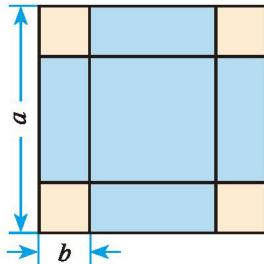
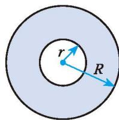
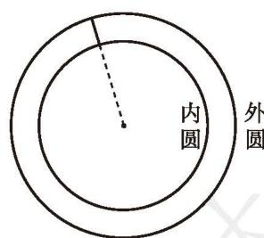
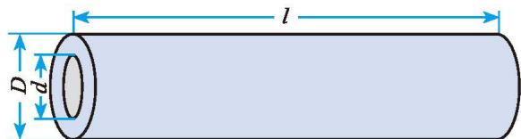

## 3 公式法

观察多项式 $x^{2} - 25, 9x^{2} - y^{2}$ , 它们有什么共同特征? 尝试将它们分别写成两个因式的乘积, 并与同伴进行交流。

事实上，把乘法公式 $(a + b)(a - b) = a^2 - b^2$ 反过来，就得到

$$
a ^ {2} - b ^ {2} = (a + b) (a - b) _ {\circ}
$$

> [!example]- 例1 把下列各式因式分解:  
(1) $25 - 16x^{2}$ ; (2) $9a^{2} - \frac{1}{4} b^{2}$ .
解：(1) $25 - 16x^{2} = 5^{2} - (4x)^{2} = (5 + 4x)(5 - 4x)$ ;  
(2) $9a^{2} - \frac{1}{4} b^{2} = (3a)^{2} - \left(\frac{1}{2} b\right)^{2} = \left(3a + \frac{1}{2} b\right)\left(3a - \frac{1}{2} b\right)$ 。

> [!example]- 例2 把下列各式因式分解:  
(1) $2x^{3} - 8x;$ (2) $9(m + n)^{2} - (m - n)^{2}$
解：(1) $2x^{3}-8x=2x(x^{2}-4)$ $=2x(x^{2}-2^{2})$ $=2x(x+2)(x-2);$

$$
9 (m + n) ^ {2} - (m - n) ^ {2}
$$
当多项式的各项含有公因式时，通常先提出这个公因式，再进一步因式分解。

$$
\begin{array}{r l} & = [ 3 (m + n) ] ^ {2} - (m - n) ^ {2} \\ & = [ 3 (m + n) + (m - n) ] [ 3 (m + n) - (m - n) ] \\ & = (3 m + 3 n + m - n) (3 m + 3 n - m + n) \\ & = (4 m + 2 n) (2 m + 4 n) \\ & = 4 (2 m + n) (m + 2 n). \end{array}
$$

##### 操作·思考

如图 4-2, 在一张边长为 $a \mathrm{~cm}$ 的正方形纸片的四角, 各剪去一个边长为 $b \mathrm{~cm}$ 的正方形, 求剩余部分的面积。当 $a = 3.6$ , $b = 0.8$ 时, 剩余部分的面积是多少?

图4-2

##### 随堂练习

1. 判断下列等式是否一定成立：  
(1) $x^{2} + y^{2} = (x + y)(x + y)$ ;  
(2) $x^{2} - y^{2} = (x + y)(x - y)$ ;  
(3) $-x^{2}+y^{2}=(-x+y)(-x-y);$ ( )

$$
(4) - x ^ {2} - y ^ {2} = - (x + y) (x - y) _ {\circ}
$$

( )

2. 把下列各式因式分解：  
(1) $a^{2}b^{2}-m^{2};$  
(3) $x^{2}-(a+b-c)^{2};$  
(2) $(m - a)^{2} - (n + b)^{2}$ ;  
(4) $-16x^{4} + 81y^{4}$ 。

分别把乘法公式 $(a + b)^2 = a^2 + 2ab + b^2, (a - b)^2 = a^2 - 2ab + b^2$ 反过来，就得到

$$
a ^ {2} + 2 a b + b ^ {2} = (a + b) ^ {2}, a ^ {2} - 2 a b + b ^ {2} = (a - b) ^ {2} 。
$$

> [!example]- 例3 把下列各式因式分解:  
(1) $x^{2}+14x+49;$  
(2) $(m + n)^{2} - 6(m + n) + 9$ 。
解：(1) $x^{2}+14x+49=x^{2}+2\times7x+7^{2}=(x+7)^{2}$ ;

$$
\begin{array}{r l} (2) (m + n) ^ {2} - 6 (m + n) + 9 & = (m + n) ^ {2} - 2 \times 3 (m + n) + 3 ^ {2} \\ & = [ (m + n) - 3 ] ^ {2} \\ & = (m + n - 3) ^ {2}. \end{array}
$$

> [!example]- 例4 把下列各式因式分解:  
(1) $3ax^{2} + 6axy + 3ay^{2}$ ;  
(2) $-x^{2} - 4y^{2} + 4xy$ 。
解：（1） $3ax^{2}+6axy+3ay^{2}=3a(x^{2}+2xy+y^{2})=3a(x+y)^{2}$ ;

$$
\begin{array}{r l} - x ^ {2} - 4 y ^ {2} + 4 x y & = - (x ^ {2} + 4 y ^ {2} - 4 x y) \\ & = - (x ^ {2} - 4 x y + 4 y ^ {2}) \\ & = - [ x ^ {2} - 2 \cdot x \cdot 2 y + (2 y) ^ {2} ] \\ & = - (x - 2 y) ^ {2}. \end{array}
$$

根据因式分解与整式乘法的关系，我们可以利用乘法公式把某些多项式因式分解，这种因式分解的方法叫作公式法。

> [!summary] 回顾·反思
回顾从整式乘法到因式分解的探索过程，你有哪些感悟？

##### 随堂练习

1. 下列多项式中，哪些可以用公式法因式分解？你是怎样分解的？  
(1) $x^{2}-x+\frac{1}{4};$  
(2) $9a^{2}b^{2}-3ab+1;$  
(3) $\frac{1}{4} m^2 + 3mn + 9n^2$ ;  
(4) $x^{6}-10x^{3}-25$ 。

2. 把下列各式因式分解：  
(1) $x^{2} - 12xy + 36y^{2}$ ;  
(2) $16a^{4} + 24a^{2}b^{2} + 9b^{4};$  
(3) $-2xy - x^{2} - y^{2}$ ;  
(4) $4 - 12(x - y) + 9(x - y)^{2}$ 。

##### 智慧数

如果一个正整数能表示成两个正整数的平方差, 那么称这个正整数为 “智慧数”。例如, $16 = 5^{2} - 3^{2}$ , 16 就是一个智慧数。如果将智慧数从小到大进行排列, 那么第 1000 个智慧数是哪个数?

下面是小颖的思考过程。
设 $p$ 是一个智慧数, 则 $p$ 能表示成两个正整数 $m$ , $n$ 的平方差, 即 $p = m^{2} - n^{2} = (m + n)(m - n)$ , 其中, $m$ , $n$ 是正整数, 且 $m > n$ 。她知道, $m + n$ 与 $m - n$ 有相同的奇偶性, 所以 $p$ 只能是奇数或 4 的倍数。  
(1) 当 $p$ 为奇数时, 设 $p = 2k + 1$ ( $k$ 为自然数), 怎样把它表示成两个正整数的平方差呢? 经过尝试, 她发现: 1 不是智慧数, $3 = 4 - 1 = 2^2 - 1^2$ , $5 = 9 - 4 = 3^2 - 2^2$ , $7 = 16 - 9 = 4^2 - 3^2$ , ……于是, 她猜想, 除 1 以外的奇数都是智慧数, 且 $2k + 1 = (k + 1)^2 - k^2$ , $k$ 为正整数。事实上

$$
(k + 1) ^ {2} - k ^ {2} = (k + 1 + k) (k + 1 - k) = 2 k + 1 。
$$
所以小颖的猜想是正确的。  
(2) 当 p 为 4 的倍数时，……

你认为当 $p$ 为4的倍数时，它一定是智慧数吗？请你说明理由，并找到第1000个智慧数。

##### 习题 4.3

##### 知识技能

1. 把下列各式因式分解：  
(1) $36 - x^{2}$ ;  
(3) $169x^{2} - 4y^{2}$ ;  
(5) $3ax^{2} - 3ay^{4}$ ;  
(2) $0.25q^{2} - 121p^{2}$ ;  
(4) $49(a-b)^{2}-16(a+b)^{2}$ ;  
(6) $p^{4}-1$ 。

2. 把下列各式因式分解：  
(1) $9 - 12t + 4t^{2}$ ;  
(2) $y^{2} + y + \frac{1}{4}$ ;  
(3) $25m^{2} - 80m + 64$ ;  
(4) $(x + y)^{2} + 6(x + y) + 9$ ;  
(5) $a^{2} - 2a(b + c) + (b + c)^{2}$ ;  
(6) $-a + 2a^{2} - a^{3}$ 。

##### 数学理解

3. 已知多项式 $x^{2} + 1$ 与一个单项式的和是一个多项式的平方, 请你找出一个满足条件的单项式。

##### 问题解决

4. 如图，大、小两圆的圆心相同，已知它们的半径分别是 $R \mathrm{~cm}$ 和 $r \mathrm{~cm}$ ，求它们所围成的环形的面积。如果 $R = 8.45, r = 3.45$ 呢（ $\pi$ 取 3.14）？

(第4题)

5. 观察下列各等式，你发现了什么规律？请用代数式表示，并说明其正确性。 $2^{2}-4^{2}=-4\times3,$ $3^{2}-5^{2}=-4\times4,$ $4^{2}-6^{2}=-4\times5,$ $5^{2}-7^{2}=-4\times6,$

6. 证明：任意两个连续奇数的平方差是8的倍数。

7. 今有环田，中周九十二步，外周一百二十二步，径五步。问：为田几何？（选自《九章算术》）

题目大意：有一块圆环形田（如图），内圆周长92步，外圆周长122步，两圆半径的差为5步，圆环形田的面积是多少（π取3）？

《九章算术》的算法是：两圆周长之和的一半与两圆半径的差的积，即圆环形田的面积。请说明这种算法的道理。

(第7题)

### 因式分解 回顾与思考

1. 举例说明什么是因式分解。

2. 因式分解与整式乘法有什么关系?

3. 因式分解常用的方法有哪些?

4. 梳理本章内容，用适当的方式呈现全章知识结构，并与同伴进行交流。

### 因式分解 复习题

##### > 知识技能

1. 把下列各式因式分解：  
(1) $3a^{2}-3b^{2}$ ;  
(3) $(x + y + z)^2 - (x - y - z)^2$ ;  
(5) $a^{2}b^{2}-0.01;$  
(7) $(a^{2} + 4)^{2} - 16a^{2}$ ;  
(9) $2x^{2}+2x+\frac{1}{2};$  
(2) $y^{2}-9(x+y)^{2}$ ;  
(4) $(x + y)^2 - 14(x + y) + 49$ ;  
(6) $x^{2}y - 2xy^{2} + y^{3}$ ;  
(8) $x^{2} - xy + \frac{1}{4} y^{2};$  
(10) $(x + 1)(x + 2) + \frac{1}{4}$ 。

2. 先因式分解, 再计算求值:  
(1) $9x^{2}+12xy+4y^{2}$ ，其中 $x=\frac{4}{3}$ ， $y=-\frac{1}{2}$ ;  
(2) $\left(\frac{a+b}{2}\right)^{2}-\left(\frac{a-b}{2}\right)^{2}$ ，其中 $a=-\frac{1}{8}$ ，b=2。

##### > 数学理解

3. 利用因式分解说明： $25^{7}-5^{12}$ 能被120整除。

&emsp;※4. 已知 $x + y = 1$ , 求 $\frac{1}{2} x^{2} + xy + \frac{1}{2} y^{2}$ 的值。

##### > 问题解决

5. 利用因式分解计算：  
(1) $3^{2027}-3^{2026}$ ;  
(2) $(-2)^{101}+(-2)^{100}+2^{99}$

6. 如图, 某农场修建一座小型水库, 需要一种空心混凝土管道, 它的规格是内径 $d = 45 \mathrm{~cm}$ , 外径 $D = 75 \mathrm{~cm}$ , 长 $l = 300 \mathrm{~cm}$ 。利用因式分解计算浇制一节这样的管道大约需要多少立方米的混凝土 ( $\pi$ 取 3.14, 结果精确到 $0.01 \mathrm{~m}^{3}$ )。

(第6题)

&emsp;※7. 已知 $a, b, c$ 是 $\triangle ABC$ 的三边，且满足 $a^2 - b^2 + ac - bc = 0$ ，请判断 $\triangle ABC$ 的形状，并说明理由。

&emsp;※8. 当 $x$ 取何值时, 多项式 $x^{2} + 2x + 1$ 取得最小值?

&emsp;※9. 正方形Ⅰ的周长比正方形Ⅱ的周长长 96 cm，它们的面积相差 $960 \, cm^{2}$ 。求这两个正方形的边长。

##### > 联系拓广

&emsp;※10. $2^{48} - 1$ 可以被60和70之间的某两个数整除，求这两个数。

&emsp;※11. 计算下列各式:  
(1) $1 - \frac{1}{2^2} =$ \_\_\_\_; (2) $\left(1 - \frac{1}{2^2}\right)\left(1 - \frac{1}{3^2}\right) =$ \_\_\_\_;  
(3) $\left(1 - \frac{1}{2^2}\right)\left(1 - \frac{1}{3^2}\right)\left(1 - \frac{1}{4^2}\right) =$ \_\_\_\_。

试根据所学知识找到计算上面算式的简便方法，并利用你找到的简便方法计算下面的算式：

$$
\left(1 - \frac {1}{2 ^ {2}}\right) \left(1 - \frac {1}{3 ^ {2}}\right) \left(1 - \frac {1}{4 ^ {2}}\right) \dots \left(1 - \frac {1}{9 ^ {2}}\right) \left(1 - \frac {1}{1 0 ^ {2}}\right) \dots \left(1 - \frac {1}{n ^ {2}}\right) _ {\circ}
$$

12. 如图, 有①②③三种不同型号的卡片若干, 其中型号①②分别是边长为 $a$ 和 $b$ 的正方形卡片, 型号③是长为 $a\text{、宽为} b$ 的长方形卡片。

①

②

③  
(第12题)  
(1) 请用这些卡片分别拼出面积为 $2a^{2} + ab, a^{2} + 4ab + 4b^{2}$ 的长方形，并画出图形。

&emsp;※(2)你能拼出面积为 $3a^{2}+4ab+b^{2}$ 的长方形吗? 如果能, 请画出图形; 如果不能, 请说明理由。  
(3)请再提出一个问题,并加以解答。

&emsp;※13. 如果 ab = 0，那么 a = 0 或 b = 0。利用所学知识，尝试求解方程 $x^{2} - 2x = 0$ 。

