## 3 直角三角形

我们曾经探索过直角三角形的性质：直角三角形的两个锐角互余。请你证明这一结论。

如果一个三角形有两个角互余，那么这个三角形是直角三角形吗？请证明你的结论，并与同伴进行交流。

**定理** 直角三角形的两个锐角互余。

**定理** 有两个角互余的三角形是直角三角形。

我们曾经利用数方格和割补图形的方法得到了勾股定理。实际上，利用基本事实和已有定理，我们能够证明勾股定理（有关证明过程参见本节"阅读·欣赏"）。

**勾股定理** 直角三角形两条直角边的平方和等于斜边的平方。

> [!tip] 尝试·交流
> 在一个三角形中，当两条边的平方和等于第三条边的平方时，我们曾用测量的办法得出"这个三角形是直角三角形"的结论。你能用基本事实和已有定理证明这一结论吗？与同伴进行交流。

已知：如图 1-24（1），在 $\triangle ABC$ 中，$AB^{2} + AC^{2} = BC^{2}$ 。

求证：$\triangle ABC$ 是直角三角形。

分析：要证明 $\triangle ABC$ 是直角三角形，一般需要证明有一个角是直角。这里的已知条件是边的关系，由此你能想到什么？借助边的关系，你能构造一个直角三角形，使它与 $\triangle ABC$ 全等吗？

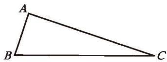

(1)

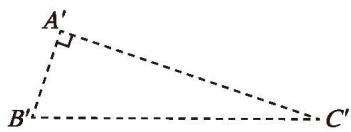

图 1-24

证明：如图 1-24（2），作 Rt $\triangle A'B'C'$，使

$$
\angle A' = 90^{\circ},\ A'B' = AB,\ A'C' = AC,
$$

则 $A'B'^2 + A'C'^2 = B'C'^2$ （勾股定理）。

$$
\because AB^{2} + AC^{2} = BC^{2},
$$

$$
\therefore BC^{2} = B'C'^{2} .
$$

$$
\therefore BC = B'C' .
$$

$$
\therefore \triangle ABC \cong \triangle A'B'C' \text{ (SSS)} .
$$

$\therefore \angle A = \angle A' = 90^{\circ}$ (全等三角形的对应角相等)。

因此，$\triangle ABC$ 是直角三角形。

**定理** 如果三角形两条边的平方和等于第三条边的平方，那么这个三角形是直角三角形。

> [!observe] 观察·交流
> (1) 观察本节第一个定理和第二个定理，它们的条件和结论之间有怎样的关系？第三个定理和第四个定理呢？与同伴进行交流。
> (2) 观察下面三组命题：
> 
> - 如果两个角是对顶角，那么它们相等；如果两个角相等，那么它们是对顶角。
> - 如果 $a = b$ ，那么 $a^2 = b^2$ ；如果 $a^2 = b^2$ ，那么 $a = b$ 。
> - 一个三角形中相等的边所对的角相等；一个三角形中相等的角所对的边相等。
> 
> 上面每组中两个命题的条件和结论也有类似的关系吗？与同伴进行交流。

在两个命题中，如果一个命题的条件和结论分别是另一个命题的结论和条件，那么这两个命题称为**互逆命题**；如果把其中一个命题称为原命题，那么另一个命题就称为它的逆命题。

> [!think] 尝试·思考
> 你能写出命题 "如果两个有理数相等，那么它们的平方相等" 的逆命题吗？它们都是真命题吗？

原命题是真命题，它的逆命题不一定是真命题。如果一个定理的逆命题经过证明是真命题，那么它也是一个定理，其中一个定理称为另一个定理的**逆定理**。例如，本节学习的第一个定理和第二个定理就是一对互逆定理，第三个定理和第四个定理也是一对互逆定理。你还能举出一些互逆定理的例子吗？

##### 随堂练习

1. 在 $\triangle ABC$ 中，已知 $\angle A = \angle B = 45^{\circ}$ ，$BC = 3$ ，求 $AB$ 的长。

2. 已知：在 $\triangle ABC$ 中，$AB = 13\ \mathrm{cm}$ ，$BC = 10\ \mathrm{cm}$ ，$BC$ 边上的中线 $AD = 12\ \mathrm{cm}$ 。求证：$AB = AC$ 。

3. 说出下列命题的逆命题，并判断每对命题的真假。
   (1) 四边形是多边形;
   (2) 两直线平行，同旁内角互补;
   (3) 如果 $ab=0$，那么 $a=0,\ b=0$。

##### 阅读·欣赏

##### 勾股定理的证明

利用教科书给出的基本事实和已有定理，我们可以证明勾股定理。

如图 1-25（1），在 $\triangle ABC$ 中，$\angle C = 90^{\circ}$ ，BC = a，AC = b，AB = c。

如图 1-25（2），分别以 Rt $\triangle ABC$ 的三边为边作正方形 AHIB，ACDE，CBFG。连接 EB，CH。过点 C 作 AB 的垂线，分别交 AB 和 HI 于点 M，N。正方形 ACDE、长方形 AHNM、长方形 MNIB，以及 $\triangle EAB$ 和 $\triangle CAH$ 的面积分别记作 $S_{\text{正方形 }ACDE}$，$S_{\text{长方形 }AHNM}$，$S_{\text{长方形 }MNIB}$，$S_{\triangle EAB}$，$S_{\triangle CAH}$。

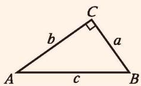

(1)

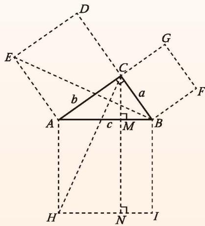

图 1-25 (2)

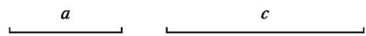

图 1-26

$$
\begin{array}{rl}
\because & EA = CA,\ \angle EAB = \angle CAH = 90^{\circ} + \angle CAB,\ AB = AH, \\
\therefore & \triangle EAB \cong \triangle CAH \text{ (SAS)} .
\end{array}
$$

又 $\because$ $S_{\text{正方形 }ACDE} = 2S_{\triangle EAB},\quad S_{\text{长方形 }AHNM} = 2S_{\triangle CAH},$

$$
b^{2} = S_{\text{长方形 }AHNM}
$$

同理 $a^{2} = S_{\text{长方形 }MNIB}.$

$$
c^{2} = a^{2} + b^{2} .
$$

以上是欧几里得在《原本》中证明勾股定理的大致过程。

勾股定理是数学史上非常重要的定理之一。两千多年来，人们对它进行了大量的研究，给出了多达数百种的证明方法。如果你有兴趣，可查阅有关资料，了解勾股定理的其他证明方法。

两边分别相等且其中一组等边的对角相等的两个三角形全等吗？如果其中一组等边的对角都是直角呢？请你画一画，并与同伴进行交流。

> [!tip] 尝试·交流
> 已知斜边和一条直角边，如何作出这个直角三角形呢？
> (1) 假设满足条件的直角三角形已经作出，你能画出这个直角三角形的草图吗？
> (2) 你是按照怎样的步骤画这个草图的？先画一画，再用尺规试一试，并与同伴进行交流。

梳理上述作图过程，请你总结"已知直角三角形的斜边和一条直角边，用尺规作这个三角形"的方法和步骤。

如图 1-26，已知线段 $a$、$c$ ($a < c$)，用尺规作 Rt $\triangle ABC$ ，使 $\angle C = 90^\circ$ ，$AB = c$ ，$BC = a$ 。

请按照给出的作法作出相应的图形：

| 作法 | 图形 |
|:---|:---|
| 1. 作射线 CN。2. 过点 C 作射线 CN 的垂线 CM。3. 在射线 CM 上截取 CB = a。4. 以点 B 为圆心，以线段 c 的长为半径作弧，交射线 CN 于点 A。5. 连接 AB。$\triangle ABC$ 就是所要作的直角三角形。 | |

把你作的三角形与同伴作的三角形进行比较，它们一定全等吗？

可以发现：斜边和一条直角边分别相等的两个直角三角形全等。请你尝试证明这一结论。

已知：如图 1-27，在 $\triangle ABC$ 和 $\triangle A'B'C'$ 中，$\angle C = \angle C' = 90^{\circ}$ ，$AB = A'B'$ ，$AC = A'C'$ 。

求证：$\triangle ABC \cong \triangle A'B'C'$ 。

证明：在 $\triangle ABC$ 中，

$$
\because \angle C = 90^{\circ}
$$

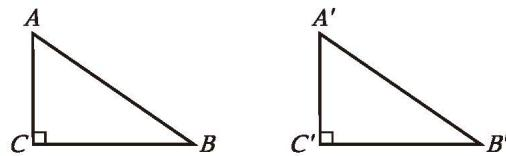

图 1-27

∴ $BC^{2} = AB^{2} - AC^{2}$ （勾股定理）。

同理，$B'C'^{2} = A'B'^{2} - A'C'^{2}$ 。

$$
\because AB = A'B',\ AC = A'C',
$$

$$
\therefore BC = B'C' .
$$

∴ $\triangle ABC \cong \triangle A'B'C'$ (SSS).

**定理** 斜边和一条直角边分别相等的两个直角三角形全等。

这一定理可以简述为"斜边、直角边"或"**HL**"。

例如图 1-28，有两个长度相等的梯子，左边梯子竖直方向的高度 $AC$ 与右边梯子水平方向的长度 $DF$ 相等，两个梯子的倾斜角 $\angle CBA$ 和 $\angle EFD$ 的大小有什么关系？

解：根据题意，可知

$$
\angle BAC = \angle EDF = 90^{\circ},
$$

$$
BC = EF,\ AC = DF,
$$

$$
\therefore \ \mathrm{Rt} \triangle BAC \cong \mathrm{Rt} \triangle EDF \text{ (HL)} .
$$

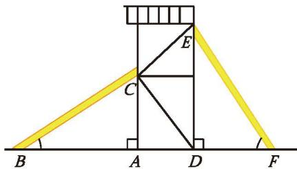

$\therefore \angle CBA = \angle FED$ (全等三角形的对应角相等)。

图 1-28

$\because \angle FED + \angle EFD = 90^{\circ}$ (直角三角形的两个锐角互余),

$$
\therefore \angle CBA + \angle EFD = 90^{\circ} .
$$

##### 随堂练习

1. 判断下列命题的真假，并说明理由：
   (1) 两个锐角分别相等的两个直角三角形全等;
   (2) 斜边及一锐角分别相等的两个直角三角形全等;
   (3) 两条直角边分别相等的两个直角三角形全等;
   (4) 一条直角边相等且另一条直角边上的中线相等的两个直角三角形全等。

2. 如图，两根长度均为 $12\ \mathrm{m}$ 的绳子，一端系在旗杆上的 $A$ 点，另一端拉直后分别固定在地面的两个木桩（用 $B$、$C$ 两点表示）上，两个木桩到旗杆底部的距离相等吗？请说明你的理由。

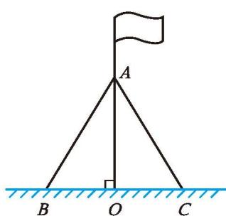

(第2题)

##### 习题 1.3

###### 知识技能

1. 如图，在四边形 $ABCD$ 中，$AB \parallel CD$ ，$E$ 是边 $BC$ 上的一点，且 $\angle BAE = 25^\circ$ ，$\angle CDE = 65^\circ$ ，$AE = 2$ ，$DE = 3$ ，求 $AD$ 的长。

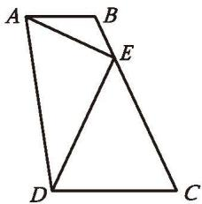

(第1题)

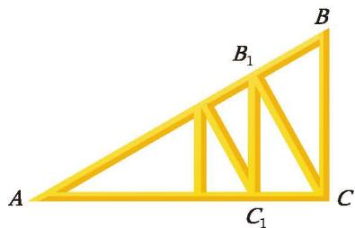

(第2题)

2. 一个直角三角形屋架如图所示，其中 $BC \perp AC$ ，$\angle A = 30^{\circ}$ ，$AB = 10\ \mathrm{m}$ ，$CB_{1} \perp AB$ ，$B_{1}C_{1} \perp AC$ ，垂足分别为 $B_{1},\ C_{1}$ ，那么 $BC$ 的长是多少？$B_{1}C_{1}$ 呢？

3. 已知：如图，D 是 $\triangle ABC$ 的边 BC 的中点，$DE \perp AC$ ，$DF \perp AB$ ，垂足分别为 E，F，且 DE = DF。求证：$\triangle ABC$ 是等腰三角形。

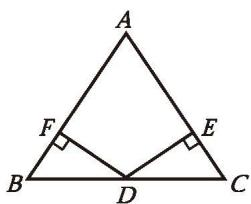

(第3题)

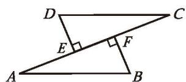

(第4题)

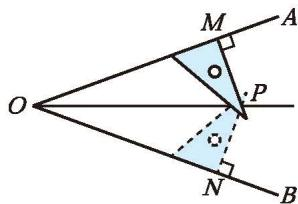

(第5题)

4. 已知：如图，AB = CD，DE $\perp$ AC，BF $\perp$ AC，垂足分别为 E，F，且 DE = BF。求证：
   (1) AE = CF;
   (2) AB // CD。

5. 用三角尺可以画角平分线：如图所示，在已知 $\angle AOB$ 的两边上分别取点 $M$、$N$ ，使 $OM = ON$ ，再过点 $M$ 画 $OA$ 的垂线，过点 $N$ 画 $OB$ 的垂线，两垂线交于点 $P$ ，那么射线 $OP$ 就是 $\angle AOB$ 的平分线。请你证明这一结论。

###### 数学理解

6. 判断下列命题的真假，并说明理由：
   (1) 两边分别相等的两个直角三角形全等;
   (2) 一个锐角和一条边分别相等的两个直角三角形全等。

###### 问题解决

7. 如图，小红想估测离 $A$ 处 $30\ \mathrm{m}$ 的大树的高度，她站在 $A$ 处仰望树顶 $B$ ，仰角为 $30^{\circ}$ (即 $\angle BDE = 30^{\circ}$)。已知小红身高 $1.52\ \mathrm{m}$ ，求大树的高度（结果精确到 $0.1\ \mathrm{m}$）。

8. 有一块三角形空地，它的三条边线分别长 $45\ \mathrm{m},\ 60\ \mathrm{m}$ 和 $70\ \mathrm{m}$ 。已知 $60\ \mathrm{m}$ 长的边线为南北向，是否有一条边线为东西向？

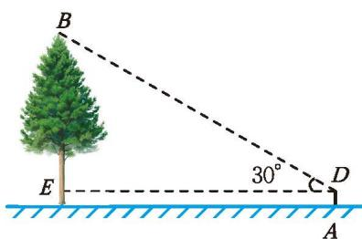

(第7题)

9. 已知两个直角三角形有一条直角边相等，添加一个条件使两个直角三角形全等。你有哪些不同的添法？任选其中一种加以证明。

###### 联系拓广

10. 在如图所示的三角形纸片 $ABC$ 中，$\angle C = 90^{\circ}$ ，$\angle B = 30^{\circ}$ 。按如下步骤，可以把这张直角三角形纸片分成三张全等的小直角三角形纸片（图中虚线表示折痕）：① 折叠三角形纸片 $ABC$ ，使点 $B$ 与点 $A$ 重合，折痕交 $BC$ 于点 $D$ ，交 $AB$ 于点 $E$ ；② 将折叠后的纸片再沿 $AD$ 折叠。
    (1) 由步骤①可以得到哪些等量关系？
    (2) 请证明 $\triangle ACD \cong \triangle AED$ 。
    (3) 按照这种方法，能否将任意一个直角三角形分成三个全等的小三角形？

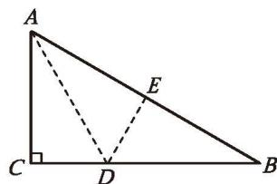

(第10题)

---

## 概念总结

### 定义

- **互逆命题**：两个命题中，一个命题的条件和结论分别是另一个命题的结论和条件
- **逆定理**：如果一个定理的逆命题经过证明是真命题，则它也成为一个定理

### 核心定理

| 序号 | 名称 | 内容 |
|:---:|------|------|
| 1 | **直角三角形性质** | 直角三角形的两个锐角互余 |
| 2 | **直角三角形判定** | 有两个角互余的三角形是直角三角形 |
| 3 | **勾股定理** | 直角三角形两条直角边的平方和等于斜边的平方 |
| 4 | **勾股定理的逆定理** | 若三角形两边的平方和等于第三边的平方，则此三角形为直角三角形 |
| 5 | **HL 判定定理** | 斜边和一条直角边分别相等的两个直角三角形全等 |

### 重要概念

- **原命题**与**逆命题**：条件和结论互换的一对命题
- 原命题为真，其逆命题不一定为真
- 勾股定理是数学史上最重要的定理之一，有数百种证明方法

