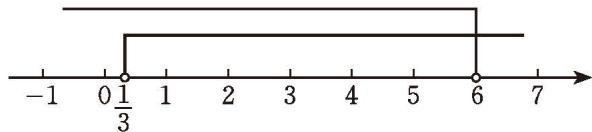
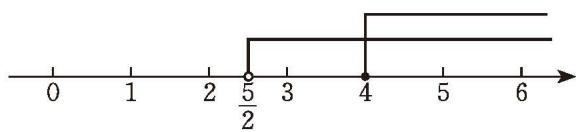

## 4 一元一次不等式组

某学校举办春季运动会，八（1）班承担制作彩旗的任务，计划用4天的课余时间制作彩旗。如果每天比原计划多制作5面，那么所制作彩旗总量将超过124面；如果每天比原计划少制作6面，那么所制作彩旗总量将不足96面。设八（1）班原计划每天制作 $x$ 面彩旗，你能列出哪些不等式？
根据题意, 可以得到不等式 $4 (x + 5) > 124$ , $4 (x - 6) < 96$ , 其中 $x$ 所代表的对象相同, 因此 $x$ 必须同时满足这两个不等式。把它们合在一起, 就组成一个一元一次不等式组

$$
\left\{ \begin{array}{l} 4 (x + 5) > 1 2 4, \\ 4 (x - 6) <   9 6 _ {\circ} \end{array} \right.\tag{*}
$$

一般地，关于同一个未知数的几个一元一次不等式合在一起，就组成一个一元一次不等式组（system of linear inequalities with one unknown）。

> [!tip] 尝试·交流  
(1) 在习题 2.1 第 9 题中, 如果要调制的饮料同时满足两个小题的条件, 那么你能列出一个不等式组吗?  
(2) 你能尝试找出满足上面一元一次不等式组（\*）的未知数的值吗？与同伴进行交流。

一元一次不等式组中各个不等式的解集的公共部分，叫作这个一元一次不等式组的解集。求不等式组解集的过程，叫作解不等式组。

解不等式组:

$$
\left\{ \begin{array}{l} 2 x - 1 > - x, \\ \frac {1}{2} x <   3 _ {\circ} \end{array} \right.\tag{①}
$$

②
解：解不等式 ①，得

$$
x > \frac {1}{3} \circ
$$
解不等式 ②，得

$$
x <   6 _ {\circ}
$$

在同一条数轴上表示不等式 ①②的解集，如图2-9所示。

图2-9

因此，原不等式组的解集是

$$
\frac {1}{3} <   x <   6 _ {\circ}
$$

解不等式组：

$$
\left\{ \begin{array}{l} 5 x - 2 > 3 (x + 1), \\ \frac {1}{2} x - 1 \geqslant 7 - \frac {3}{2} x _ {\circ} \end{array} \right.\tag{①}
$$

②
解：解不等式 ①，得

$$
x > \frac {5}{2} \circ
$$
解不等式 ②，得

$$
x \geqslant 4 _ {\circ}
$$

在同一条数轴上表示不等式 ① ② 的解集，如图 2-10 所示。

图2-10

因此，原不等式组的解集是

$$
x \geqslant 4 _ {\circ}
$$

> [!think] 尝试·思考
是否存在实数 $x$ ，使得 $x + 3 < 5$ ，且 $x - 2 > 4$ ？你能得到什么结论？

##### 随堂练习

1. 解下列不等式组：  
(1) $\left\{\begin{aligned}&2x>1,\\ &x-3<0;\end{aligned}\right.$ (2) $\left\{\begin{aligned}&\frac{x}{2}+1<2(x-1),\\&\frac{x}{3}>\frac{x+2}{5}\end{aligned}\right.$

2. 在本节一开始的“制作彩旗”问题中，八（1）班原计划每天制作多少面彩旗？

##### 阅读·思考

##### 一元一次不等式组的应用

在以前的学习中，我们曾经利用方程（组）解决了许多实际问题；在本章我们又学习了用一元一次不等式解决一些实际问题。其实，用一元一次不等式组也可以解决一些实际问题。

人的头发每天大约生长 0.32 mm。小红的头发现在大约有 10 cm 长，那么大约经过多长时间，她的头发才能生长为 16 cm 到 28 cm?
分析与解：这个问题中的不等关系是

$16 \mathrm{~cm} \leqslant$ 小红若干天后的头发长度 $\leqslant 28 \mathrm{~cm}$ 。

小红的头发现在长度为 $10 \, cm$ ，每天大约生长 $0.32 \, mm$ ，如果设经过 x 天小红的头发可以生长为 $16 \, cm$ 到 $28 \, cm$ ，那么经过 x 天她的头发长度为 $(100 + 0.32x) \, \text{mm}$ 。于是，可得

$$
1 6 0 \leqslant 1 0 0 + 0. 3 2 x \leqslant 2 8 0 _ {\circ}
$$
解这个不等式组，得 $187.5 \leqslant x \leqslant 562.5$ 。
因此，大约需要 188 天到 562 天，小红的头发才能生长为 16 cm 到 28 cm。

##### 习题 2.4

##### > 知识技能

1. 解下列不等式组:  
(1) $\left\{ \begin{array}{l} x - 5 < 1, \\ 2x > 3; \end{array} \right.$  
(2) $\left\{ \begin{array}{l} 2x - 5 > 0, \\ 3 - x < -1; \end{array} \right.$  
(3) $\left\{ \begin{array}{l} -2x \geqslant 0, \\ 3x + 5 \leqslant 0; \end{array} \right.$  
(4) $\left\{ \begin{array}{l} \frac{x + 1}{2} > 1, \\ 7x - 8 < 9x; \end{array} \right.$  
(5) $\left\{ \begin{array}{l} 2x + 5 \leqslant 3(x + 2), \\ \frac{x - 1}{2} < \frac{x}{3}; \end{array} \right.$  
(6) $\left\{ \begin{array}{l} 0.2x > 0.3x + 1, \\ 0.5x - 1 < 0.2_{\circ} \end{array} \right.$

##### 数学理解

2. 不等式 $3x - 7 > x$ 的解集、不等式 $2 - 5x < 2x$ 的解集与不等式组 $\left\{ \begin{array}{l} 3x - 7 > x, \\ 2 - 5x < 2x \end{array} \right.$ 的解集之间有什么关系？

&emsp;※3. 已知一元一次不等式组 $\left\{\begin{array}{l} x<-1, \\ x<a \end{array}\right.$ 的解集是 x<-1，求 a 的取值范围。

4. 小明、小华、小刚三人在一起讨论一个一元一次不等式组。

小明：这个不等式组的所有解均为非负数。

小华：其中一个不等式的解集是 $x \leqslant 8$ 。

小刚：其中有一个不等式在求解的过程中需要改变不等号的方向。

请你试着写出符合上述条件的不等式组，并解这个不等式组。

##### 问题解决

&emsp;※5. 一台装载机每小时可装载石料 $50 \mathrm{t}$ 。一堆石料的质量为 $1800 \mathrm{t}$ 到 $2200 \mathrm{t}$ , 那么这台装载机大约要用多长时间才能将这堆石料装完?

6. 已知两根木条的长分别为 $3 \mathrm{dm}, 7 \mathrm{dm}$ , 现再选一根木条, 用这三根木条围成一个三角形木架, 请写出所选木条的长度 $x$ (单位: $\mathrm{dm}$ ) 应满足的不等式组, 并求出这个不等式组的解集。

### 不等式与不等式组 回顾与思考

1. 不等式有哪些基本性质？它与等式的基本性质有什么异同？

2. 解一元一次不等式与解一元一次方程有什么异同?

3. 举例说明在数轴上如何表示一元一次不等式（组）的解集。

4. 回顾本章学习过程，你是怎样利用一元一次不等式解决实际问题的？与同伴进行交流。

5. 举例说明不等式、函数、方程之间的联系。

6. 梳理本章内容，用适当的方式呈现全章知识结构，并与同伴进行交流。

### 不等式与不等式组 复习题

##### #

##### > 知识技能

1. 在不等式 $ax + b > 0$ 中, $a, b$ 是常数, 且 $a \neq 0$ 。当 $\underline{\hspace{2cm}}$ 时, 不等式的解集是 $x > -\frac{b}{a}$ ; 当 $\underline{\hspace{2cm}}$ 时, 不等式的解集是 $x < -\frac{b}{a}$ 。

2. 解下列不等式，并把它们的解集分别表示在数轴上：  
(1) $2x + 3 < -1$ ; (2) $-2x + 1 < x + 4$ ;  
(3) $2(-3 + x) - 3(x + 2) < 0$ ; (4) $\frac{x}{2} \geqslant 1 + \frac{x - 1}{3}$ ;  
(5) $\frac{2x + 1}{3} \leqslant -\frac{x + 5}{2}$ ;  
(6) $x+\frac{x}{2}+\frac{x}{3}>11;$  
(7) $\frac{7x + 5}{7} - 2 > 2(x + 1)$ ;

$$
\frac {1 + 2 x}{4} - \frac {1 - 3 x}{1 0} > - \frac {1}{5} 。 \tag {8}
$$

3. 根据下列条件分别列不等式（组）:  
(1) $x+1$ 是负数；  
(2) x 的 2 倍与 -3 的差小于零;  
(3) $a$ 的 5 倍与 3 的差不小于 10，且不大于 20。

4. 解下列不等式组，并把它们的解集分别表示在数轴上：  
(1) $-5 < 2x + 1 < 6$ ; (2) $-2 < 1 - \frac{1}{5} x < \frac{3}{5}$ ;  
(3) $\left\{ \begin{array}{l} 8x + 5 > 9x + 6, \\ 2x - 1 < 7; \end{array} \right.$ (4) $\left\{ \begin{array}{l} 2x + 3 \leqslant 5, \\ 3x - 2 \geqslant 4. \end{array} \right.$

5. 已知函数 $y = 3x + 5$ 。  
(1) 当 $x$ 取哪些值时, $y > 0$ ? (2) 当 $x$ 取什么值时, $y = 0$ ? (3) 当 $x$ 取哪些值时, $y < 0$ ?

6. 求不等式 $5(x - 2) \leqslant 28 + 2x$ 的正整数解。

7. 解下列不等式组:  
(1) $\left\{ \begin{array}{l} \frac{2x - 1}{3} - \frac{5x + 1}{2} \leqslant 1, \\ 5x - 1 < 3(x + 1); \end{array} \right.$ (2) $\left\{ \begin{array}{l} 2x - 7 < 3(x - 1), \\ \frac{4}{3} x + 3 \geqslant 1 - \frac{2}{3} x_{\circ} \end{array} \right.$

##### 数学理解

8. 判断正误:  
(1) 由 $2a > 3$ ，得 $a > \frac{3}{2}$ ;  
(2) 由 $2 - a < 0$ ，得 $2 < a$ ;  
(3) 由 a < b，得 2a < 2b；  
(4) 由 a > b，得 $a + m > b + m$ ; ()  
(5) 由 a > b，得 -3a > -3b；  
(6) 由 $-\frac{1}{2} > -1$ ，得 $-\frac{a}{2} > -a$ 。 （）

9. $a, b$ 两个实数在数轴上的对应点如图所示:

(第9题)

用“<”或“>”填空：  
(1) $a$ \_\_\_\_ $b$ ; (2) $|a|$ \_\_\_\_ $|b|$ ;  
(3) $a + b$ 0; (4) $a - b$ 0;  
(5) $a + b$ \_\_\_\_ $a - b$ ; (6) $ab$ \_\_\_\_ $a$ 。

&emsp;※10. 已知不等式组 $\left\{\begin{array}{l} x+8<4x-1, \\ x>m \end{array}\right.$ 的解集是 x>3，求 m 的取值范围。

&emsp;※11. 设 a > b > 0，用“<”“>”填空：  
(1) $b - a \_\_ 0;$ (2) $a^2 - b^2 \_\_ 0;$  
(3) $\sqrt{a} - \sqrt{b}$ \_\_\_\_ 0。

##### 问题解决

12. 暑假期间，两位老师计划带领若干名学生外出参加社会实践活动，他们联系了报价均为每人500元的甲、乙两家旅行社。经协商，甲旅行社的优惠条件是：两位老师全额收费，学生都按七折收费。乙旅行社的优惠条件是：老师、学生都按八折收费。他们选择哪家旅行社支付的费用较少？

13. 某大型超市从生产基地购进一批水果，运输过程中质量损失 5%，假设不计超市其他费用。  
(1) 如果超市在进价的基础上提高 $5 \%$ 作为售价, 那么请你通过计算说明超市是否亏本;  
(2) 如果超市至少要获得 $20\%$ 的利润, 那么这批水果的售价最低应提高百分之几 (结果精确到 $0.1\%$ ) ?

14. 已知关于 $x$ 的方程 $3 x + a = x - 7$ 的根是正数, 求实数 $a$ 的取值范围。

15. 某工厂要生产 A, B 两种零件共 150 个, A, B 两种零件的生产成本分别为 $1500$ 元 / 个和 $3000$ 元 / 个。现要求 B 种零件个数不少于 A 种零件个数的 2 倍, 那么生产 A 种零件多少个时, 可使生产成本最少?

16. 通过本章的学习，你对一元一次方程、一元一次不等式、一次函数之间的关系有什么感悟？请以此为主题结合实例写一篇小短文。

17. (1) 用“<”“>”或“=”填空:

$5^{2} + 3^{2}$ \_\_\_\_ $2 \times 5 \times 3$ ;

$3^{2} + 3^{2}$ \_\_\_\_ $2 \times 3 \times 3$ ;

$(-3)^{2} + 2^{2}$ \_\_\_\_ $2\times (-3)\times 2;$

$(-4)^{2} + (-4)^{2}$ 2×(-4)×(-4)。  
(2) 观察 (1) 中各式, 你能发现它们有什么规律吗? 请用一个含有字母 $a, b$ 的式子表示上述规律。

&emsp;※（3）运用所学的知识说明你在（2）中发现的规律的正确性。

18. 已知不等式组

$$
\left\{ \begin{array}{l} 2 x - a <   1, \\ x - 2 b > 3 \end{array} \right.
$$

的解集是 $-1 < x < 1$ ，则 $(a + 1)(b - 1)$ 的值等于多少？

19. 你知道不等号的由来吗？请查阅资料，写一篇小短文介绍你了解到的信息。

