## 5 角平分线

我们曾经探索过角平分线的性质：角平分线上的点到这个角的两边的距离相等。请你尝试证明这一结论，并与同伴进行交流。

已知：如图 1-35，OC 是 $\angle AOB$ 的平分线，点 P 在 OC 上，$PD \perp OA$ ，$PE \perp OB$ ，垂足分别为 D，E。

求证：$PD = PE$ 。

证明：∵ $PD \perp OA$ ，$PE \perp OB$ ，垂足分别为 D, E，
∴ $\angle PDO = \angle PEO = 90^{\circ}$ 。
∵ $\angle 1 = \angle 2$ , OP = OP,
∴ $\triangle PDO \cong \triangle PEO$ (AAS)。

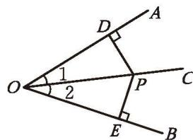

图 1-35

∴ PD = PE（全等三角形的对应边相等）。

**定理** 角平分线上的点到这个角的两边的距离相等。

> [!think] 尝试·思考
> 你能写出上面这个定理的逆命题吗？它是真命题吗？请你证明自己结论的正确性。

已知：如图 1-36，点 P 为 $\angle AOB$ 内一点，$PD \perp OA$ ，$PE \perp OB$ ，垂足分别为 D，E，且 PD = PE。

求证：OP 平分 $\angle AOB$。

证明：∵ $PD \perp OA$ ，$PE \perp OB$ ，垂足分别为 D，E，
∴ $\angle ODP = \angle OEP = 90^{\circ}$ 。
∵ PD = PE, OP = OP,
∴ Rt $\triangle DOP$ ≌ Rt $\triangle EOP$ (HL)。

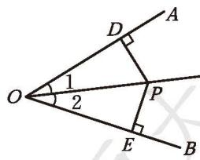

图 1-36

∴ $\angle 1 = \angle 2$ （全等三角形的对应角相等）。
∴ OP 平分 $\angle AOB$ 。

**定理** 在一个角的内部，到角的两边距离相等的点在这个角的平分线上。

> [!example]- 例1 如图 1-37，在 $\triangle ABC$ 中，$\angle BAC = 60^{\circ}$ ，点 $D$ 在边 $BC$ 上，$AD = 10$ ，$DE \perp AB$ ，$DF \perp AC$ ，垂足分别为 $E$、$F$ ，且 $DE = DF$ ，求 $DE$ 的长。
> 
> 

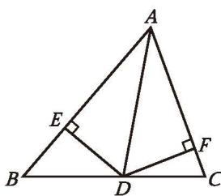

> 

图 1-37

> 
> 解：∵ $DE \perp AB$ ，$DF \perp AC$ ，垂足分别为 E，F，且 DE = DF，
> ∴ AD 平分 $\angle BAC$ （在一个角的内部，到角的两边距离相等的点在这个角的平分线上）。
> 又 ∵ $\angle BAC = 60^{\circ}$ ,
> 
> $$
> \therefore \angle BAD = 30^{\circ} .
> $$
> 
> 在 Rt $\triangle ADE$ 中，$\angle AED = 90^{\circ}$，AD = 10，
> ∴ $DE = \frac{1}{2} AD = \frac{1}{2} \times 10 = 5$ （在直角三角形中，如果一个锐角等于 $30^{\circ}$ ，那么它所对的直角边等于斜边的一半）。

##### 随堂练习

1. 如图，某工地在 A 区，到公路、铁路距离相等，距公路与铁路交叉处 500 m，请你在图中标出它的位置（比例尺为 1:20 000）。

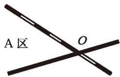

(第1题)

> [!example]- 例2 如图 1-38，在 $\triangle ABC$ 中，$AC = BC$ ，$\angle C = 90^{\circ}$ ，$AD$ 是 $\triangle ABC$ 的角平分线，$DE \perp AB$ ，垂足为 $E$ 。
> 
> (1) 已知 $CD = 4\ \mathrm{cm}$ ，求 $AC$ 的长;
> (2) 求证：$AB = AC + CD$ 。
> 
> 

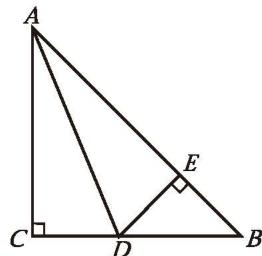

> 

图 1-38

> 
> (1) 解：$\because AD$ 是 $\triangle ABC$ 的角平分线，$DC \perp AC$ ，$DE \perp AB$ ，
> 
> $\therefore DE = CD = 4\ \mathrm{cm}$ （角平分线上的点到这个角的两边的距离相等）。
> 
> $$
> \because AC = BC,
> $$
> 
> $\therefore \angle B = \angle BAC$ （等边对等角）。
> $\because \angle C = 90^{\circ}$ 
> $\therefore \angle B = \frac{1}{2} \times 90^{\circ} = 45^{\circ}$ 
> $\therefore \angle BDE = 90^{\circ} - 45^{\circ} = 45^{\circ}$ 
> $\therefore BE = DE$ （等角对等边）。
> 
> 在等腰直角三角形 BDE 中，
> 
> $BD = \sqrt{DE^{2} + BE^{2}} = \sqrt{2DE^{2}} = 4\sqrt{2}\ \mathrm{cm}$ （勾股定理）。
> 
> $$
> \therefore AC = BC = CD + BD = (4 + 4\sqrt{2})\ \mathrm{cm} .
> $$
> 
> (2) 证明：由 (1) 的求解过程易知，Rt $\triangle ACD$ ≌ Rt $\triangle AED$ (HL)。
> $AC = AE$ (全等三角形的对应边相等)。
> $BE = DE = CD$ ，
> $AB = AE + BE = AC + CD$ 。

> [!example]- 例3 已知：如图 1-39，在 $\triangle ABC$ 中，角平分线 $BM$ 与角平分线 $CN$ 相交于点 $P$ 。
> 求证：$\angle A$ 的平分线经过点 $P$ 。
> 
> 

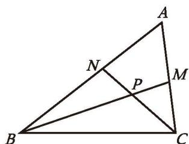

> 

图 1-39

> 
> 分析：要证明 $\angle A$ 的平分线经过点 $P$ ，需要什么条件？已知的两条角平分线相交于点 $P$ ，由此你能得到哪些相关的结论？
> 
> 证明：如图 1-40，过点 P 分别作 $PD \perp AB$ ，$PE \perp BC$ ，$PF \perp AC$ ，垂足分别为 D，E，F。
> 
> ∵ BM 是 $\triangle ABC$ 的角平分线，
> ∴ PD = PE（角平分线上的点到这个角的两边的距离相等）。
> 
> 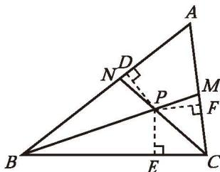
> 
> 同理，$PE = PF$ 。
> 
> 图 1-40
> 
> $$
> \therefore PD = PE = PF .
> $$
> 
> ∴ 点 P 在 $\angle A$ 的平分线上（在一个角的内部，到角的两边距离相等的点在这个角的平分线上），
> 即 $\angle A$ 的平分线经过点 P。

**三角形的三条角平分线相交于一点，并且这一点到三条边的距离相等。**

##### 随堂练习

1. 已知：如图，在 Rt $\triangle ABC$ 中，$\angle ACB = 90^{\circ}$，$\angle B = 60^{\circ}$，AD，CE 是 $\triangle ABC$ 的角平分线，AD 与 CE 相交于点 F，FM $\perp$ AB，FN $\perp$ BC，垂足分别为 M，N。
   求证：$FE = FD$

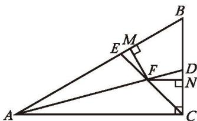

(第1题)

##### 习题 1.5

###### 知识技能

1. 已知：如图，AD 是 $\triangle ABC$ 的角平分线，且 BD = CD，$DE \perp AB$ ，$DF \perp AC$ ，垂足分别为 E，F。
   求证：EB = FC。

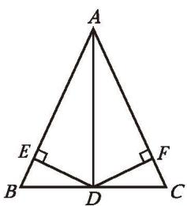

(第1题)

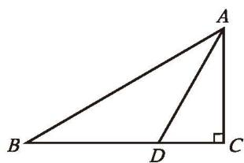

(第2题)

2. 已知：如图，在 $\triangle ABC$ 中，$\angle C = 90^\circ$ ，$\angle B = 30^\circ$ ，$AD$ 是 $\triangle ABC$ 的角平分线。求证：$BD = 2CD$ 。

3. 已知：如图，$\triangle ABC$ 的外角 $\angle CBD$ 和 $\angle BCE$ 的平分线相交于点 F。
   求证：点 $F$ 在 $\angle DAE$ 的平分线上。

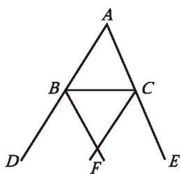

(第3题)

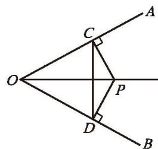

(第4题)

4. 已知：如图，P 是 $\angle AOB$ 平分线上的一点，$PC \perp OA$ ，$PD \perp OB$ ，垂足分别为 C，D。求证：
   (1) $OC = OD$ ;
   (2) $OP$ 是线段 $CD$ 的垂直平分线。

5. 如图，三条公路两两相交，现计划修建一个油库。
   (1) 如果要求油库到两条公路 $AB,\ AC$ 的距离相等，那么该如何选择油库的位置？请说明理由。
   (2) 如果要求油库到这三条公路的距离都相等，那么又该如何选择油库的位置？

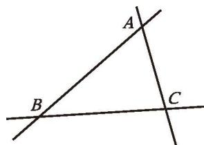

(第5题)

###### 数学理解

6. 如图，在 $\triangle ABC$ 中，点 $D$ 在边 $BC$ 上，$DE \perp AB$ ，$DF \perp AC$ ，垂足分别为 $E,\ F$ ，连接 $AD,\ EF$ 。当 $AD$ 与 $EF$ 满足什么条件时，$AD$ 是 $\triangle ABC$ 的角平分线？为什么？

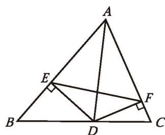

(第6题)

###### 联系拓广

7. 如图，在 $\triangle ABC$ 中，$\angle C = 90^{\circ}$ ，$\angle A = 30^{\circ}$ ，作 $AB$ 的垂直平分线，交 $AB$ 于点 $D$ ，交 $AC$ 于点 $E$ ，连接 $BE$ ，则 $BE$ 平分 $\angle ABC$ 。请证明这一结论。你有几种证明方法？

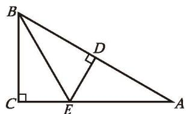

(第7题)

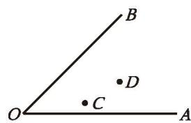

(第8题)

8. 如图，用尺规在 $\angle AOB$ 内部作一点 $P$ ，使 $PC = PD$ ，并且点 $P$ 到 $\angle AOB$ 两边的距离相等。

### ☆ 问题解决策略：反思

**问题** 证明：等腰三角形两腰上的中线相等。

已知：如图 1-41，在 $\triangle ABC$ 中，AB = AC，BD 和 CE 分别是边 AC，AB 上的中线。

求证：BD = CE。

##### 理解问题

已知条件是什么？目标是什么？将条件标注到图形中，你发现了哪些相等关系？

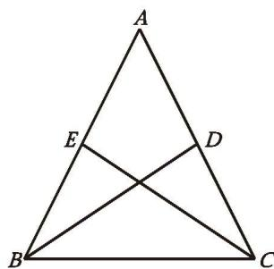

图 1-41

##### 拟订计划

(1) 证明两条线段相等有哪些常用的方法？
(2) 以 $BD$ 为边的三角形有哪些？以 $CE$ 为边的三角形呢？其中哪些三角形有可能全等？
(3) 找出两个有可能全等的三角形，要证明这两个三角形全等，已知哪些边或角相等？还需要证明哪些边或角相等？
(4) 整理你的思路，并与同伴进行交流。

##### 实施计划

按照下述思路写出证明过程，并说明每一步的理由。
(1) 通过 $\triangle ABD \cong \triangle ACE$ ，证明 BD = CE。
(2) 通过 $\triangle CBD \cong \triangle BCE$ ，证明 $BD = CE$ 。

##### 回顾反思

(1) 比较两种证明方法，你更喜欢哪种方法？说说你的理由。
(2) 根据题目的条件，你还能得到哪些结论？与同伴进行交流。
(3) 适当改变题目的条件，你还能得到哪些结论？
(4) 本题证明了等腰三角形两腰上的中线相等。反过来，如果一个三角形两边上的中线相等，那么这个三角形是等腰三角形吗？
(5) 你认为还可以研究哪些问题？与同伴进行交流。

解决问题之后，还可以继续进行思考与尝试：①条件不变，尝试寻找更多可能成立的结论；②适当改变条件（如将条件变成更一般的条件或类似的条件），探究结论是否仍然成立；③研究是否可以将一些条件和结论互换。

请你解答下列问题。

1. (1) 证明：全等三角形对应边上的中线相等；
   (2) 参考上述命题提出几个新的命题，并说明它们与原来命题的联系和区别。

2. (1) 将 $0 \sim 9$ 这 10 个数字填写到图 1-42 中 10 个圆圈内，使得相邻两数差的绝对值的和最大；
   (2) 参考上述问题提出几个新的问题，并说明它们与原来问题的联系和区别。

图 1-42

### 三角形的证明及其应用 回顾与思考

1. 说说三角形内角和定理的证明思路。三角形的内角与外角有什么关系？由此得出了哪些推论？

2. 多边形的内角和与边数有怎样的关系？多边形的外角和呢？哪一个更能反映多边形的共同特征？

3. 等腰三角形有哪些性质？等边三角形呢？直角三角形呢？它们各自有哪些判定条件？

4. 叙述两个直角三角形全等的判定条件，并证明本章中学过的一个判定条件。

5. 分别说说线段的垂直平分线、角平分线的性质定理及其逆定理，你是怎样发现和证明它们的？

6. 请你说出一对互逆命题，并判定它们是真命题还是假命题。

7. 你认为本章哪些定理的证明方法比较独特？举例说明如何用反证法证明，并与同伴进行交流。

8. 在本章中你学习了哪些尺规作图？尺规作图的一般思路是什么？

9. 举例说明你是怎样发现并证明本章一些定理的，总结你在这方面的经验，并与同伴分享。

10. 梳理本章内容，用适当的方式呈现全章知识结构，并与同伴进行交流。

### 三角形的证明及其应用 复习题

###### 知识技能

1. 如图，在 $\triangle ABC$ 中，点 $D$、$E$ 分别在边 $AB$ 和 $AC$ 上，$DE \parallel BC$ ，$\angle A = 56^{\circ}$ ，$\angle C = 69^{\circ}$ ，$\angle DBE = 30^{\circ}$ ，求 $\angle BED$ 的度数。

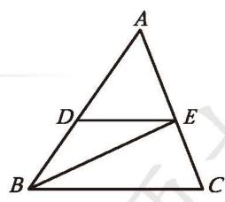

(第1题)

2. 分别确定一般三角形、四边形、五边形、六边形……的内角和，以及正三角形、正四边形、正五边形、正六边形……每个内角的度数，并填入下表。

| 边数 | 3 | 4 | 5 | 6 | ... |
|:---:|:---:|:---:|:---:|:---:|:---:|
| 多边形的内角和 | | | | | |
| 正多边形每个内角的度数 | | | | | |

3. 过多边形某个顶点的所有对角线，将这个多边形分成7个三角形，这个多边形是几边形？

4. 已知：如图，在 $\triangle ABC$ 中，$AB = AC$ ，点 $D$、$E$ 分别在边 $AC$ 和 $AB$ 上，且 $\angle ABD = \angle ACE$ ，$BD$ 与 $CE$ 相交于点 $O$ 。求证：
   (1) $OB = OC$ ;
   (2) $BE = CD$ 。

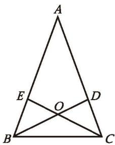

(第4题)

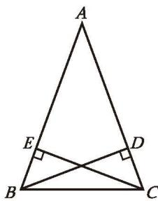

(第5题)

5. 已知：如图，BD，CE 是 $\triangle ABC$ 的高，且 BD = CE。
   求证：$\triangle ABC$ 是等腰三角形。

6. 已知：如图，在 $\triangle ABC$ 中，点 $D$、$E$ 分别在边 $AB$ 和 $AC$ 上，$DE \parallel BC$ ，$F$ 是线段 $AD$ 上的一点，$FE$ 的延长线交 $BC$ 的延长线于点 $G$ 。
   求证：$\angle EGH > \angle ADE$ 。

(第6题)

(第7题)

7. 把长方形纸片 $AB'CD$ 沿对角线 AC 折叠，得到如图所示的图形，已知 $\angle BAO = 30^{\circ}$ ，求 $\angle AOC$ 和 $\angle BAC$ 的度数。

8. 在 $\triangle ABC$ 中，已知 $\angle A,\ \angle B,\ \angle C$ 的度数之比是 $1:2:3$ ，$AB = \sqrt{3}$ ，求 $AC$ 的长。

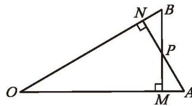

9. 已知：如图，$AN \perp OB$ ，$BM \perp OA$ ，垂足分别为 N, M，OM = ON，BM 与 AN 相交于点 P。
   求证：PM = PN。

(第9题)

10. 如图，已知线段 $a$ ，用尺规作底边等于 $a$ 、高等于 $2a$ 的等腰三角形。

(第10题)

###### 数学理解

11. 如图，$\triangle ABC$ 的高 $BD$ 与 $CE$ 相交于点 $O$ ，$OD = OE$ ，$AO$ 的延长线交 $BC$ 于点 $M$ 。
    (1) 从图中找出几对全等直角三角形，并给出证明。
    (2) 求证：$\triangle ABC$ 是等腰三角形。

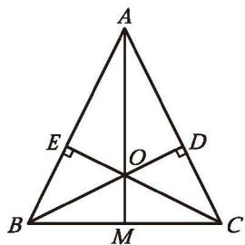

(第11题)

(第12题)

12. 已知：如图，在 $\triangle ABC$ 中，$BC > AC$ 。
    求证：$\angle BAC > \angle B$ 。
    
    证明：由 $BC > AC$ ，可在 $BC$ 边上截取 $CD = AC$ ，连接 $AD$ 。……
    
    请你完成证明过程。

13. 在 $\triangle ABC$ 中，$AB = AC$ ，$AD \perp BC$ ，垂足为 $D$ 。
    (1) 如图 (1)，点 $E$ 在线段 $AD$ 上，连接 $BE$ 、$CE$ 。请找出图中所有相等的角，并说明理由。
    (2) 如图 (2)，点 $E$ 在线段 $DA$ 的延长线上，连接 $BE$ 、$CE$ 。请找出图中所有相等的线段、相等的角，并说明理由。
    (3) 你还可以提出哪些问题？

(1)

(第13题) (2)

14. 如图，在 $\triangle ABC$ 中，$\angle C = 90^{\circ}$ ，$\angle A = 30^{\circ}$ ，$AB$ 的垂直平分线分别交 $AB$ 、$AC$ 于点 $D$ 、$E$ 。求证：$AE = 2CE$ 。

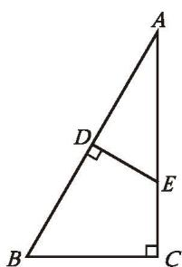

(第14题)

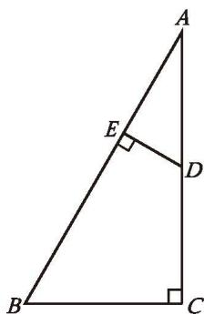

(第15题)

15. 如图，在四边形 $BCDE$ 中，$\angle C = \angle BED = 90^{\circ}$ ，$\angle B = 60^{\circ}$ ，延长 $CD$ 、$BE$ ，两线相交于点 $A$ 。已知 $CD = 2$ ，$DE = 1$ ，求 Rt $\triangle ABC$ 的面积。

16. 如图，已知 $\angle ACB = \angle BDA = 90^{\circ}$ ，要使 $\triangle ACB \cong \triangle BDA$ ，还需要添加什么条件？请你选择其中一个加以证明。

17. 求证：等腰三角形的底角必为锐角。

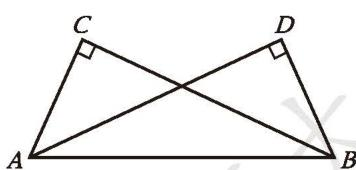

(第16题)

18. 如图，在 $\triangle ABC$ 中，$\angle B = 64^{\circ}$ ，$\angle BAC = 72^{\circ}$ ，$D$ 为边 $BC$ 上的一点，$DE$ 交 $AC$ 于点 $F$ ，且 $AB = AD = DE$ ，连接 $AE$ ，$\angle E = 55^{\circ}$ 。请判断 $\triangle AFD$ 的形状，并说明理由。

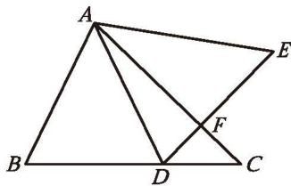

(第18题)

###### 问题解决

19. (1) 如图 (1)，在 $\triangle ABC$ 中，$BD$ 平分 $\angle ABC$ ，$CD$ 平分 $\angle ACB$ ，试确定 $\angle A$ 和 $\angle D$ 的数量关系；
    (2) 如图 (2)，在 $\triangle ABC$ 中，$BE$ 平分 $\angle ABC$ ，$CE$ 平分外角 $\angle ACM$ ，试确定 $\angle A$ 和 $\angle E$ 的数量关系；
    (3) 如图 (3)，在 $\triangle ABC$ 中，$BF$ 平分外角 $\angle CBP$ ，$CF$ 平分外角 $\angle BCQ$ ，试确定 $\angle A$ 和 $\angle F$ 的数量关系。

(1)

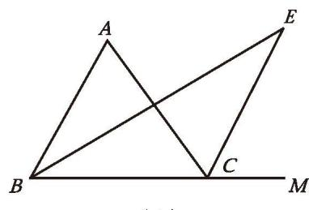

(第19题) (2)

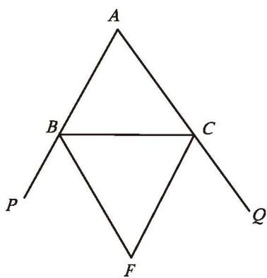

(3)

※20. 如图，在 $\triangle ABC$ 中，$BE$ 和 $BF$ 三等分 $\angle ABC$ ，$CE$ 和 $CF$ 三等分 $\angle ACB$ ，$\angle A = 75^{\circ}$ 。求 $\angle BEC$ 和 $\angle BFC$ 的度数。

(第20题)

21. 如图，在 $\triangle ABC$ 中，$AB = AC$ ，$AB$ 的垂直平分线交 $AB$ 于点 $D$ ，交 $AC$ 于点 $E$ 。已知 $\triangle BCE$ 的周长为 8，$AC - BC = 2$ ，求 $AB$ 和 $BC$ 的长。

22. 如图，在等边三角形 $ABC$ 的三边上分别取点 $D,\ E,\ F$ ，使 $AD = BE = CF$ 。试判定 $\triangle DEF$ 的形状，并说明理由。

(第21题)

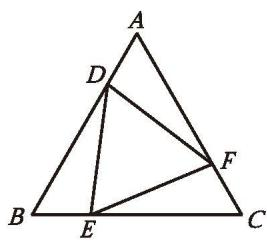

(第22题)

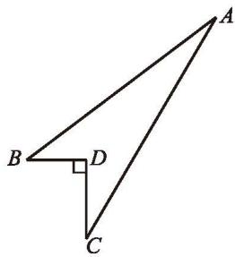

(第23题)

23. 一块菜地的形状如图所示，其中 $BD = 3\ \mathrm{m}$ ，$CD = 4\ \mathrm{m}$ ，$AB = 12\ \mathrm{m}$ ，$AC = 13\ \mathrm{m}$ ，且 $BD \perp CD$ 。求这块菜地的面积。

24. 已知等腰三角形的底边和腰的长分别为 6 和 5，求这个等腰三角形的面积。

25. 回忆研究三角形内角和的过程与方法，你有哪些心得体会？撰写一篇小短文，并在班级内分享。

###### 联系拓广

26. 如图，已知线段 $c$ ，用尺规作等腰直角三角形，使它的斜边等于 $c$ 。

(第26题)

27. 两边分别相等且其中一组等边的对角（对角是钝角）相等的两个三角形全等吗？如果不全等，请举一反例；如果全等，请加以证明。

28. 已知：$a,\ b,\ c$ 是三角形的三边，且满足 $(a + b + c)^{2} = 3(a^{2} + b^{2} + c^{2})$ 。求证：这个三角形是等边三角形。

---

## 概念总结

### 核心定理

| 序号 | 名称 | 内容 |
|:---:|------|------|
| 1 | **角平分线性质定理** | 角平分线上的点到这个角的两边的距离相等 |
| 2 | **角平分线判定定理** | 在一个角的内部，到角的两边距离相等的点在这个角的平分线上 |
| 3 | **三角形三角平分线定理** | 三角形的三条角平分线相交于一点，且该点到三条边的距离相等 |

### 重要概念

- **角平分线**：从一个角的顶点出发，将这个角分成两个相等角的射线
- 三角形三条角平分线的交点即三角形的**内心**（内切圆圆心）

### 问题解决策略：反思

- 证明线段相等的常用方法：三角形全等、等角对等边、平行四边形性质等
- 解决问题后可继续思考：①寻找更多结论；②改变条件看结论是否成立；③条件和结论互换

